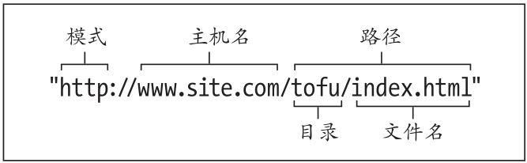
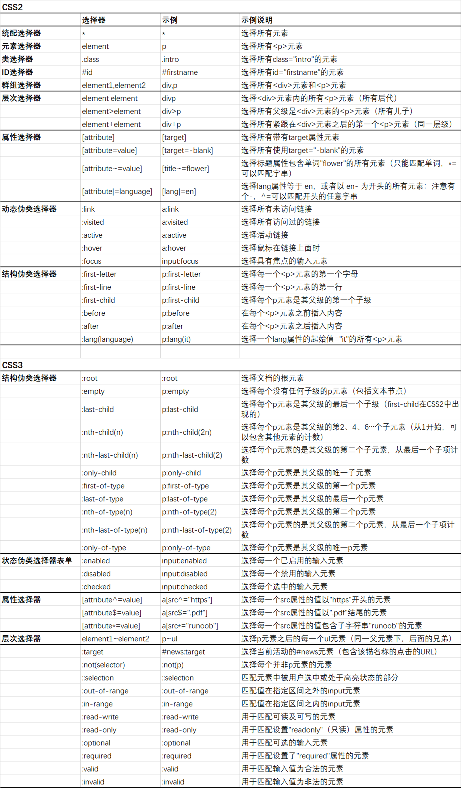

# HTML

## 01 HTML 简介

Hyper Text Markup Language 超文本标记语言

```html
<!DOCTYPE html> <!-- 文档类型声明 -->
<html>
  <head>
    <meta charset="UTF-8" /> <!-- 字符集 -->
    <title>Title of the document</title> <!-- 标题 -->
    <base href="http://www.w3school.com.cn/images/" />  <!-- 为页面上的所有链接规定默认地址 -->
		<base target="_blank" />  <!-- 为页面上的所有链接规定默认目标 -->
    <link rel="stylesheet" href="mystyle.css" />  <!-- 定义文档与外部资源之间的关系 -->
    <link rel="icon" href="<%= BASE_URL %>favicon.ico"> <!-- URL图标 -->
    <style type="text/css">...</style> <!-- 内部样式 -->
    <script>...</script> <!-- 内部脚本 -->
    <meta name="description" content="Free Web tutorials on HTML, CSS, XML" />
  </head>

  <body>The content of the document......</body>
</html>
```

- HTML元素由**开始标签**、**内容**和**结束标签**组成
- 标签的组成：元素（element）、属性（attribute）、值（value）
- **空元素**无内容和结束标签
- 开始标签中有属性和值
- 布尔属性不需要属性值，如 `required`
- 属性不管顺序，不同的属性-值对用**空格**隔开，属性值用双引号包裹
- `<!-- -->` 注释

### URL

Uniform Resource Locator 统一资源定位符

 

* 有时，URL 路径不以文件名结尾，而以一个目录结尾（可以包含一个结尾的斜杠，也可以不包含）。在这种情况下，URL 指的是路径中最后一个目录中的默认文件，通常为 `index.html`。通常情况下，所有 Web 服务器的配置都将 `index.html` 作为默认文件名，因此你不必修改任何服务器配置。）
* 文件名全部用小写字母，用短横线分割单词，用 `.html` 作为扩展名
* `https`：超文本传输协议；`ftp`：文件传输协议
* 主机名后面还有端口号

## 02 HTML 标签

### 2.1 简单标签

* 标题 `<h1> - <h6>`
* 段落`<p>` 
* 区块`<div>` `<span>`

### 2.2 链接 a

```html
<!-- html链接语法 -->
<a href="url" target="_blank" rel="section" id="tips">链接文本</a>
<a href="url#tips">访问有用的提示部分</a>  <!-- 访问锚 -->
```

* href 属性定义链接的地址（结尾建议加斜杠）
* target 属性定义被链接的文档在何处显示
* rel 属性定义从源文档到目标文档的关系
* id 属性定义一个HTML文档书签（锚）

### 2.3 图像 img

```html

```

* src 属性定义图片的地址
* alt 属性指定无法加载图片时显示的文字
* width和height属性指定图片的宽高，可以直接用key=value的形式写，不用写在style中

### 2.4 表格 table

```html
<table border="1">
  <thead>
    <th>Heading</th>
    <th>Another Heading</th>
  </thead>
  <tr>
    <td>row 1, cell 1</td>
    <td>row 1, cell 2</td>
  </tr>
  <tr>
    <td>row 2, cell 1</td>
    <td>&nbsp;</td>  <!-- 空格占位符 -->
  </tr>
</table>
```

* border="1" 定义边框
* colspan="2" 两列合一，横向合并单元格
* rowspan="2" 两行合一，纵向合并单元格
* cellpadding="10" 单元格边距
* cellspacing="10" 单元格间距
* align="left" 左对齐

### 2.5 列表 li

```html
<ul> <!-- 无序列表 -->
  <li>Coffee</li>
  <li>Milk</li>
</ul>

<ol> <!-- 有序列表 -->
  <li>Coffee</li>
  <li>Milk</li>
</ol>
```

* type属性可以改变列表类型，但不建议使用，推荐使用css设置样式

### 2.6 表单 form

用于收集用户输入

```html
<form action="URL" method="post" target="_blank">
	文本-姓名
  <input type="text" name="firstname" value="Mickey">
  
  单选-性别
  <input type="radio" name="sex" value="male" checked>男<br>
  <input type="radio" name="sex" value="female">
  
  多选-爱好
  <input type="checkbox" name="hobby" value="car" checked>汽车<br>
  <input type="checkbox" name="hobby" value="movie">电影<br>
  <input type="checkbox" name="hobby" value="coding">编程<br>
  
  密码：<input type="password">
  日期：<input type="date">
  颜色：<input type="color">
  文件选择框：<input type="file" value="Submit">
  重置：<input type="reset" value="Submit">

  下拉列表
  <select name="cars">
    <option value="volvo">Volvo</option>
    <option value="saab" selected>Saab</option>
    <option value="fiat">Fiat</option>
    <option value="audi">Audi</option>
  </select>
  
  多行文字输入域
  <textarea name="message" rows="10" cols="30">
    The cat was playing in the garden.
  </textarea>
  
  按钮：<button type="button" onclick="alert('Hello World!')">Click Me!</button>
	提交按钮：<input type="submit" value="Submit">  
  
</form>
```

* form中的`action`属性指定表单提交的地址
* 单选radio和多选checkbox中需配置相同的`name`属性；`checked`表示默认选中

### 2.7 框架 frameset

```html
<frameset cols="25%,75%">
   <frame src="frame_a.htm">
   <frame src="frame_b.htm">
</frameset>
```

### 2.8 行内元素

`<a>` `<span>` `<input>` `<button>` `` `<textarea>` `<select>` 等

* 行内元素和其他元素会在同一行上显示
* 行内元素的**宽、高以及外边距和内边距**都**不可以改变**
* 行内元素的宽度就是其中内容的宽度，且不可以改变
* 行内元素中只能容纳文本或者其他行内元素

## 03  HTML 属性

### 常用属性

| 标签属性  | 相关HTML标签    | 描述                                           |
| --------- | --------------- | ---------------------------------------------- |
| id        | 全局            | ID                                             |
| class     | 全局            | 类                                             |
| style     | 全局            | CSS样式                                        |
| title     | 全局            | 规定元素的额外信息；鼠标放上去会显示           |
| rel       | link            | relevant相关的，取值一般是stylesheet表示样式表 |
| role      | banner  main 等 | 地标角色，改善可访问性                         |
| lang      | 全局            | 语言                                           |
| translate | 全局            | 规定是否翻译元素的内容                         |
| name      |                 |                                                |

## 04 H5 新特性

* 语义化标签：header、nav、footer、aside、article、section
* 多媒体标签：video、audio
* 画布：Canvas
* 本地存储：sessionStorage、localStorage
* 表单控件：calendar, datetime, date, time, email, url, search, number, color, month, week
* 拖拽释放
* 新技术：webworker、websocket、Geolocation 地理位置API

Canvas是H5的新标签，本质是一个画布，可以通过js在上面绘制图形，单位是像素，放大会失真；
SVG 是使用 XML 描述的2D矢量图像，使用元素绘制的，可以通过js给元素任意添加事件

### 拖拽

```html
<!DOCTYPE HTML>
<html>
<head>
  <meta charset="utf-8">
  <title>拖拽</title>
  <style type="text/css">
    #div1 { width: 350px;height: 70px;padding: 10px;border: 1px solid #aaaaaa; }
    #div2 { width: 336px;height: 69px;background-color: skyblue; }
  </style>
  <script>
    // 拖拽对象
    function drag(ev) {
      ev.dataTransfer.setData("Text", ev.target.id);
    }
    // 目标区域
    function allowDrop(ev) {
      ev.preventDefault();
    }
    function drop(ev) {
      ev.preventDefault();
      var data = ev.dataTransfer.getData("Text");
      ev.target.appendChild(document.getElementById(data));
    }
  </script>
</head>
<body>
  <p>拖动矩形块到矩形框中:</p>
  <!-- 矩形框 -->
  <div id="div1" ondrop="drop(event)" ondragover="allowDrop(event)"></div><br>
  <!-- 矩形块 -->
  <div id="div2" draggable="true" ondragstart="drag(event)"></div>
</body>
</html>
```

## 05 其他内容

### 颜色

* 十六进制 `#000000` 黑色
* RGBA `rgba(255,255,255,0)` 白色，不透明

### 字符实体

* 空格：`&nbsp`
* 小于号：`&lt`
* 大于号：`&gt`

### picture标签

该元素通过包含多个source元素和一个img元素来为不同的显示场景提供图像版本，浏览器会选择最匹配的source元素，如果没有匹配的，就选择img元素的src属性中的URL，然后呈现在img元素占据的空间中


# CSS

## 01 CSS基础

 Style Sheets 层叠样式表

* `/*   */` 注释可以包含回车，可以换行
* 下层的元素继承了其祖先元素的属性；某些属性默认不继承，可以用`*attribute*: inherit;` 强制继承
* 优先级：`!important` > 行内样式 > ID > 类 || 属性 || 伪类 > 标签(元素) > 通配符

### 属性的值

- inherit
- 预定义的值：如`left, none, center`等
- URL：`url(*bg-pattern.png*)`
- 长度和百分数

- 纯数字

### 颜色属性

- name - 指定颜色名，如 `red`
- HEX - 指定十六进制，如 `#ff0000`
- RGB - 指定RGB值， 如 `rgb(255, 255, 255)` 或 `rgb(50%, 50%, 50%)`
- RGBA - 指定RGBA值，如 `rgba(255, 255, 255, 0.5)`
- HSL - 指定HSL值， 如 `hsl(360, 360, 360)` 或 `hsl(50%, 50%, 50%)`
- 全透明 - `transparent`

### 长度属性

- `cm`
- `em`：相对于当前对象内文本的字体尺寸（和当前字体大小相等），相对单位（1em = 16px）
- `rem`：相对于根元素font-size的值，相对单位
- `px`：像素，绝对单位
- `pt`
- `%`

## 02 样式表

### 2.1 三种样式表

```html
<!-- 1.外部样式表，浏览器会将外部样式表保存在缓存中 -->
<link rel="stylesheet" href="css/style.css">

<!-- 2.嵌入样式表，写在head标签中的style标签内 -->
<style>
  img {	border: 4px solid red }
</style>

<!-- 3.应用内联样式 -->

```

### 2.2 媒体相关

对屏幕显示和打印使用不同的样式表

```html
<!-- 在<link>元素中添加media="*output*" 可取print、screen、all-->
<link rel="stylesheet" href="css/style.css" media="print">

<!-- 在<style>元素的开始标签中添加media="*output*" -->
<style media="screen">
  img {	border: 4px solid red	}
</style>

<!-- 打印样式表 -->
@media print {
		body {font-size: 25pt;}
		p {color: #000;}
		img {display: none}
}
```

## 03 选择器



## 04 元素特有属性

| 元素CSS属性           | 可选值                                         | 描述                                             |
| --------------------- | ---------------------------------------------- | ------------------------------------------------ |
| **字体**              |                                                |                                                  |
| font                  |                                                | 至少包含font-size和font-family                   |
| font-family           | 字体名                                         | 规定文本的字体系列                               |
| font-size             | length  small                                  | 规定文本的字体大小                               |
| font-style            | italic  normal                                 | 规定文本的字体样式                               |
| font-weight           | bold  200(100~900)  normal                     | 规定字体的粗细                                   |
| font-variant          | small-caps  none                               | 设置小型大写字母                                 |
| **背景**              |                                                |                                                  |
| background-color      | color                                          | 设置元素的背景色                                 |
| background-image      | url(图片地址)                                  | 设置元素的背景图像                               |
| background-repeat     | repeat  repeat-x  repeat-y  no-repeat          | 设置背景图像是否及如何重复                       |
| background-attachment | fixed  scroll  local                           | 设置背景图像是固定的还是与页面的其余部分一起滚动 |
| background-position   | left  center  right  top  center  bottom       | 设置背景图像的开始位置                           |
| background-size       | contain  cover  auto  length                   | 设置背景图像的尺寸                               |
| **文本**              |                                                |                                                  |
| color                 | color                                          | 规定文本的字体颜色                               |
| word-spacing          | length                                         | 设置单词之间的距离，字间距                       |
| letter-spacing        | length                                         | 设置字母之间的距离                               |
| line-height           | length                                         | 规定段落内每行之间的间距                         |
| text-intent           | length                                         | 设置元素的缩进                                   |
| text-align            | left  right  center  justify                   | 设置文本的对齐方式                               |
| vertical-align        | top  center  bottom                            | 表格中文本的垂直对齐                             |
| text-transform        | capitalize  uppercase  lowercase  none         | 设置文本的大小写                                 |
| text-decoration       | underline  overline                            |                                                  |
| line-through  none    | 设置文本装饰                                   |                                                  |
| white-space           | pre  nowrap  normal                            | 设置空白属性                                     |
| text-shadow           |                                                | 添加到文本的阴影效果                             |
| text-overflow         | clip  ellipsis  string                         | 未显示出的溢出内容的效果                         |
| **列表**              |                                                |                                                  |
| list-style            |                                                |                                                  |
| list-style-type       | circle  square  none  upper-roman  lower-alpha | 设置列表项标记的类型                             |
| list-style-image      | url(图片地址)                                  | 将图像指定为列表项标记                           |
| list-style-position   | outside  inside                                | 设置列表项标记的位置                             |
| **表格**              |                                                |                                                  |
| border                |                                                |                                                  |
| border-collapse       | separate  collapse  inherit                    | 合并表格的多个边框                               |
| border-spacing        | length length  inherit                         | 相邻单元格之间的边框的距离                       |
| caption-side          | top  bottom  inherit                           | 表格标题位置                                     |
| empty-cells           | show  hide  inherit                            | 空单元格的边框和背景                             |
| table-layout          | automatic  fixed  inherit                      | 列宽自适应                                       |

- 对于包含多个单词的字体名称，应该用引号包围起来
- 可以使用小写字母指定字体名称，如`geneva`
- 字体列表称为字体栈，一般至少包含三个字体
- 如果使用数字设定行高，则子元素会继承这个因子，即所有子元素的行高也是子元素字体大小的相同倍数
- 如果用`em`或**百分数**设定行高，则子元素会继承产生的行高，即子元素与父元素行高**相同**
- 使用`font`简写属性，至少包含字体大小`font-size`和字体系列`font-family`两个属性
- `.875em/1.3` 行高跟在字体大小和一个斜杠后面 `font-size/line-height`
- 默认情况下，`HTML`文档里面的多个空格和回车会显示为一个空格

## 05 盒模型

网站设计主要分为固定宽度(fixed)和响应式(fluid)

* 标准盒模型：宽度包含margin和padding
* IE盒模型：宽度不包含margin和padding

| 属性             | 可选值                            | 描述                                                         |
| ---------------- | --------------------------------- | ------------------------------------------------------------ |
| **边框**         |                                   |                                                              |
| border           |                                   | 边框宽度；必须声明border-style                               |
| border-style     | solid  dotted  dashed  none 等    | 边框样式；可以设置四个值，用空格隔开，分别表示上-右-下-左边框 |
| border-width     | thin  medium  thick  lenth        | 边框宽度；四个值同上                                         |
| border-color     | color                             | 边框颜色；四个值同上                                         |
| border-top-style |                                   | right, bottom, left                                          |
| border-radius    | lenth                             | 将边框变为圆角；属性值表示圆角的程度                         |
| **外边距**       |                                   |                                                              |
| margin           | auto  length  %  inherit          | 外边距宽度；四个值同上                                       |
| margin-top       | auto  length  %  inherit          | right, bottom, left                                          |
| **内边距**       |                                   |                                                              |
| padding          | length  %  inherit                | 内边距；四个值同上                                           |
| padding-top      | length  %  inherit                | right, bottom, left                                          |
| **轮廓**         |                                   |                                                              |
| outline          |                                   | 轮廓；在边框之外                                             |
| outline-style    | solid  dotted  dashed  none 等    | 轮廓样式                                                     |
| outline-width    | thin  medium  thick  lenth        | 轮廓宽度                                                     |
| outline-color    | color                             | 轮廓颜色                                                     |
| outline-offset   | lenth                             | 轮廓偏移；在元素的轮廓与边框之间添加透明空间                 |
| **元素**         |                                   |                                                              |
| height           | auto  length  %  inherit  initial | 元素高度，不包括边框和边距                                   |
| width            | auto  length  %  inherit  initial | 元素宽度，不包括边框和边距                                   |
| max-width        | length  %  none                   | 元素最大宽度；覆盖width                                      |
| float            | left  right  none                 |                                                              |
| clear            |                                   | 清除浮动元素                                                 |
| position         | relative  static                  |                                                              |
| z-index          | n 数字                            | 值越大，元素位于层级越高                                     |
| overflow         | visible  hidden  scroll  auto     | 处理溢出                                                     |
| cursor           | default  pointer move  text  等   | 控制鼠标指针样式                                             |

- 外边距合并：当两个垂直外边距相遇时，他们形成一个外边距，合并后的外边距等于两个外边距中**较大者**

- 背景应用在**内容+内边距+边框**
- 元素大小=内容+内边距+边框+外边距
- 轮廓不属于元素尺寸的一部分

## 06 弹性布局 Flex

采用 Flex 布局的元素，称为 Flex 容器（flex container），简称“容器”。它的所有子元素自动成为容器成员，称为 Flex 项目（flex item），简称“项目”。容器默认存在两根轴，分别为水平的主轴（main axis）和垂直的交叉轴（cross axis）。主轴的开始位置叫做 main start，结束位置叫做 main end；交叉轴的开始位置叫做 cross start，结束位置叫做 cross end。项目默认沿主轴排列。单个项目占据的主轴空间叫做 main size，占据的交叉轴空间叫做 cross size。 

可以通过将元素的 display 属性设置为 flex（生成块级 flex 容器）或 inline-flex（生成类似 inline-block 的行内块级 flex 容器） 

### 6.1 容器属性

#### flex-direction 主轴方向

设置主轴的方向，即项目的排列方向

| 值       			| 描述                               |
| ------------   | ---------------------------------------------- |
| **row**        | **默认值**，主轴沿水平方向从左到右 |
| row-reverse    | 主轴沿水平方向从右到左             |
| column         | 主轴沿垂直方向从上到下             |
| column-reverse | 主轴沿垂直方向从下到上             |

#### flex-wrap 主轴换行

设置主轴的换行方式(当项目超过主轴长度时)

| 值           | 描述                                           |
| ------------ | ---------------------------------------------- |
| **nowrap**   | **默认值**，项目不会换行(一般会默认压缩)       |
| wrap         | 项目会在需要时换行                             |
| wrap-reverse | 项目会在需要时换行，但会以相反的顺序(向上换行) |

#### flex-flow 联合属性

是 flex-direction 和 flex-wrap 的简写

#### justify-content 主轴对齐

设置项目在主轴方向上的对齐方式

| 值             | 描述                                           |
| -------------- | ---------------------------------------------- |
| **flex-start** | **默认值**，主轴起点对齐                       |
| flex-end       | 主轴终点对齐                                   |
| center         | 居中对齐                                       |
| space-between  | 沿主轴两端对齐，项目之间的间隔相等(两端不留空) |
| space-around   | 沿主轴，项目两侧的间隔相等(两端留空)           |

#### align-items 侧轴对齐(单行)

设置一行项目在侧轴上的对齐方式

| 值          | 描述                                                         |
| ----------- | ------------------------------------------------------------ |
| **stretch** | **默认值**，**如果项目未设置高度**，项目将被拉伸以适合容器(上下拉伸填充) |
| flex-start  | 侧轴起点对齐                                                 |
| flex-end    | 侧轴终点对齐                                                 |
| center      | 侧轴中点对齐                                                 |
| baseline    | 项目第一行文字的基线对齐                                     |

#### align-content 侧轴对齐(多行)

设置多行项目在侧轴上的对齐方式

| 值            | 描述                                                       |
| ------------- | ---------------------------------------------------------- |
| **stretch**   | **默认值**，下面行的项目尽量在上下都留出空白，直至占满侧轴 |
| flex-start    | 侧轴起点对齐                                               |
| flex-end      | 侧轴终点对齐                                               |
| center        | 侧轴中点对齐                                               |
| space-between | 多行项目与侧轴两段对齐，中间平均分布                       |
| space-around  | 每行项目两侧的间隔相等(边缘留空)                           |

### 6.2 项目属性

#### flex-grow 伸

设置项目在主轴上的**拉伸**比率

值为一个数字。**默认值为 0，表示默认不可以拉伸**

#### flex-shrink 缩

设置项目在主轴上的**压缩**比率

值为一个数字。**默认值为 1，表示默认可以压缩**

#### flex-basis 基准长度

设置项目在主轴上的基准长度(浏览器依赖该属性计算主轴上是否还有剩余空间；根据主轴方向的不同，该属性会替代项目的宽或高，使其失效)

值为 auto、inherit(表示从父元素继承该属性的值)或者以具体的值加 "%"、"px"、"em" 等单位的形式。**默认值为 auto，表示不设置基准长度，根据项目的实际宽高值确定**

#### flex 联合属性

flex 属性是 flex-grow、flex-shrink 和 flex-basis 三个属性的简写，按顺序来的

- flex-grow：设置项目的拉伸比率，**默认值为 0（必填）**
- flex-shrink：设置项目的压缩比率，**默认值为 1**
- flex-basis：设置项目在主轴上的基准长度，**默认值为 auto**
- flex 属性还有几个快捷值
  - **auto 可以拉伸和压缩**（1 1 auto）
  - **1 可以拉伸和压缩，设置基准长度为 0**（1 1 0）
  - **none 不可以拉伸和压缩**（0 0 auto）


#### order 排序

设置项目在容器中出现的顺序

值为一个数字。**默认值为 0**

#### align-self 单独对齐

单独设置某个项目在侧轴上的对齐方式，覆盖 align-items 的值
值与 align-items 中的值相同。auto 表示元素将继承其父容器的 align-items 属性值

## 07 C3 新特性

* 选择器
  * 结构伪类 `:nth-child(n)`
  * 状态伪类 `:disable`
  * 属性选择器 `[attribute^=value]`
  * 其他选择器 `element1~element2`
* 页面布局方式
  * 多列布局 `column-count` 等
  * 弹性盒子布局 flexbox
  * 网格布局 grid
* 元素修饰方法
  * RGBA和透明度
  * 圆角 `border-radius`
  * 渐变效果 `linear-gradient`
  * 阴影和反射 `box-shadow` `text-shadow`
  * 背景：`background-clip` `background-origin` `background-size` 
* 盒子模型 `box-sizing:` 
  * `content-box`：标准盒模型，width不包含padding和border
  * `border-box`：IE盒模型，width包含padding和border

* 过度和动画
  * transition：过渡
  * transform：2D变化，如旋转rotate、扭曲skew、缩放scale和移动translate以及矩形变形matrix
  * animation
* 媒体查询 `@media screen and (max-width: 1920px) { ... }`
* 开放字体

## 08 浮动


