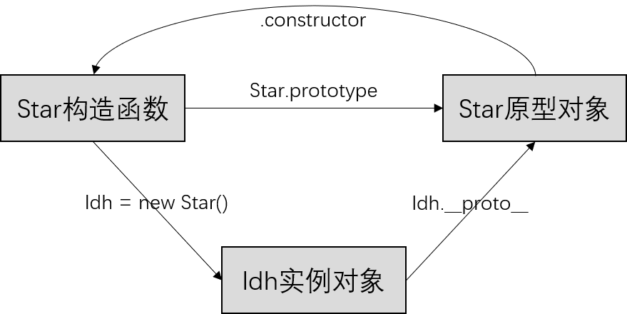

## 01 JavaScript基础

### 1.1 什么是JavaScript

- 运行在客户端的脚本语言：动态改变页面内容、网页外观；验证表单数据；响应事件
- 无需编译，由JS解释器逐行解释并执行
- 可以基于Node.js进行服务端编程
- 浏览器分为两部分
  - 渲染引擎：解析HTML和CSS，如chrome的blink
  - JS引擎：读取JavaScript代码，如chrome的V8
- JS组成：ECMAScript和DOM和BOM

### 1.2 基本使用

* JS使用 `camelCase` 书写标识符（变量、函数、属性或函数参数的名称）；
* 注释：`//` 单行注释    `/* 这是多行注释 */`；
* 以**分号**结尾 `；` C语言风格代码块，用花括号`{ }`；
* 现在一般将外部 `JS` 放在 `</body>` 结束标签之前，先渲染页面；
  * 浏览器解析html时遇到script标签会停止解析，去执行script标签中的内容，阻塞渲染
  * `async` ：加载和渲染后续文档的过程并行执行（先网络请求js，再执行js；网络的时候html依然可以渲染，执行js的时候就不能渲染了）；
  *  `defer` ：加载和渲染后续文档的过程并行执行，但是script.js的执行要在所有元素解析完成后，DOMContentLoaded事件触发之前完成；defer会按照脚本的加载顺序来执行

* 三种书写方式
  * 行内式：写在元素标签内部 `onclik=""`
  * 内嵌式：写在 `<script>` 标签内部
  * 外部引入：在 `<scritp>` 开始标签中，`src=""`

 


### 1.3 输入输出

```javascript
// 输入
var n = prompt()  // 浏览器弹出输入框，用户可以输入

// 输出
window.alert()  // 写入警告框
document.write()  // 写入 HTML 输出
S.innerHTML  // 写入 HTML 元素
S.innerText  // 写入 Text 元素
console.log()  // 写入浏览器控制台
```

### 1.4 变量

- 声明变量

  - `var`：var声明的变量是全局变量，没有块作用域，在块内声明的变量，在块外也可访问；但是在函数内声明的，就是局部作用域（函数作用域），在外部不可访问；
  - `let`：作用域为块作用域（大括号内），在函数之内，可重新赋值；
  - `const`：块作用域，声明时必须赋值，不可重新赋值，但可以更改常量对象的属性。

- 只声明不赋值，变量的值为 `undefined`；

- 不声明直接赋值，会变成全局变量，不建议使用；

- 变量可以用于保存任何类型的数据；

- ###### 使用习惯，`const` 优先，`let` 次之，尽量不使用 `var`。

### 1.5 数据类型

- JavaScript是弱类型，不提前声明变量类型；而且是动态类型，可变；
- `typeof var` 返回变量类型，不加括号；typeof是一个操作符，不是函数；
- `typeof null` 的结果是 `object`
- 在JavaScript中，一切皆对象；
- 分为原始值类型和引用数据类型

```javascript
/* ********** 原始值类型 ********** */
// 1.布尔型 Boolean
let a = true
// 2.数字型 Number
let a = 18;
// 3.字符串型 String
let a = "hello"
// 4.未定义型 Undefined
let a
// 5.空值 Null
let a = null
// 6.符号 Symbol（ES6新增）
let sym = Symbol(str)  // 表示独一无二的值
// 7.大数字 BigInt（ES6新增）

/* ********** 对象类型 ********** */
// 1.数组 Array
let a = [1,2,3,4]
// 2.对象 Object
let a = {name:'John', age:34}
// 3.函数 Function
let a = function() { console.log("hello")}
```

### 1.6 运算符

```javascript
// `&&` 与    `||` 或    `！` 非/* ********** 算数运算符 ********** */
a = 10 % 3;  // 1 取余
// 前置递增 ++num  --num 类似于 num = num + 1 先加一，再返回值
// 后置递增 num++ num-- 先返回原值，再加一
let i = 1
console.log(i++ + ++i + i)  // 1 + 3 + 3

/* ********** 比较运算符 ********** */
// == 会把字符串自动转换为数字，值相等即可
// === 全等，类型和值都要相等

/* ********** 逻辑运算符 ********** */
// && 与    || 或    ！非
```

#### 短路运算

正常的逻辑与或运算，参与的是布尔值；当**表达式或值**参与逻辑运算时，会触发短路运算。
当有多个表达式（值）时，左边的表达式值可以确定结果时，就不再继续运算右边的表达式值

- `表达式1 && 表达式2` 如果表达式1的值为真，则返回表达式2，如果为假，则返回表达式1
- `表达式1 || 表达式2` 如果表达式1的值为真，则返回表达式1，如果为假，则返回表达式2

## 02 流程控制

### 2.1 条件语句

```jsx
// if 条件语句
if (表达式) {  
  // do something 
} else { };

// switch 条件语句
switch (表达式) {
  case value1:
    yuju1;
    break;  // 如果case里面没有break，则不会退出，而是继续执行下一个case
  case value2:
    yuju2;
    break;
  default:
    yuju3;
```

### 2.2 三元表达式

- `条件表达式 ? 表达式1 : 表达式2`
- 如果条件表达式结果为真，则返回表达式1的值，如果条件表达式结果为假，则返回表达式2的值

### 2.3 循环语句

```javascript
// for 循环
for (var i = 1; i <= 100; i++) {
  // 语句;
}

// while 循环
while (表达式) {
  // 循环体;
  // 更新表达式;
}

do {
  // 循环体;
  // 更新表达式;
} while (条件表达式)
// for ... in ... 可以用来遍历对象、数组、字符串，获取属性的键名（一般用于遍历对象，遍历数组时，获取的是字符串类型的下标"0"）
// for ... of ... 可以用来遍历数组和字符串，获取属性值（不可遍历对象）因为对象内部没有iterator
```

- `continue` 立即跳出本次循环，继续下一次循环
- `break` 跳出整个循环

### 2.4 错误处理

- try 语句允许我们定义在执行时进行错误测试的代码块；

- catch 语句允许我们定义当 try 代码块发生错误时，所执行的代码块；

- throw 语句允许您创建自定义错误，new 一个内置的 Error 对象实例

- finally 使您能够执行代码，在 try 和 catch 之后，无论结果如何。


```javascript
try {
  tryCode // 尝试执行代码块
} catch (error) {
  catchCode // 捕获错误的代码块
} finally {
  finallyCode // 无论 try|catch 结果如何都会执行的代码块
}

function demo() {
  const date = Date.now();
  if (date % 2 === 0) {
		console.log("OK");
  } else {
    throw new Error("错误"); // 抛出一个错误对象
  }
}

// try catch 通常和 axios 一起使用，配合 async await 处理异步请求
// 不过可以使用请求拦截器批量处理所有错误 
async function getDog() {
  try {
    const result = await axios.get('url');
    dogList.push(result.data.message);
  } catch (error) {
    alert (error);
  }
}
```

## 03 数组 Array

### 3.1 创建数组

```javascript
// 创建数组
let arr = new Array()  // 使用 new Array 构造函数创建
let arr = [1, 2]  // 字面量
let arr = Array.from("arrayLike object")  // 从其他类型转换
let arr = [...new Set([1, 2])]  // 扩展运算符，从set转array

// 访问数组元素
arr[0]  // arr[index]
// 添加最高索引的元素可在数组中创建未定义的“洞”，undefined
```

### 3.2 数组属性和方法

**变更数组的方法（只有这几种）**

```javascript
let arr = [1, 2, 3]
/* ********** 变更数组的方法 ********** */
// 1.push() 在数组结尾添加元素，返回新数组的长度
arr.push("hello")  // 4

// 2.pop() 在数组结尾删除一个元素，返回被删除的值
arr.pop()  // 3

// 3.shift() 在数组开头删除一个元素，返回被删除的值
arr.shift()  // 1

// 4.unshift() 在数组开头添加一个元素，返回新数组的长度
arr.unshift("hello")  // 4

// 5.splice() 在数组指定位置添加或删除元素，返回被删除的元素组成的数组
arr.splice(index, howmany, ...items)
// index       表示从哪里开始添加或删除元素，包含这个位置的元素
// howmany     表示删除多少个元素，如果未规定则删除之后所有元素
// ...items    表示需要添加的元素们
let fruits = ["Banana", "Orange", "Apple", "Mango"];
fruits.splice(2, 1, "Lemon", "Kiwi");  // ["Banana", "Orange", "Lemon","Kiwi", "Mango"]

// 6.sort() 对数组排序，返回排序后的数组（会改变原数组，默认升序）
let a = arr.sort()  // a指向arr的地址，当arr再发生变化时，a也会跟着变化
arr.sort( (a, b) => a - b )  // 升序
arr.sort( (a, b) => b - a )  // 降序
arr.sort( (a, b) => 0.5 - Math.random() )  // 随机排序

// 7.reverse() 反转数组，返回反转后的数组
arr.reverse()  // [3, 2, 1]
```

**其他数组属性和方法**（不改变原数组）

```javascript
let arr = [1, 2, 3]
/* ********** 其他数组的方法 ********** */
// length属性，返回数组长度
arr.length  // 3

// toString() 以逗号分隔的字符串返回数组
let a = arr.toString()  // "1,2,3"  等同于 arr.join()

// join() 把数组中的所有元素转换一个字符串，默认输出以逗号分隔，可传入分隔符参数；不改变原数组
let arr1 = [1, 2, 3]
let arr2 = arr1.join("*")  // "1*2*3"

// concat() 连接两个数组，返回连接后的数组；不改变原数组(可以实现浅拷贝)
let arr1 = [1, 2, 3]
let arr2 = [4, 5, 6]
let arr3 = arr1.concat(arr2)  // [1, 2, 3, 4, 5, 6]

// indexOf() 返回数组中指定元素的第一个索引号，找不到则返回-1（同理有lastIndexOf()从后往前找）
let arr = [1, 2, 3]
let a = arr.indexOf(2)  // 1

// slice(start, end) 左闭右开 end可取负值(可以实现浅拷贝)
// 当数组里面的值是基本类型时为深拷贝；当数组里面的值是引用类型时为浅拷贝 concat同理
let arr = [1, 2, 3, 4, 5];
let arr1 = arr.slice(2, 4);  // [3, 4] 不改变原数组

// arr.find((item, index, array) => { /* … */ }) 用于找出第一个符合条件的数组成员，如果没有找到则返回undefined
let arr = [ {id: 1, name: '张三'}, { id: 2, name: '李四' } ];
let target = arr.find((item, index) => item.id == 2); // { id: 2, name: '李四' }

// arr.findIndex((item, index, array) => { /* … */ } )
let arr = [10, 20, 50];
let index = arr.findIndex(item => item > 15);  // 1

// arr.includes(item)
let arr = ["a", "b", "c"];
let result = arr.includes('a');  // true

// arr.fill() 使用固定值填充数组 可以接受第二个和第三个参数，用于指定填充的起始位置和结束位置

// delete 运算符 删除数组某个元素，返回是否删除成功的布尔值；该方法会在数组中留下 undefined
let arr = [1, 2, 3]
a = delete arr[1]  // ture     arr = [1, undefined 3]
```

**数组去重的方法**

```javascript
// 1. 利用ES6的Set
Array.from(new Set(arr));

// 2. 两层for循环
// 内层循环可变成利用数组的indexOf、includes、sort
// 或者内层循环变成利用Set的has；Object的key in obj 或 obj.hasOwnProperty

// 3. filter，也相当于for循环+indexOf
var uniqueArr = arr.filter((item, index, arr) => arr.indexOf(item) === index);

// 4. reduce，也相当于for循环+includes
var uniqueArr = arr.reduce(
	(prev, cur) => prev.includes(cur) ? prev : [...prev, cur], [])

// 5. 递归
arr.sort();
function loop(index) {
  if (index >= 1) {
    if (arr[index] === arr[index - 1]) { arr.splice(index, 1) }
    loop(index - 1); // 递归
  }
}
loop(arr.length - 1);
```

### 3.3 数组遍历和迭代

好像这些方法set也可以使用

```javascript
let arr = [1, 2, 3]
// 1.Array.forEach( callback(value, index, array) ) 是否会改变原数组取决与数组元素的类型是基本类型还是引用类型，无返回值
// forEach主要用于改变当前数组里面的值，一般不用return，也没有返回值
arr.forEach(（value，index） => {
  console.log(index);  // 0, 1, 2
	console.log(value);  // 1, 2, 3
})
// 把set中的元素都添加到arr中，相当于arr = Array.from(set)
set.forEach(value => arr.push(value))

// 2.Array.map( callback(value, index, array) ) 不改变当前数组，返回一个新数组
// 需要return，return的值就是每个元素的新值
let arr2 = arr.map( value => value + 1 )  // arr2 = [2, 3, 4]
let arr = ["12", 13];
let arr2 = arr.map(Number);  // [12, 13] 将字符串数组转换成数字数组，非数字NaN

// 3.Array.filter( callback(value, index, array) ) 返回一个包含通过测试的数组元素的新数组
let arr2 = arr.filter( value => value > 2)
let uniqueArr = arr.filter(  // 数组去重
  (item, index, arr) => arr.indexOf(item) === index  // 元素的第一个索引等于元素的下标，则返回
);

// 4.Array.reduce( callback(prev, value, index, arr), init) 在每个数组元素上运行函数，以生成（减少它）单个值
// filter主要用于过滤当前数组，找出符合条件的元素，返回一个新的数组，不会改变原数组
// prev表示上一次调用回调函数的返回值；value表示当前元素；index表示当前元素索引；arr表示原数组；init表示初始化时prev的值，如果不指定则是默认第一个元素，如果指定了，value就从0开始
let sum = arr.reduce( (total, value) => total + value )  // 求数组中所有数字的总和
const arr = [5, 10, 15];
const sum = arr.reduce((pre, cur, index, arr) => {
  console.log(pre);    //  5  15   从索引为0的元素开始，它是每次迭代的返回值
  console.log(cur);    // 10  15   从索引为1的元素开始（如果指定了init，则从0开始）
  console.log(index);  //  1   2
  console.log(arr);  // [5, 10, 15]
  return pre + cur;  // 返回给上面的pre了
})

// 5. Array.every( callback(value, index, array) ) 检查所有数组值是否通过测试，返回布尔值
arr.every( value => value > 2 )  // false

// 6.Array.some( callback(value, index, array) ) 检查某些数组值是否通过测试，返回布尔值
arr.some( value => value > 2 )  // true

// 遍历数组
for (let i in arr) {
  console.log(arr[i])；  // 遍历key
}
for (let val of arr) {
	console.log(val);  // 遍历值
}
```

## 04 字符串 String

### 4.1 字符串方法

所有字符串方法都会返回新字符串，它们不会修改原始字符串

```javascript
let str = "hello world!"
// length属性，返回字符串长度
str.length  // 12

// String.slice( start, end )  裁剪字符串
let s = str.slice(2, 5)  // "llo"

// String.substring( start, end )  类似slice，但不能传入负的索引值

// String.substr( start length )  裁剪字符串
let s = str.substr(2, 5)  // "llo w"

// String.replace( old, new ) 用另一个值替换在字符串中指定的值，只替换首个匹配
let s = str.replace("e", "d")  // "hdllo world!"
let s = JSON.stringify(s).replace(/'/g, '"');  // 将数组中字符串的单引号全部替换成双引号

// String.toUpperCase()  
// String.toLowerCase()
// String.trim() 去除首尾空白

// String.split() 将字符串转换成数组
let s = str.split()  // 不传入分隔符，字符串成为一整个数组，数组长度为1
let s = str.split("")  // 每个字符都被分开，数组长度为12

// String.concat()  连接两个字符串
let a = "hello "
let b = "world"
let c = a.concat(b)  // "hello world"

// String.startsWith() String.endsWith() 返回布尔值
// 判断字符串是否以某个字串开头或结尾

// String.repeat(n) 将字符串重复n次，返回新字符串
```

### 4.2 字符串搜索

```javascript
let str = "hello world!"
// String.indexOf( char, start) 返回字符串中一个子串第一处出现的索引，没找到返回-1；可声明第二个参数表示起始检索位置
let index = str.indexOf("wo")  // 6
// 字符串中indexOf空字符串，结果是0

// String.lastIndexOf() 向后进行检索（从尾到头）

// String.search(str) 搜索特定值的字符串，并返回首次匹配的位置
let index = str.search("wo")  // 6

// String.includes(str) 返回是否包含指定字符串的布尔值
str.includes("m")  // false

// String.charAt(index) 根据索引位置返回字符，类似于str[index]
str.charAt(0)  // "h"
```

### 4.3 字符串遍历

```javascript
// 遍历索引 for ... in str
for (let i in str) {
  console.log(str[i]);
}
// 遍历字符 for ... of str
for (let char of "Hello") {
  console.log(char);
}

// 求字符串中出现次数最多的字符
let str = "ahbqkbqbkqebreqrerqraaaab";
let obj = {};  // 存放每个字符出现的次数
let n = 0;  // 存放字符出现的最大次数
for (let c of str) {
  if (c in obj) {
    obj[c]++;
  } else {
    obj[c] = 1;
  }
  if (obj[c] > n) { 
    n = obj[c] // 字符出现的最多次数
  }
}

let maxChar = [];  // 出现次数最多的字符组成的数组
for (let key in obj) {
  if (obj[key] === n) {
    maxChar.push(key);
  }
}
console.log(maxChar);
// 还可以把字符串变成数组，排序，使用indexOf和lastIndexOf计算长度。利用set
```

## 05 数字 Number

```javascript
// 在所有数字运算中，JavaScript 会尝试将字符串转换为数字；
// 使用全局函数判断一个元素是否为非数字
isNaN("12")  // false 它可以转换成一个数字
isNaN("H")  // true

let num = new Number(value)  // 生成一个Number对象
let n = 15  // n.__proto__ 是Number对象，具有toString()等方法
```

### 5.1 数字方法

```javascript
let num = 12.34
// Number.toString()  数字转字符串，不改变原数字
num.toString()  // "12.34"

// Number.toFixed(val)  数字转字符串，指定小数位数
num.toFixed(3)  // "12.340"

// Number.toPrecision(val)  数字转字符串，指定数字长度，不含小数点
num.toPrecision(3)  // "12.3"
```

### 5.2 全局方法

```javascript
// 变量转数字
num = Number("12")  // 12
// 变量转字符串
str = String(12)  // "12"
// parseInt(string, radix)  解析一段字符串并返回一个整数；开头结尾允许空格；如果第一个字符不能被转换为数字，则返回NaN
parseInt("  12.3 years  ")  // 12
parseFloat("  12.3 years  ")  // 12.3
```

## 06 函数 Function

### 6.1 函数基础

#### 声明函数

```javascript
// 1. 自定义函数(命名函数)
function fn() {};
// 2. 函数表达式 (匿名函数)
var fun = function() {};
// 3. 利用 new Function('参数1', '参数2', '函数体')
var f = new Function('a', 'b', 'console.log(a + b)');
```

#### 调用函数

```javascript
// 1.调用普通函数 fn(); fn.call()
// 2.对象的方法，Object.key，value是函数，则被调用了
// 3.构造函数 new
// 4.绑定事件函数，执行事件即可
// 5.定时器函数
// 6.立即执行函数，自动调用 ()()，前一个()里面写一个函数；后一个()表示立即执行这个函数，可传参
(function() {
  console.log('人生的巅峰');
})();
```

- 如果实参个数大于形参个数，会取形参的个数；如果实参个数小于形参个数，缺少的实参会被当作 `undefined`
- `return` **只能返回一个值**，返回最后一个值；没有 `return` 时返回 `undefined`
- 访问没有括号 `()` 的函数将返回函数定义
- **arguments对象**的使用
  - 不确定有多少参数传递时，用 `arguments` 对象获取，存取了传递的所有实参
  - 以伪数组形式展示：具有 `length` 属性；按照索引的方式存储；没有真正数组的一些方法;
  - arguments无需指出参数名就可访问

```javascript
function fn(...args) {
  for (var i = 0; i < arguments.length; i++) {
    console.log(arguments[i])  // 也可用args
  }
}
```

**this指向**：函数的不同调用方式决定了 this 的指向不同

* 普通函数 this 指向 window；
* 对象的方法 this 指向的是对象；
* 构造函数和原型对象的 this 都指向创建的实例对象；
* 绑定事件函数 this 指向的是函数的调用者 btn 这个按钮对象；
* 定时器函数 this 指向的也是window；
* 立即执行函数 this还是指向window。

#### 改变this指向

```javascript
var p = { };  // 一个对象
function fn(a, b) { };  // 一个函数

// 1.call()
fn.call(p, a, b)  // 把this指向对象p；实参依次传入
// 2.apply()
fn.apply(p, [a, b])  // 把this指向对象p；实参以数组或伪数组形式传入
var max = Math.max.apply(Math, arr);  // 利用 apply 借助于数学内置对象求数组最大值
// 3.bind()
var fn2 = fn.bind(p, 1, 2);  // 不会调用原来的函数，返回的是原函数改变this之后产生的新函数
// 可用在setTimeout里面，绑定回调函数，改变其this指向
```

### 6.2 箭头函数

箭头函数是用来简化函数定义语法；对于箭头函数，`this` 关键字始终表示定义箭头函数的对象

```javascript
// 箭头函数
(参数) => { 语句 }
// 如果只有一条语句，可以去掉 {} 和 return 关键字
// 如果只有一个参数，可以去掉()
hello = val => "Hello " + val;
```

### 6.3 闭包

**高阶函数：**对其他函数进行操作的函数，它接收**函数作为参数**或者将**函数作为返回值**输出；如回调函数，它就是将callback作为参数，在高阶函数的函数体内最后一行执行。

#### 闭包

有权访问另一个函数作用域中变量的函数

```javascript
function fn() {
  var num = 10;
  function fun() {
    console.log(num);  // fun函数访问了外部函数fn作用域内的变量
  }
  fun();
}
fn();  // fn()为闭包函数；被访问的变量所在的函数是闭包函数
```

闭包延伸了变量的作用范围，可以用以下方法从外部作用域访问内部的局部变量

```javascript
function fn() {
  var num = 10;
  function fun() { console.log(num) }
  return fun;  // 返回一个函数 ！！！
}
var f = fn();  // 调用f就可以拿到num的值，相当于从函数外部获取到函数内部的局部变量
// 可简写
function fn() {
  var num = 10;
  return () => console.log(num);  // 直接返回一个匿名函数或箭头函数
}
// 使用fn()()即可打印出num的值，从外部访问函数作用域的变量
```

闭包应用案例：循环注册点击事件（点击事件是异步任务）

以下代码点击任意`li`只会输出 4 。原因如下：
点击事件是异步任务，只有点击了才会执行函数；但for循环是同步任务，它会立即执行，然后就给4个 `li` 注册了点击事件函数，这时`i`的值已经变为4，所以点击任意 `li`，执行其点击事件函数，输出的都是4。

```javascript
// 点击li输出其索引号（错误写法）
var lis = document.querySelector('.nav').querySelectorAll('li');  // 4个li
for (var i = 0; i < lis.length; i++) { 
  lis[i].onclick = function() {  // 循环注册点击事件
    console.log(i);  // 输出索引号
  }
}

// 正确写法1：动态添加属性
for (var i = 0; i < lis.length; i++) {
  lis[i].index = i;  // 保存 li 的索引号
  lis[i].onclick = function() {
    console.log(this.index);  // 输出索引号
  }
}

// 正确写法2：闭包
for (var i = 0; i < lis.length; i++) {
  // 利用for循环创建了4个立即执行函数
  // 立即执行函数也称为小闭包因为立即执行函数里面的任何一个函数都可以使用它的 i 这个变量
  (function(i) {  // i 表示接收的参数
    lis[i].onclick = function() {
      console.log(i);  // 使用了立即执行函数的 i 这个变量（闭包）
    }
  })(i);  // i 表示传入的参数
}  
```

闭包应用案例：定时器中的闭包（定时器是异步任务）

```javascript
// 写法1：闭包
for (var i = 0; i < lis.length; i++) {
  (function(i) {
    setTimeout(function() {
      console.log(lis[i].innerHTML);
    }, 3000)  // 3秒之后一次全部打印
  })(i);
}

// 写法2：非闭包（一次输出0，1，2，3，4）
var output = function(i) {
  setTimeout(function() {
    console.log(i)
  }, 1000)
};
for (var i = 0; i < 5; i++) {
  output(i)
}

// Promise写法（隔1秒依次输出0，1，2，3，4）
const tasks = [];  // 存放异步操作的Promise
const output = (i) => new Promise((resolve) => {
  setTimeout(() => {
    console.log(i);
  }, 1000 * i);
});
for (var i = 0; i < 5; i++) {
  tasks.push(output(i));  // 生成全部的异步操作
}
Promise.all(tasks); // 执行所有的Promise，间隔1秒输出0，1，2，3，4

// async await（ES7新增）
const sleep = (timeountMS) => new Promise((resolve) => {  // 设置一个异步操作
  setTimeout(resolve, timeountMS);  // 指定时间之后调用resolve
});
(async () => {  // 声明即执行的async异步函数
  for (var i = 0; i < 5; i++) {
    await sleep(1000);
    console.log(i);
  }
})();
// 异步函数 async function 中可以使用 await 指令，await 指令后必须跟着一个 Promise，异步函数会在这个 Promise 运行中暂停，直到其运行结束再继续运行。
```

#### 闭包的优缺点

优点：**跨作用域访问变量**；让这些变量的值始终保存在内存中；
缺点：内存消耗大，容易产生内存泄漏（要将不使用的局部变量删除）

#### 闭包使用场景

* 闭包的使用场景包含两点：创建私有变量和延长变量的生命周期
* 只要将函数作为返回值，就有闭包；只要使用了回调函数，都有闭包的应用
* 定时器，事件监听，ajax请求，防抖节流等

### 6.4 递归函数

一个函数内部自己调用自己，这个函数就是递归函数

```javascript
var num = 1;
function fn() {
  console.log('我要打印6句话');
  if (num == 6) {
    return;  // 递归里面必须加退出条件
  }
  num++;
  fn();  // 调用自身
}
fn();

// 递归求阶乘
function fn(n) {
  if (n == 1) {
    return 1;
  }
  return n * fn(n-1)
}

// 递归求fb数列
function fb(n) {
  if (n == 1 || n == 2) {
    return 1;
  }
  return fb(n-1) + fb(n-2);
}
```

#### 赋值和深浅拷贝

深拷贝和浅拷贝是只针对Object和Array这样的引用数据类型的。

赋值和浅拷贝的区别：赋值是赋的对象在**栈中的地址**，不是**堆中的数据**，不会创建新的对象，也就是说两个变量指向同一个存储空间；而浅拷贝会创建一个新的对象，新对象有着原始对象属性的一份精确拷贝，如果属性是基本类型，就拷贝值，如果是引用类型，就拷贝内存地址。

```javascript
var obj = {
  id: 1,
  name: 'Andy',
  msg: { age: 18 }
}

// 浅拷贝 1.for循环拷贝
var shallow = {};
for (var k in obj) {
  shallow[k] = obj[k];  // 对于obj中的msg（复杂数据类型）只会拷贝其地址
}
// 浅拷贝 2.Object.assign()
Object.assign(shallow, obj)  // 把obj浅拷贝给shallow，实际上是合并对象

// 浅拷贝 3.arr.concat()
let arr2 = arr.concat();  // 里面啥都不写，就是浅拷贝

// 浅拷贝 4.arr.slice()
let arr2 = arr.slice();  // 里面啥都不写，就是浅拷贝

// 浅拷贝 5.对象解构
let arr2 = { ...arr };

// 深拷贝 1.递归 封装成一个深拷贝函数
function deepCopy(newobj, oldobj) {
    for (let k in oldobj) {
        let item = oldobj[k];  // 1. 获取属性值  oldobj[k]
        if (item instanceof Array) {  // 2. 判断这个值是否是数组
            newobj[k] = [];
            deepCopy(newobj[k], item)  // 递归
        } else if (item instanceof Object) {  // 3. 判断这个值是否是对象
            newobj[k] = {};
            deepCopy(newobj[k], item)  // 递归
        } else {  // 4. 属于简单数据类型
            newobj[k] = item;
        }
    }
}
// 深拷贝 1.递归 封装成一个深拷贝函数（难一点儿的写法）
function deepcopy2(obj) {
  let newobj
  if (typeof obj !== 'object') { // 非数组和object
    newobj = obj
  }
  else { // 数组或对象
    newobj = (obj instanceof Array) ? [] : {}
    for (let k in obj) {
      if (typeof obj[k] === 'object') {
        newobj[k] = deepcopy2(obj[k])
      }
      else {
        newobj[k] = obj[k]
      }
    }
  }
  return newobj
}

// 深拷贝 2.JSON.parse(JSON.stringify())
let arr2 = JSON.parse(JSON.stringify(arr));  // 无法处理函数

// 深拷贝 3.函数库lodash里面的cloneDeep()方法
```

## 07 类和对象 Object

### 7.1 创建类

JavaScript 类是 JavaScript 对象的模板；类的本质是一个函数；构造函数的另一种写法

```javascript
class Car {  // 使用关键字 class 创建类
  // 类的共有属性放到 constructor 里面
  constructor(name, year) {  // 构造函数，在new的时候自动调用该函数（用于传参？）
    this.uname = name;
    this.year = year;
  }  // 不能加逗号
  sing(song) { console.log(this.uname + song) }
  methods...
}

// 创建一个对象，使用new关键字，对象的实例化
let myCar1 = new Car("Ford", 2014);
```

### 7.2 类的继承

* 子类通过extends继承父类的属性和方法；
* constructor 里面的 this 指向的是创建的实例对象；方法中的this指向的是方法的调用者（子类继承父类的方法，方法的调用者还是父类）；
* super关键字是用于访问和调用对象父类上的函数。可以用于调用父类的构造函数，也可以调用普通函数。

```javascript
class Father {  // 父类
  constructor(x, y) {
    this.x = x;
    this.y = y;
  }
  sum() { console.log(this.x + this.y) }  // 父类的属性和方法
}

// 继承
class Son extends Father {
  constructor(x, y) { 
    super(x, y)  // 调用了父类中的构造函数，将这里的x和y传递给父类
  }
}
Son.sum(x, y)  // sum方法是父类中的方法，xy先传递给子类的构造函数，再通过super传递给父类的构造函数

class Son extends Father {
  constructor(x, y) {
    // 利用super 调用父类的构造函数；super 必须在子类this之前调用
    super(x, y);  // 子类调用【父类】的方法时就用这里的xy
    this.x = x; this.y = y;  // 子类调用【自己】的方法时就用这里的xy
  }
  subtract() { console.log(this.x - this.y) }
}
```

### 7.3 创建对象

对象由**属性**和**方法**组成，一个属性或方法就是一个键值 `key-value` 对；
对象分为：自定义对象；内置对象：如Dtae、Math；浏览器对象：如Window、Location

```jsx
// 1.字面量创建对象（大括号）
let obj = {
  uname: '张三',
  age: 18,
  sayHi : function() { console.log('hi') }
}
// 多个属性或方法中间用逗号隔开，方法冒号后面是一个匿名函数
obj.uname // 用该方法时，属性uname是字符串，不可以是变量
obj['uname'] // []中可以写变量 
obj.sayHi()

// 2.new Object创建对象
let obj = new Object();
obj.uname = '张三';
obj.age = 18;
obj.sayHi = function() {}

// 3.构造函数创建对象（可复用）它的高级版就是类class
function Star(uname, age, sex) {
  this.name = uname
  this.age = age
  this.sex = sex
}
let ldh = new Star('刘德华', 18, '男');
// 构造函数名首字母大写
// 构造函数不需要return
// 调用构造函数必须使用new
// 利用构造函数创建对象的过程称为对象的实例化
```

### 7.4 对象方法

```javascript
// obj.hasOwnProperty(key) 判断对象是否具有某个键，而且是在其自身，不是原型链上的
// (key in obj) 也会返回一个布尔值

for (let key in obj) {  // 遍历对象
  console.log(key);  // 得到属性名
  console.log(obj[key]);  // 得到属性值
}

// Object.keys(obj) 和 Object.values(obj) 分别返回对象key数组和value数组
```

### 7.5 Map对象

* object对象的键名只能是字符串，而map的键名可以是任意类型
* Map保留了顺序
* Map可以用for...of进行迭代

```javascript
// 创建Map实例
var m = new Map();
var m = new Map([['name', 'zhangsan'], ['age', 18]]);  // 二维数组
console.log(m) // Map(2) { 'name' => 'zhangsan', 'age' => 18 }
var m = new Map(Object.entries(obj)) // 将对象转换成Map

// 添加成员 set()
m.set('name', 'zhangsan').set('age', 18);
// 访问成员 get()
m.get('age');  // 18
// 判断成员是否存在 has()
m.has('age');  // true
// 删除成员 delete()
m.delete('age');  // 返回删除是否成功的布尔值 true
// 清空成员 clear()
m.clear();
// 获取成员个数 size属性
m.size;  // 2
// 遍历成员
m.forEach(callback(value, key, map))
```

## 08 日期对象 Date

```javascript
// Date()是一个构造函数
let t = new Date()  // Wed Aug 31 2022 21:31:53 GMT+0800 (中国标准时间) 当前时间
new Date(year, month, day, hours, minutes, seconds, milliseconds)
new Date(milliseconds)
new Date(date string)
```

| 类型     | 实例                             |
| :------- | :------------------------------- |
| ISO 日期 | "2018-02-19" （国际标准）        |
| 短日期   | "02/19/2018" 或者 "2018/02/19"   |
| 长日期   | "Feb 19 2018" 或者 "19 Feb 2019" |
| 完整日期 | "Monday Februarr 25 2015"        |

### 8.1 日期获取方法

* Date对象才有的方法
* `getFullYear()` 方法以四位数字形式返回日期年份
* `getMonth()` 以数字（0-11）返回日期的月份
* `getDate()` 方法以数字（1-31）返回日期的日
* `getHours()` 方法以数字（0-23）返回日期的小时数
* `getMinutes()` 方法以数字（0-59）返回日期的分钟数
* `getSeconds()` 方法以数字（0-59）返回日期的秒数
* `getMilliseconds()` 方法以数字（0-999）返回日期的毫秒数
* `getDay()` 方法以数字（0-6）返回日期的星期名（weekday）
* `valueof()` `getTime()`  `Date.now()` 获取1970.1.1到现在的毫秒数
* 相对应的，设置这些日期的方法就是 `set...`

## 09 数学对象 Math

* **与其他全局对象不同，Math对象没有构造函数。方法和属性是静态的。可以在不首先创建Math对象的情况下使用所有方法和属性（常量）**
* `Math.PI;  // 返回 3.141592653589793`
* `Math.max(a,b,c);`
* `Math.round(x)` 的返回值是 x 四舍五入为最接近的整数
* `Math.pow(x, y)` 的返回值是 x 的 y 次幂
* `Math.sqrt(x)` 返回 x 的平方根
* `Math.abs(x)` 返回 x 的绝对（正）值
* `Math.ceil(x)` 的返回值是 x **上舍入**最接近的整数
* `Math.floor(x)` 的返回值是 x **下舍入**最接近的整数
* `Math.min()` 和 `Math.max()` 可用于查找参数列表中的最低或最高值
* `Math.random()` 返回介于 0（包括） 与 1（不包括） 之间的随机数 `[0, 1)`

## 09 正则表达式

* 正则表达式是构成搜索模式的字符序列。该搜索模式可用于文本搜索和文本替换操作。
* 正则表达式常用于两个字符串方法：`search()` 和 `replace()`  还有test方法
  * search() 方法用于检索字符串中指定的子字符串，或检索与正则表达式相匹配的子字符串，并返回子串的起始位置；
  * replace() 方法用于在字符串中用一些字符串替换另一些字符串，或替换一个与正则表达式匹配的子串

* 语法：`/pattern/modifiers;`

| 修饰符 modifiers | 描述                                                     |
| :--------------- | :------------------------------------------------------- |
| i                | 执行对大小写不敏感的匹配。                               |
| g                | 执行全局匹配（查找所有匹配而非在找到第一个匹配后停止）。 |
| m                | 执行多行匹配。                                           |

| 表达式 | 描述                       |
| :----- | :------------------------- |
| [abc]  | 查找方括号之间的任何字符。 |
| [0-9]  | 查找任何从 0 至 9 的数字。 |
| (x\|y) | 查找由 \| 分隔的任何选项。 |

| 元字符 | 描述                                        |
| :----- | :------------------------------------------ |
| \d     | 查找整数字。                                |
| \s     | 查找空白字符。                              |
| \b     | 匹配单词边界。                              |
| \uxxxx | 查找以十六进制数 xxxx 规定的 Unicode 字符。 |

| 量词 | 描述                                |
| :--- | :---------------------------------- |
| n+   | 匹配任何包含至少一个 n 的字符串。   |
| n*   | 匹配任何包含零个或多个 n 的字符串。 |
| n?   | 匹配任何包含零个或一个 n 的字符串。 |

### 案例

检查字符串是否符合美元书写格式：`$1,023,032.03`  如果是小数，小数部分长度为2

```javascript
/^\$[1-9]\d{0,2}(,\d{3})*(\.\d{2})?$/.test(str)
/RexExp/.test(str)  // 返回true or false

^n // 匹配开头为n的字符串
\$  // 转义字符，表示美元符号$
[1-9]  // 表示一个1-9之间的整数
\d  // 表示一个0-9之间的整数
n{0,2}  // 表示n最少出现0次，最多2次
n*  // 表示n出现0次或多次 (,\d{3})*表示三位整数可以出现多次
\.  // 转义字符，表示小数点.
n? // 表示n出现0次或一次    (\.\d{2})？表示必须加两位整数的小数或不加小数
n$  // 表示必须以n结尾
```

## 10 事件

**事件的三要素：事件源、事件、事件驱动程序function**

| 事件        | 描述                         |
| :---------- | :--------------------------- |
| onchange    | HTML 元素已被改变            |
| onclick     | 用户点击了 HTML 元素         |
| onmouseover | 用户把鼠标移动到 HTML 元素上 |
| onmouseout  | 用户把鼠标移开 HTML 元素     |
| onkeydown   | 用户按下键盘按键             |
| onload      | 浏览器已经完成页面加载       |

## 11 ES6 新特性

### 11.1 let关键字

具有块级作用域（大括号内），用来替代var；块级作用域中的变量只能在块中访问。

* 防止循环变量变成全局变量；
* let关键字声明的变量没有变量提升，只能先声明，后使用；
* 使用let关键字声明的变量具有**暂时性死区**特性。
  * 如果区块中存在`let`和`const`命令，这个区块对这些命令声明的变量，从一开始就形成了封闭作用域。凡是在声明之前就使用这些变量，就会报错


### 11.2 const关键字

* 使用const关键字声明的常量具有块级作用域，没有变量提升；
* 常量地址不可更改（但可以更改数组或者对象中的值）；
* 使用const关键字声明的常量必须赋初始值。

### 11.3 数组解构

数组解构允许我们按照一一对应的关系从数组中提取值，然后将值赋值给变量

```javascript
let arr = [1, 2, 3];
let [a, b, c] = arr; // a b c分别为1，2，3
```

### 11.4 对象解构

对象解构允许我们使用变量的名字匹配对象的属性，匹配成功则将对象属性的值赋值给变量

```javascript
let person = { name: 'zhangsan', age: 30, sex: '男' };
let { name, age, sex } = person; // name = "zhangsan"

// name 用于和对象的 key 进行匹配，将匹配到的 value 赋值给变量 myName
let { name: myName } = person; // myName = "zhangsan"
```

### 11.5 箭头函数

箭头函数是用来简化函数定义语法；
箭头函数不绑定this，箭头函数没有自己的this关键字，如果在箭头函数中使用this，将指向箭头函数定义位置中的this

```javascript
const fun = function() { };  // 普通函数
const fn = () => { };  // 箭头函数
// 如果函数体中只有一句代码，并且代码的执行结果就是函数的返回值，函数体大括号可以省略
const sum = (n1, n2) => n1 + n2;
// 如果形参只有一个，形参外侧的小括号也是可以省略
const fn = v => alert(v);

var age = 100;
var obj = {
  age: 20,
  say: () => { alert(this.age) }
}
obj.say();  // 输出100（对象不产生作用域，箭头函数say实际上被定义在window中）
```

### 11.6 剩余参数

```javascript
function sum(first, ...args) {
  console.log(first);  // 10
  console.log(args);  // [20, 30]
}
sum(10, 20, 30);
```

### 11.7 扩展运算符

**扩展运算符(...)可以将数组、 Set 、字符串、对象拆分成以逗号分隔的参数序列**；可应用于对象的浅拷贝

```javascript
let arr1 = [1, 2, 3];
...arr  // 1, 2, 3
console.log([...arr]);  // [1, 2, 3]

// 用于数组合并
let arr1 = [1, 2, 3];
let arr2 = [4, 5, 6];
let arr3 = [...arr1, ...arr2];  // 方法1
arr1.push(...arr2);  // 方法2 结果数组是arr1

// 伪数组转真实数组：先用扩展运算符解开，再外面加中括号变成数组
[...arrayLike]  // 适用于可遍历的伪数组

// 对象浅拷贝
let obj1 = { name: "Kobe", address: {x: 100, y: 100}}
let obj2 = { ...obj1 }  // 相当于let obj2 = Object.assign({}, obj1)

arr = [1, 2, 3, 4];
const [ , , ...rest] = arr;  // rest = [3, 4]

// 字符串转数组
let arr = [..."hello"];

// 使用字面量合并两个对象
let obj1 = { a: 1, b: 2 }
let obj2 = { a: 3, c: 4 }
let newObj = {...obj1, ...obj2}  // { a: 3, b: 2, c: 4}
// 上述操作会合并obj1和obj2中的属性，obj2有的以obj2为主，obj2没有的，以obj1为主
```

### 11.8 Array.from方法

```javascript
var arrayLike = {
  "0": "1",  // 这些key必须是从0开始数
  "1": "2",
  "length": 2  // 必须有这个length才行
}
var arr = Array.from(arrayLike, item => item * 2)  // 把伪数组转换成真实数组
// 结果是 [2, 4]
```

### 11.9 数组find方法

用于找出第一个符合条件的数组成员，如果没有找到则返回undefined

```javascript
// arr.find((element, index, array) => { /* … */ })
let arr = [ { id: 1, name: '张三' }, { id: 2, name: '李四' } ];
let target = arr.find((item, index) => item.id == 2);
```

### 11.10 数组findIndex方法

用于找出**第一个符合条件**的数组成员的索引，如果没有找到则返回-1

```javascript
// arr.findIndex((element, index, array) => { /* … */ } )
let arr = [10, 20, 50];
let index = arr.findIndex(item => item > 15);  // 1
```

### 11.11 数组includes方法

表示数组中是否包含某个元素，返回布尔值

```javascript
let arr = ["a", "b", "c"];
let result = arr.includes('a');  // true
```

### 11.12 模板字符串

ES6新增创建字符串的方法，使用反引号定义；本是上是一个字符串，但是其中可以**解析变量、函数**；用 `${}`；模板字符串可以换行

```javascript
const fn = () => { return '我是fn函数' }
let html = `我是模板字符串 ${fn()}`;  // 我是模板字符串 我是fn函数
```

### 11.13 字符串startsWith和endsWith

判断字符串是否在原字符串头部或尾部，返回布尔值

```javascript
let str = 'Hello ECMAScript 2015';
let r1 = str.startsWith('Hello');  // true
let r2 = str.endsWith('2016');  // false
```

### 11.14 字符串repeat方法

表示将原字符串重复n次，返回一个新字符串

```javascript
x = "y".repeat(5);  // "yyyyy"
```

### 11.15 Set和Map数据结构

Set类似于数组，但是成员值都是唯一的，不重复（类似于python的集合）
Set本身是一个构造函数，用来生成Set数据结构

```javascript
const s = new Set();
const set = new Set([1,2,3,4,4]);  // [1,2,3,4] 数组去重

s.add(1).add(2).add(3);  // 添加某个值，返回Set本身
s.delete(2);  // 删除某个值，返回是否删除成功布尔值
s.has(1);  // 查询某个值，返回布尔值
s.clear();  // 清空所有成员，没有返回值
```

## 12 Promise 期约

### 前置知识

* 函数对象：将函数作为对象使用
* 实例对象：通过 new 构造函数或类产生的对象
* 同步回调函数：立即在主线程执行，不会放入回调队列，如数组遍历相关的回调
* 异步回调函数：不会立即执行，会放入回调队列中等待主线程执行完毕再执行，如定时器，ajax，Promise 的回调

```javascript
// 函数对象
function Person() { };
Person.age = 18;
console.log(Person.age);

// 实例对象
const p = new Person();
```

### 12.1 异步编程

同步就是按照代码书写的顺序执行，异步不按照代码顺序执行，异步的执行效率更高；主线程作为一个线程，不能够同时接受多方面的请求。所以，当一个事件没有结束时，界面将无法处理其他请求；我们常常用子线程来完成一些可能消耗时间足够长以至于被用户察觉的事情。

因为子线程独立于主线程，所以即使出现阻塞也不会影响主线程的运行。但是子线程有一个局限：一旦发射了以后就**会与主线程失去同步，我们无法确定它的结束**，如果结束之后需要处理一些事情，比如处理来自服务器的信息，我们是无法将它合并到主线程中去的。为了解决这个问题，JavaScript 中的异步操作函数往往通过**回调函数**来实现异步任务的结果处理。

**回调函数**就是一个函数，它是在我们启动一个异步任务的时候就告诉它：等你完成了这个任务之后要干什么。这样一来主线程几乎不用关心异步任务的状态了，他自己会善始善终。Promise 之前的 ajax 和定时器都是异步解决方案。

例如 setTimeout(callback, t) 就会启动一个子线程，执行回调函数

### 12.2 Promise 类

Promise 是一个 ECMAScript 6 提供的**类**，目的是更加优雅地书写复杂的异步任务。将“函数瀑布”变成顺序格式的代码。或者说是一个**构造函数**，Promise 的实例对象可以用来封装一个异步操作，并可以获取其成功或失败的值。

* Promise 构造函数只有一个参数，是一个**同步回调函数**，这个函数在构造之后会直接在主线程被同步运行，所以我们称之为**起始函数 executor** 函数；
* **起始函数**包含两个参数 resolve 和 reject。**resolve 和 reject 都是函数**，当调用 resolve，表示异步任务成功，Promise 状态变为 fulfiled，当调用 reject，表示异步任务失败，Promise 状态变为 rejected；
* 在 Promise 的 executor 函数中书写**异步任务**，之后调用 resolve 和 reject；
* then 方法中的回调函数是**异步回调函数**，then 方法返回一个新的 Promise 实例对象，因此可以继续链式调用 then，但状态不会再改变了；
* then 方法传入两个函数，第一个是成功的回调函数，第二个是失败的回调函数（我们一般只传成功的回调）；
* 状态只能改变一次，从 pending 到 fulfiled 或从 pending 到 rejected；
* 指定多个失败或成功的回调函数，都会依次调用**(回调队列)**，注意是多个 then 的回调几乎同时推入回调队列，同时执行；
* Promise 有三种状态： pending (等待态)，fulfiled (成功态)，rejected (失败态) ；状态一旦改变，就不会再变。创造 Promise 实例后，它会**立即执行**。

```javascript
new Promise((resolve, reject) => {
  // 要做的事
  resolve(); // or reject()
}).then(
	value => {}, // 成功的回调
  reason => {} // 失败的回调
)

new Promise((resolve, reject) => {
  setTimeout(() => {
    console.log("First");
    resolve();  // 表示一切正常，继续执行
  }, 1000);
}).then(() => {
  return new Promise((resolve, reject) => {
    setTimeout(() => {
      console.log("Second");
      resolve();
    }, 1000);
  });
}).then(() => {
  setTimeout(() => {
    console.log("Third");
  }, 3000);
});

new Promise((resolve, reject) => {
  console.log(1111);
  resolve(2222);  // 表示一切正常，把2222传递给下一个then的value，继续执行
}).then(value => {
  console.log(value);
  return 3333;  // 表示一切正常，把3333传递给下一个then的value
}).then(value => {
  console.log(value);
  throw "An error"; // 抛出异常和调用 reject 类似
}).catch(err => {
  console.log(err);
});

// 1111 2222 3333 An error 几乎同时执行
```

Promise 类有 **.then() .catch() 和 .finally()** 三个方法，这三个方法的参数都是一个回调函数（`Promise.prototype.then`），then 方法可以将参数中的函数添加到当前 Promise 的正常执行序列，catch() 则是设定 Promise 的异常处理序列，finally() 是在 Promise 执行的最后一定会执行的序列。 **then() 传入的函数会按顺序依次执行**，有任何异常都会直接跳到 catch 序列。

resolve() 中可以放置一个参数用于向下一个 then 传递一个值，then 中的函数也可以 return 一个值传递给 then。reject() 参数中一般会传递一个异常给之后的 catch 函数用于处理异常。

- resolve 和 reject 的作用域只有起始函数，不包括 then 以及其他序列；
- resolve 和 reject 并不能够使起始函数停止运行，别忘了 return；
- 什么时候适合用 Promise 而不是传统回调函数？
  - 当**需要多次顺序执行异步操作的时候**，例如，如果想通过异步方法先后检测用户名和密码，需要先异步检测用户名，然后再异步检测密码的情况下就很适合 Promise。
- Promise 只不过是一种更良好的编程风格，没有把异步转换为同步；
- 什么时候我们需要再写一个 then 而不是在当前的 then 接着编程？
  - 当你又需要调用一个异步任务的时候

### 12.3 Promise 函数

把 Promise 放在函数的返回值中，这样函数就成了一个异步函数，可以在调用函数之后使用 then 方法，也可以放在 await 之后，相当于用 Promise 封装了一个异步操作。

```javascript
// Promise 函数
function print(delay, message) {
  return new Promise((resolve, reject) => {
    setTimeout(() => {
      console.log(message);
      resolve();
    }, delay);
  });
}
// 调用 Promise 函数
print(1000, "First").then(() => {
  return print(1000, "Second");
}).then(function () {
  print(1000, "Third");
});

// 改写异步函数
async function asyncFunc() {
  await print(1000, "First");  // await 后面一般跟一个 Promise 实例对象
  await print(1000, "Second");
  await print(1000, "Third");
}
asyncFunc();
```

### 12.4 异步函数 async await

异步函数 async function 中可以使用 await 指令，**await 指令后必须跟着一个 Promise**，异步函数会在这个 Promise 运行中暂停，直到其运行结束再继续运行。

```javascript
async function fn1 (){
  console.log(1);
  await fn2();
  console.log(2);  // 阻塞
}
async function fn2 (){
  console.log('fn2');
}
fn1();
console.log(3);
// 1 fn2 3 2  await 阻塞后面代码的运行，它相当于一个 Promise，then 方法会阻塞
```

Promise 解决了传统回调函数的回调地狱的问题，但是导致了纵向的回调链，遇到复杂的业务场景也不美观；async await 的代码更简洁，看起来像同步代码，是基于 Promise 实现的

### 12.5 Promise API

#### Promise.all(PromiseArr)

传入包含 n 个 Promise 的数组，返回一个新的 Promise，只有**所有的 Promise 都成功才成功**，且成功的 value 是所有 Promise 成功的 value 的数组，只要有一个失败了就直接失败。并且只要检测到失败的，就立即返回失败的 Promise。

#### Promise.race(PromiseArr)

传入包含 n 个 Promise 的数组，返回一个新的 Promise，**第一个完成的 Promise 的结果状态**就是最终的结果状态，和 all 方法一样，获取到当第一个完成的 Promise 的结果状态，就立即返回。

## 13 构造函数和原型

在 ES6 之前，通过**构造函数**和**原型**模拟类的实现机制，也就是 ES6 中的类

### 13.1 构造函数

* 本质上是一个函数，把对象中公共的属性和方法封装到函数中，用来创建对象，和new一起使用才有意义；
* 身上的constructor属性指向自身(这句话可能有问题)；
* **new执行四步骤：**
  * 在内存中创建一个空对象；
  * 让构造函数的this指向这个空对象（将这个对象的原型设置为构造函数的prototype对象）；
  * 执行构造函数里面的代码，给这个空对象添加属性和方法；
  * 返回这个新对象（所以构造函数里面不需要return）。

```javascript
// 构造函数
function Star(name, age) {
  this.name = name;
  this.age = age;
}

// 创建对象
var ldh = new Star('刘德华', 18)；
```

### 13.2 静态成员和实例成员

* 构造函数中的属性和方法称为**成员**，可以添加；
* **实例成员**是构造函数内部通过this添加的成员，如上方的name，age；实例成员只能通过实例化的对象来访问，如通过ldh来访问实例成员；
* **静态成员**是在构造函数本身上添加的成员，只能通过构造函数访问，不能通过实例化对象来访问。

```javascript
// 构造函数
function Star(name, age) {
  this.name = name; // 实例成员
  this.age = age;
}

Star.sex = '男'; // 静态成员只能通过以下方式添加，不能直接写在构造函数里面

Star.prototype.sing = () => {console.log("singing")} // 给原型对象身上添加属性或者方法，所有的实例成员都可访问到，但Star本身直接访问不到
```

### 13.3 原型

**构造函数的原型对象** `prototype`

**构造函数存在内存浪费问题**，因为函数是复杂类型，会单独开辟一个空间存储函数，这样每次调用构造函数的时候，都会为方法单独开辟一个空间存储相同的函数，造成了浪费；

 

**为了解决内存浪费的问题，一般将公共属性定义在构造函数里面，将公共的方法定义在构造函数的原型对象上**

> **构造函数通过原型分配的函数是所有对象共享的**；
>**每个构造函数都有一个prototype属性（也叫原型对象），指向另一个对象，这个对象的所有属性和方法都会被构造函数所拥有；**
> **可以把不变的方法定义在原型对象上，这样所有对象的实例就可以共享这些方法；**

```javascript
function Star(name, age) {
  this.name = name;
  this.age = age;
}
Star.prototype.sing = function() { console.log('唱歌ing') }  // 在构造函数的原型对象上添加方法
var ldh = new Star('刘德华', 18)；
ldh.sing  // 实例化的对象都可以使用构造函数原型对象上的方法
```

**对象的原型** `__proto__`

每个对象都有一个属性 `__proto__` 指向其构造函数的prototype原型对象，则每个对象可以使用其构造函数的prototype原型对象身上的属性和方法。`ldh.__proto__ === Star.prototype`

 

### 13.4 constructor属性

**Star原型对象**身上有一个constructor属性，指向**Star构造函数**；用于记录该对象引用于哪个构造函数。

```javascript
// 使用下面的方法只是在Star原型对象上添加属性，不会覆盖原来的原型对象
Star.prototype.sing = function() { console.log('我会唱歌') }

// 如果修改了原来的原型对象，给原型对象赋值的是一个对象，则必须利用constructor指回原来的构造函数
Star.prototype = {
  constructor: Star,
  sing: function() { console.log('我会唱歌') },
  movie: function() { console.log('我会演电影') }
}
```

### 13.5 原型链

只要是对象，就都有 `__proto__` 属性，该属性指向一个原型对象

 

### 13.6 this指向

* 普通函数 this 指向 window；
* 对象的方法 this 指向的是对象；
* 构造函数和原型对象的 this 都指向创建的实例对象；
* 绑定事件函数 this 指向的是函数的调用者 btn 这个按钮对象；
* 定时器函数 this 指向的也是window；
* 立即执行函数 this还是指向window。

### 13.7 原型对象的应用

扩展内置对象的方法；
数组和字符串内置对象不能给原型对象覆盖操作，只能是用追加属性和方法的方式；

```javascript
// 给数组添加（追加）自定义求和方法
Array.prototype.sum  = function() {
  let sum = 0;
  for (let i = 0; i < this.length; i++) {
    sum += this[i];
  };
  return sum;
}
let arr = [1, 2, 3]  // 定义数组
arr.sum()  // 调用原型对象方法
```

### 13.8 模拟继承 （构造函数+原型对象）

和上面的class类进行对比

**call()方法**调用这个函数，并**修改函数运行时this的指向** `fun.call(thisArg, arg1, arg2, ...)`
**thisArg表示当前调用函数this的指向对象**
arg表示传递的其他参数

```javascript
function fn(x) {
  console.log(this.name, '你好啊', x)；
};
var person = {
  name: 'Jack'
};
fn.call(person, 666);
// 输出：Jack 你好啊 666

// apply方法亦可，不过参数要以为数组的形式传入；bind方法返回一个新函数，不会调用该函数
```

如何实现继承：
**利用构造函数实现父类的属性，利用原型对象实现父类的方法；**
通过call()把父类的this指向子类的this。

```javascript
// 1. 父构造函数
function Father(uname, age) {
  // this 指向父构造函数的实例对象
  this.uname = uname;
  this.age = age;
}
Father.prototype.money = function() {
  console.log(100000);
}

// 2. 子构造函数 
function Son(uname, age, score) {
  // 通过call()方法，调用父构造函数，并将其this指向子类（继承属性）
  Father.call(this, uname, age);  // 这里的this相当于Son
  this.score = score;
}

// 3. 原型链实现继承方法
Son.prototype = new Father();  // 子构造函数的原型对象指向父构造函数的实例对象
Son.prototype.constructor = Son;  // 更改了原型对象，要利用constructor指回原来的构造函数

var son = new Son('刘德华', 18, 100);
son.money()
```

 

## 14 其他

### 14.1 垃圾回收机制

只有函数内的变量才能被回收，也就是局部变量的生命周期结束；

#### 两种回收机制

* 标记清除：变量进入环境时标记“进入”，变量离开环境时，标记“离开”；
* 引用计数：当变量A（**引用类型**）赋值给了变量B，则A引用次数加一；当B不再指向A时，A引用次数-1；

```javascript
// 标记清除
function test(){
  var a = 10 ;       // 被标记 ，进入环境 
}
test();            // 执行完毕 之后 a又被标离开环境，被回收。

// 引用计数
function test() {
  var a = {};    // a指向对象的引用次数为1
  var b = a;     // a指向对象的引用次数加1，为2
  var c = a;     // a指向对象的引用次数再加1，为3
  var b = {};    // a指向对象的引用次数减1，为2
}
```

### 14.2 内存泄漏

循环引用、闭包、DOM泄露、定时器泄漏

```javascript
// 意外的全局变量：在函数中没有声明就赋值的变量，或者通了this声明，但最后挂到window上了

// 闭包，维持函数内部局部变量，使其无法释放
function bindEvent() {
  var obj = document.createElement('XXX');
  var unused = function () {
    console.log(obj, '闭包内引用obj obj不会被释放');
  };
  obj = null;  // 解决方法
}

// 定时器泄漏
var someResource = getData(); 
let t = setInterval(function() { 
    var node = document.getElementById('Node'); 
    if(node) { 
        node.innerHTML = JSON.stringify(someResource));  // 处理 node 和 someResource 
    } 
}, 1000);
clearInterval(t);  // 如果不关计时器，node对象和回调函数都不会被回收

// 对DOM元素的监听，当不监听的时候，取消事件监听
// 对DOM元素的引用，不需要时取消应用
```
