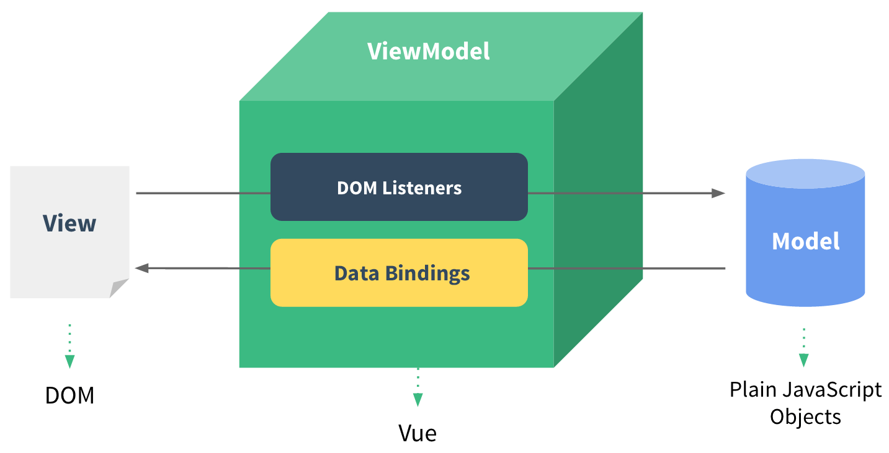
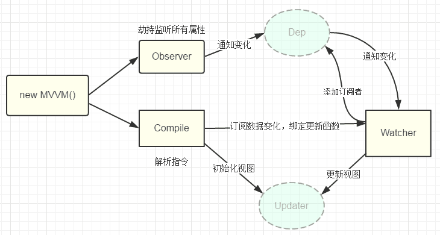
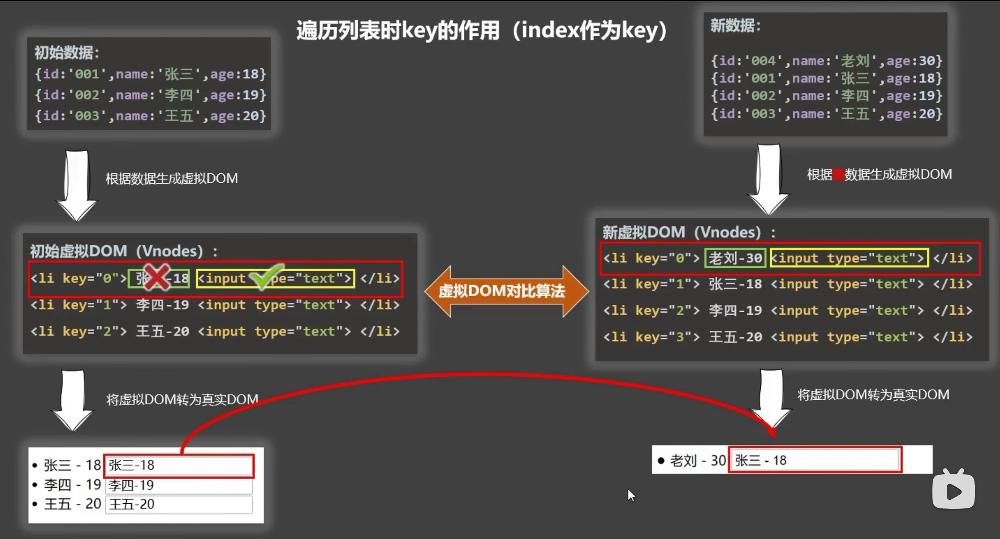
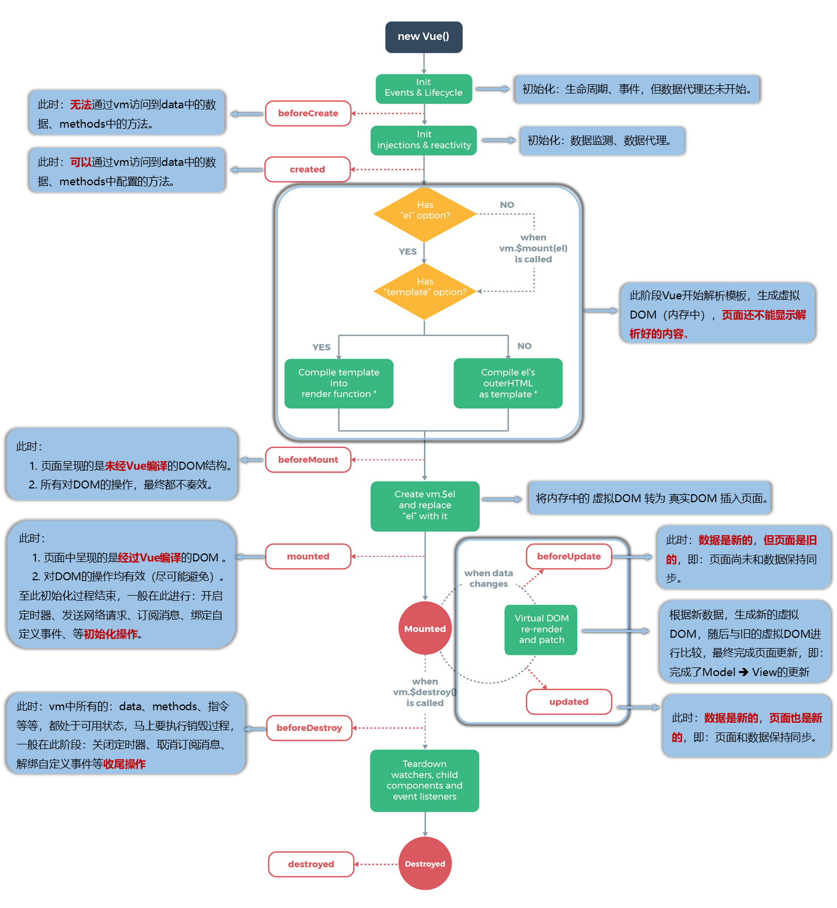
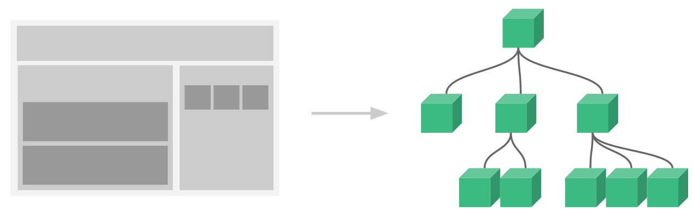
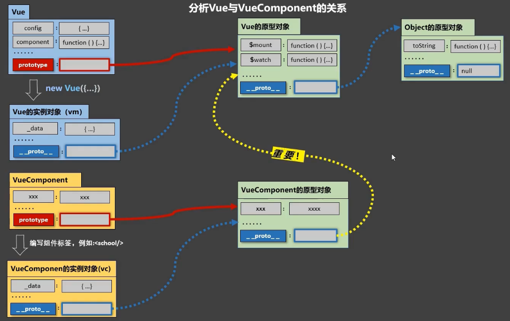

## 01 初识Vue

- 想让 Vue 工作，就必须创建一个 **Vue 实例（ViewModel，vm）**，且要传入一个配置对象；
- root 容器里的代码依然符合 HTML 规范，只不过混入了一些特殊的 Vue 语法；
- root 容器里的代码被称为 **Vue 模板**；
- Vue 实例和容器是一一对应的；
- 真实开发中只有一个 Vue 实例，并且会配合着组件（**Vue Components，vc）**一起使用；
- `{{ xxx }}` 中的 xxx 要写 **JS 表达式**，且 xxx 可以自动读取到 data 中的所有属性；
- 一旦 data 中的数据发生改变，那么页面中用到该数据的地方也会自动更新。

```javascript
// Vue 实例和 Vue 组件中常用的配置项（vm 和 vc 共有的）
// main.js 里面 new Vue 生成的叫做 vm；其他 .vue 文件中 export default 的都是 vc
new Vue ({
  // 1.数据
  data: function() { },  // 可简写为对象形式，但不推荐
  computed: { },  // 计算属性
  watch: { },  // 监视属性
  methods: { },  // 方法（函数）
  props: { },  // 接收父组件和路由传来的数据
  // 2.DOM
  el: '#app',  // 仅用于 new Vue 的 vm 中
  template: '<App/>',  // 一个字符串模板作为 Vue 实例的标识
  render: h => h(App),  // 字符串模板的替代方案
  renderError: { },  // 渲染失败时的输出
  // 3.生命周期钩子（回调函数，有省略）
  beforeCreate() { },
  created() { },  // 出现 $
  beforeMount() { },
  mounted() { },  // 出现 $el
  beforeUpdate() { },
  updated() { },
  activated() { },  // 当使用 keep-alive 缓存组件时会出现
  deactivated() { },  // 当使用 keep-alive 缓存组件时会出现
  beforeDestroy() { },
  destroyed() { },
  // 4.资源
  components: { },  // 组件
  directives: { },  // 指令
  filters: { },  // 过滤器
  mixins: { },   // 混合、混入
  // 5.其他
  name: '',  // 用在组件 vc 身上
  store: store,  // 当使用 Vue.use(Vuex) 后，就可以传入 store 配置项（vm 身上）
  router: router,  // 当使用 Vue.use(VueRouter) 后，就可以传入 router 配置项（vm 身上）
  beforeRouteEnter,  // 组件内守卫（进入守卫），vc 身上
  beforeRouteLeave,  // 组件内守卫（离开守卫），vc 身上
})
```

## 02 模板语法

写在  `<template>` 标签中的语法

### 2.1 插值语法

功能：用于解析标签体内容
写法：`{{ xxx }}`，xxx 是 **JS 表达式**，且可以直接读取到 data 中的所有属性

### 2.2 指令语法

功能：用于解析标签（包括：标签属性、标签体内容、绑定事件......）
举例：`v-bind:href="xxx"` 或 简写为 `:href="xxx"`，xxx 同样要写 **JS 表达式**，且可以直接读取到 data 中的所有属性

## 03 数据绑定

`v-bind` `v-model` `sync`

### 3.1 单向绑定 v-bind

* 数据只能从 data 流向页面，`v-bind:attr="xxx"` 可以简写成 `:attr="xxx"`
* 可以绑定其他属性，通常在属性前面加上冒号，这样属性等号后面的值就当作 **JS 表达式**来解析

### 3.2 双向绑定 v-model

* 数据不仅可以从 data 流向页面，也可以从页面流向 data，只能应用于**表单元素**；
* `v-model:value="xxx"` 可以简写为 `v-model="xxx"`，**默认收集的是 value 值**；
* label 标签为 input 元素定义标注（标记）；**它不会向用户呈现任何特殊效果**。不过，它为鼠标用户改进了可用性。如果您在 label 元素内点击文本，就会触发此控件。就是说，当用户选择该标签时，浏览器就会自动将焦点转到和标签相关的表单控件上；使用 for 属性指定表单控件的 id；
* 若 `<input type="text"/>`，则收集 value 值，用户的输入就是 value 值；
* 三个修饰符
  * `v-model.lazy` 失去焦点再收集数据；
  * `v-model.number` 输入字符串转为有效数字（整数，有加减号）；
  * `v-model.trim` 去除首尾空格。

```html
<!-- 收集表单数据 -->
<form>
  <label for="demo">账号</label>  <!-- 用lable之后，点击“账号”也可以使输入框获取焦点 -->
  <input type="text" id="demo" v-model.trim="userInfo.account">  <!-- trim去掉前后的空格 -->
  密码：<input type="password" v-model="userInfo.password">
  年龄：<input type="number" v-model.number="userInfo.age">  <!-- 字符串转数字 -->
  
  性别：  <!-- 单选，需配置相同的name属性，收集value值 -->
  男<input type="radio" name="sex" v-model="userInfo.sex" value="male">
  女<input type="radio" name="sex" v-model="userInfo.sex" value="female">
  
  <!-- 多选，如果没有value属性，或有value属性，但是v-model初始值不是数组，则收集是否选择的布尔值；如果配置了value属性，且v-model初始值为数组，则收集value组成的数组-->
  爱好：
  学习<input type="checkbox" v-model="userInfo.hobby" value="study">
  打游戏<input type="checkbox" v-model="userInfo.hobby" value="game">
  吃饭<input type="checkbox" v-model="userInfo.hobby" value="eat">
  
  所属校区
  <select v-model="userInfo.city">
    <option value="">请选择校区</option>
    <option value="beijing">北京</option>
    <option value="shanghai">上海</option>
    <option value="shenzhen">深圳</option>
    <option value="wuhan">武汉</option>
  </select>
  其他信息：
  <textarea v-model.lazy="userInfo.other"></textarea>
</form>
<script>
  userInfo: {
    account: '',
    password: '',
    age: 18,
    sex: 'female',
    hobby: [],
    city: 'beijing',
    other: '',
}</script>
```

### 3.3 sync 修饰符

* sync 修饰符可以实现类似 v-model 的双向绑定，因为一个组件只能有一个 v-model，而且 props 的数据是不可以修改的，所以需要双向绑定 props 的数据或其他数据的时候，可以用 sync 修饰符。它也是组件通信方式的一种；
* `:money.sync` 表示父组件通过 props 给子组件传递一个数据 `money`，同时给当前子组件绑定一个自定义事件`update:money`

```html
<child :show="show" @update:show="show=$event"></child>
<!-- 等价于 -->
<child :show.sync="show"></child>

<!-- 注意：子组件中触发自定义事件的形式必须类似如下 -->
<script>
	this.$emit("update:show", !this.show)
</script>
```

#### element 中 sync 的使用

因为 el-dialog 也是一个组件，需要将 visible 这个属性值传递给 el-dialog，在 el-dialog 组件中也有改变 visible 属性值的方法，为了父组件能接收到，所以用了 sync 修饰符

```vue
<template>
	<el-button @click="dialogTableVisible=true">点击显示对话框</el-button>
	<el-dialog :visible.sync="dialogTableVisible"></el-dialog>
</template>
<script>
	export default {
    data() { return { dialogTableVisible: false; }}
  }
</script>
```

## 04 el 与 data 的两种写法

### 4.1 el 的写法

```javascript
// 方法1
new Vue({
  el: '#root',  // new Vue时配置el属性
  ...
})

// 方法2
const vm = new Vue( { ... } )
vm.$mount('#root')  // 创建 Vue 实例 vm，使用 vm.$mount('#root')，这是 Vue 原型身上的方法
```

### 4.2 data 的写法

组件中的 data 必须写成函数式，定义组件时会通过 `Vue.extend()` 生成组件实例，每次都返回一个全新的 VueComponent ；**如果采用对象的方式，一个组件在复用的时候，data 都指向同一个对象地址，改变一处会影响其他处**；而采用函数返回的对象地址是不同的，则不会产生污染。

```javascript
new Vue ({
  // 对象式，vue3 中已被废弃
  data: {
  	name: '尚硅谷'
	},

  // 函数式（推荐使用）
  data: function() { return { name: '尚硅谷' } },
  // 简写
  data() { }
})

```

由 Vue 管理的函数，一定不要写箭头函数，一旦写了箭头函数，this 就不再是 Vue 实例了

## 05 数据代理和数据劫持

### 5.1 MVVM 模型

 

M：模型 (Model) ：data 中的数据；
V：视图 (View) ：模板代码，即 template 标签中的内容；
VM：视图模型 (ViewModel)：Vue 实例对象

* data 中所有的属性，最后都出现在了 vm 身上
* vm 身上所有的属性及 Vue 原型上所有属性，在 Vue 模板中都可以直接使用

### 5.2 Object.defineProperty

* 给对象添加属性，直接用 “=” 添加的时候，添加的属性是不可以枚举的；
* 使用 JS 实现**给对象添加或修改属性**：`Object.defineProperty(obj, prop, 属性描述符descriptor)`；
*  可以添加 getter 和 setter 以实现响应式

```javascript
// Vue 响应式原理
let number = 18
Object.defineProperty(person, 'age', {
  value: 18,
  enumerable: true,  // 控制属性是否可以枚举，默认值是false
  writable: true,  // 控制属性是否可以被修改，默认值是false
  configurable: true  // 控制属性是否可以被删除，默认值是false
  // 当有人读取person的age属性时，get函数(getter)就会被调用，且返回值就是age的值
  // get:function(){}  完整形式
  get(){  // 收集依赖
    console.log('有人读取age属性了')
    return number  // 上面不配置 value 时才能使用 getter
  },
  // 当有人修改person的age属性时，set函数(setter)就会被调用，且会收到修改的具体值
  set(value){  // 通知依赖变更UI
    console.log('有人修改了age属性，且值是', value)
    number = value
  }
})
```

### 5.3 数据代理

* 数据代理：通过一个对象 B 代理对另一个对象 A 中属性的操作，给对象 B 添加对象 A 的属性即可；
* Vue 中的数据代理：通过 vm 对象来代理 `vm._data` 对象中属性的操作，添加了getter 和 setter；
*  `vm._data` 中的数据来自于 data 配置项，也运用到了数据代理，添加了getter 和 setter，相当于 `vm._data` 和 vm 中都有 data 中数据的 getter 和 setter。


### 5.4 数据劫持(监听)

**Vue 监测对象中数据的改变**

1. 加工 data 对象中的数据，添加 getter 和 setter，在 setter 中加入重新解析模板操作；通过一个 Observer 劫持 data 中的数据并发送给 `vm._data`；Obeserver 的目的是将普通的数据转换成带有 getter 和 setter 的数据；

2. 将加工后的数据给 `vm._data`；
3. 使用数据代理，把 `vm._data` 下的数据给到 vm。

```javascript
let data = { name:'尚硅谷', address:'北京' }
// Vue数据劫持的基本原理（实现响应式）
// 创建一个构造函数，逻辑写在构造函数中
// Observer复制了 data 的所有数据，并添加了 getter 和 setter
function Observer(obj){
  // 汇总对象中所有的属性形成一个数组
  const keys = Object.keys(obj)
  // 遍历属性，添加 getter 和 setter
  keys.forEach((k)=>{
    Object.defineProperty(this, k, {  // this 是 obs，用于监视的实例对象
      get() { return obj[k] },
      set(val) { obj[k] = val }  // 在setter中触发重新解析模板操作
    })
  })
  // 每个 Observer 实例中都有一个 Dep
}

// 创建一个监视的实例对象，用于监视 data 中属性的变化
const obs = new Observer(data)  // 订阅者

// 观察者 obs 上具有 data 的所有属性和对应的 getter 和 setter；将 obs 赋给 data 和 vm._data
let vm = { }
vm._data = data = obs
```

> 总结：Vue 先劫持 data 对象，添加 getter 和 setter，并在 setter 中调用重新解析模板的操作（每个 setter 中有一个 watcher）；之后将劫持的数据赋给 `vm._data` 对象；然后使用数据代理，将数据赋给 vm 对象做代理，这样就可以直接在 vm 身上拿到 data 中的数据了。

#### Vue.set

* 如果初始化时 vm 的 data 里面没有的属性，需要增加时，要调用 Vue.set，不能直接使用 `vm._data` 添加，不然会没有 getter 和 setter；也可以用于修改数组元素，也会触发响应式
* 但是注意：**不能使用此方法往 vm 和 vm.data 中添加属性**，只能往其下一层添加

```javascript
// Vue.set(target, key, val) or vm$set(target, key, val)
Vue.set(vm._data.student, 'sex', '男')
vm$set(vm.student, 'sex', '男')
```

#### Vue 监测数组中数据的改变

* Vue 没有为 data 中**数组**里面的元素匹配 getter 和 setter，所以通过索引修改数组中的元素时，无法触发响应式；
* 只有调用这 7 个数组身上的方法，才能触发响应式 `[push, pop, shift, unshift, splice, sort, reverse]`，Vue 对这 7 个方法进行了包装。或者直接使用 Vue.set 方法。

### 5.5 双向绑定原理(不好说)

发布者-订阅者模式

1. `new Vue()` 首先执行初始化，对 `data` 执行响应化处理，这个过程发生 `Observe` 中；
2. 同时对模板执行编译，找到其中动态绑定的数据，从 `data` 中获取并初始化视图，这个过程发生在 `Compile` 中；
3. 同时定义⼀个更新函数和 `Watcher` ，将来对应数据变化时 `Watcher` 会调用更新函数；
4. 由于 `data` 的某个 `key` 在⼀个视图中可能出现多次，所以每个 `key` 都需要⼀个管家 `Dep` 来管理多个 `Watcher`；
5. 将来 data 中数据⼀旦发生变化，会首先找到对应的 `Dep`，通知所有 `Watcher` 执行更新函数；



## 06 事件处理 v-on @

### 6.1 事件的基本使用

- 在 HTML 标签中，使用 `v-on:xxx` 或 `@xxx` 绑定事件，其中 xxx 是事件名；
- 事件的回调函数需要写在 methods 对象中（不能用箭头函数，否则 this 指向就不是 vm 或 vc）；
- 事件的回调函数默认会传入**事件对象**，比如点击事件对象，是第一个参数；
- 事件函数调用传参使用 `$event` 占位，这样就不会丢失默认传入的 event 参数；
- 在组件标签中，默认绑定的是自定义事件，如果要使用原生 DOM 事件，需要加 `.native` 修饰符

```javascript
@click = "showInfo($event, 66)"
// 调用方法 func 括号可加可不加
showInfo(e, num) { console.log(e, num) }
```

### 6.2 事件修饰符

```javascript
@click.prevent="func"  // 阻止默认事件 如阻止链接自动跳转
@click.stop= "func"    // 阻止事件冒泡 当内外标签绑定相同事件时，触发内部标签不会同时触发外部标签
@click.once= "func"    // 事件只触发一次
@click.capture= "func" // 使用事件的捕获模式 先外层标签，再内层标签，与冒泡相反
@click.self= "func"    // 当event.target是当前操作元素时才出发操作  仅作用于绑定事件的标签，点击其内部标签无作用
@click.passive= "func" // 事件的默认行为立即执行 无需等待事件的回调函数执行完毕（有可能事件回调执行时间很长）
// 事件修饰符可以连续写
```

### 6.3 键盘事件

```javascript
@keydown
@keyup
@keyup.enter.native="login" // enter键抬起时触发登录
```

## 07 计算属性 computed

* `computed` 计算属性应写成对象的形式，**包含 get 和 set 两个方法**；当**读取**计算属性时，get 方法就会被调用，且返回值就作为计算属性的值；当**修改**计算属性时，set 方法就会被调用；
* 计算属性依赖 return 实现功能；
* 计算属性简写：当只读不改时，计算属性可简写为一个函数。

```javascript
new Vue({
  computed: {
    fullName: {
      // 读取计算属性
      // get 在初次读取 fullName 的值和所依赖的数据发生变化时被调用
      get() { return this.firstName + '-' + this.lastName },
      // 修改计算属性
      set(value) {
        const arr = value.split('-')
        this.firstName = arr[0]
        this.lastName = arr[1]
      }
    }
	},
  // 简写（只读不改）
  computed: {
    fullName() { return this.firstName + '-' + this.lastName }
  }
})

```

* 要用的属性不存在，要通过已有的属性计算得来，就使用计算属性；
* 与 methods 实现相比，计算属性内部有**缓存机制**（复用），效率更高，调试方便；
* **计算属性最终会出现在 vm 上**，直接读取使用即可；
* 把计算属性当作一个快照，不要修改计算属性的返回值；
* 被 Vue 管理的函数，最好写成普通函数，这样 this 的指向才是 vm 或 vc；
* 不被 Vue 所管理的函数（定时器的回调函数、ajax 的回调函数、Promise 的回调函数等），最好写成箭头函数。

## 08 监视属性 watch

- **当被监视的属性变化时， 回调函数自动调用， 进行相关操作**；
- 监视的属性必须存在，才能进行监视；
- 两种写法：new Vue 时传入 watch 配置项；或者用 `vm.$watch`；
- `immediate: true` 表示初始化时调用一下；
- 配置 `deep: true` 表示深度监视，检测对象内部多层的变化；Vue 中的 watch 默认不监测对象内部值的改变（一层）；
- 当只需要 handler 时，可简写为 handler 函数形式，传入形参 newValue 和 oldValue；**只传一个形参时，就是 newValue**；
- computed 能完成的功能，watch 都可以完成；
- watch 能完成的功能，computed 不一定能完成，例如：watch 可以进行**异步操作**。计算属性 computed 靠的是 return 的返回值来实现功能，无法做到异步生成返回值；而 watch 不依赖返回值，用的是 handler 函数；
- watch 不缓存；

```vue
<script>
  new Vue({
    watch: {
      isHot: {
        immediate: true,  // 初始化时让handler调用一下
        deep: true,  // 深度监视
        handler(newValue, oldValue) {
          console.log('isHot被修改了', newValue, oldValue)
        },
      }
    },
    // 简写
    watch: {
      isHot(newValue, oldValue) {
        console.log('isHot被修改了', newValue, oldValue, this)
      }
    },
  })
  
  vm.$watch("firstName", {
    function(val) {
      // 这里必须用箭头函数，因为定时器是 JS 引擎控制的，这个函数不是 Vue 管理的
      setTimeout(() => { this.fullName = val + '-' + this,lastName })
    }
  })
</script>
```

## 09 绑定样式

使用 `v-bind` 单向绑定

### 9.1 绑定 class 样式

```javascript
:class="mood"     // 字符串写法，适用于样式的类名不确定，需要动态指定
:class="classArr" // 数组写法，适用于样式的个数不确定，类名也不确定
:class="classObj" // 对象写法，适用于样式的个数确定，类名确定，但需要动态决定用不用

data: {
  mood: 'normal',
  classArr: ['style1', 'style2', 'style3'],
  classObj: {
    style1: false,
    style2: false,
  }
}
```

### 9.2 绑定 style 样式

```javascript
:style="styleObj"  // 对象写法
:style="styleArr"  // 数组写法

data: {
  styleObj: { fontSize: '40px', color: 'red', },
  styleArr: [
    { fontSize: '40px', color: 'blue', },
    { backgroundColor: 'gray' }
  ]
}
```

## 10 条件渲染 v-if v-show

- `v-if="xxx"` 当表达式为 false 时，不展示的 DOM 元素直接被**移除**，适用于切换频率较低的场景（管理系统的权限列表）；配合 `v-else` 使用；
- `v-show="xxx"` 当表达式为 false 时，不展示的 DOM 元素隐藏，`display: none` 适用于切换频率较高的场景（前台页面的数据展示）；
- xxx 表示的是一个表达式，可以求出一个值，判断这个值是 true 或 false，当他们的表达式为 true 时则显示；
- `v-if` 一般和 `template` 搭配使用，在一个 `template` 标签中使用 `v-if`；因为 `template`标签不影响结构，在解析时会被移除；

> 当 v-for 和 v-if 同时使用的时候，v-for 的优先级更高，会导致 v-if 重复运行在每个 for 循环中，会重复操作 DOM。（vue3 中 v-if 优先级更高）
>
> 1. 如果循环内部没有条件判断，则用 template 标签包裹 v-for，在外面进行 v-if 判断；
>
> 2. 如果循环内部有条件判断，则**用计算属性提前过滤掉不需要显示的项（就不需要 v-if 了）**

## 11 列表渲染 v-for

### 11.1 列表渲染

遍历数组 `v-for="(item, index) in items" :key="item.id"`（推荐用 `item.id` 作为 `key` ）
遍历对象 `v-for="(val, key) in items` 拿到的分别是对象的 value 和 key

* 可省略数组的 index 或者对象的 key，这样拿到的就是 item 或者 val；
* 使用 v-for 时一定要加 `:key`；
* v-for 可应用在数组、对象、字符串。

**`key` 的重要性**

 

* key 是 Vue 内部在用，不会出现在 DOM 结构上；
* key 是虚拟 DOM 对象的标识，当数据发生变化时，Vue 会根据【新数据】生成【新的虚拟 DOM】，随后 Vue 进行【新虚拟 DOM】与【旧虚拟 DOM】的差异比较；
* **对比规则：**
  * 旧虚拟 DOM 中找到了与新虚拟 DOM 相同的 key
    * 若虚拟 DOM 中节点内容没变, 直接使用之前的真实 DOM
    * 若虚拟 DOM 中节点内容变了, 则生成新的真实 DOM，随后替换掉页面中之前的真实 DOM
  * 旧虚拟 DOM 中未找到与新虚拟 DOM 相同的 key
    * 创建新的真实 DOM，随后渲染到到页面

### 11.2 列表过滤 filter

```javascript
new Vue ({
  data: {
    // 1.data 中配置 keyWord 和 filPersons 数组
    keyWord: '',  // 关键词
    filPersons: [ ],  // 用一个新数组接收过滤后的数组（监视属性用）
    persons: [ ]  // 原数组
  },
  // 1. watch 监视属性写法
  watch: {
    keyWord: {
      immediate: true,  // 对起始的空字符串进行一次过滤，展示整个数组
      handler(val){  // 只传一个参数表示变化后的 newValue
        this.filPerons = this.persons.filter((p)=>{
          return p.name.indexOf(val) !== -1  // 字符串中 indexOf 空字符串，结果是 0
        })
      }
  	}        
  },
  // 2. computed 计算属性写法（推荐）
  computed: {
    filPerons() {
      return this.persons.filter(p => p.name.indexOf(this.keyWord) !== -1 )
    }
  }
})
```

## 12 过滤器 filters

对要显示的数据进行特定格式化后再显示（适用于一些简单逻辑的处理），本质上是一个函数

- 注册过滤器（局部或全局）
  - 局部过滤器：在创建 vm 时传入 `filters` 配置项；
  - 全局过滤器：`Vue.filter(filterName, callback)`

- 使用过滤器：`{{ xxx | 过滤器名 }}` 或 `v-bind: 属性 = "xxx | 过滤器名"`
- **callback 函数默认传入第一个参数是需要过滤的数据的 `value`**，上面的 xxx 是需要过滤的数据

```html
<script type="text/javascript">
  // 全局过滤器（写在 Vue 实例之前）
  Vue.filter('mySlice', function (value) {
    return value.slice(0, 4)  // 截取前四位
  })

  new Vue({
    // 局部过滤器（本质是一个函数）
    filters: {
      timeFormater(value, str = 'YYYY年MM月DD日 HH:mm:ss') {  // str 传一个形参默认值
        return dayjs(value).format(str)
      }
    }
  })
</script>
```

## 13 其他指令

* `v-text` 向所在节点渲染文本内容，会直接替换掉标签中的内容，不解析标签；
* `v-html` 向所在节点渲染包含html结构的内容，但是有安全性问题；
* `v-cloak` 是一个特殊属性，没有值；当 Vue 实例创建完毕接管容器后，会删掉该属性，配合 css（属性选择器）使用解决网速过慢时展示出未经解析模板的问题（给带有 v-cloak 属性的节点设置 `display: none`），这样在 Vue 实例创建完毕之前，带有 v-cloak 的节点不会显示；接管完毕之后，v-cloak 属性被删除，就可以显示了；
* `v-once` 所在节点初次动态渲染后，就视为静态内容，以后数据的改变不会引起所在结构的更新；
* `v-pre` 让 Vue 跳过其所在节点的编译过程，跳过没有指令语法和插值语法的节点，加快编译过程。

## 14 自定义指令 directives

`bind` `inserted` `update`

自定义指令可以**简写成函数形式**，完整形式要写成对象（可用于权限控制）

* 第一个形参是真实的 **DOM 元素** `<span></span>`
* 第二个形参是绑定的元素对象，我们需要用到其 value 值 `binding.value = n`

* 定义一个 v-big 指令，和 v-text 功能类似，但会把绑定的数值放大 10 倍
* 定义一个 v-fbind 指令，和 v-bind 功能类似，但可以让其所绑定的 input 元素默认获取焦点
* 如果想在不同的时机调用不同的函数，就要写成对象式

```vue
<h2> 放大10倍后的n值是：<span v-big="n"></span> </h2>
<input type="text" v-fbind:value="n">

<script>
  // 定义全局指令(对象式)
  Vue.directive('fbind', {
    bind(element, binding){  // 指令与元素成功绑定时（一上来）被调用
      element.value = binding.value
    },
    inserted(element, binding){  // 指令所在元素被插入页面时被调用
      element.focus()
    },
    update(element, binding){  // 指令所在的模板被重新解析时被调用
      element.value = binding.value
    }
  })
  new Vue({
    // 定义局部指令(函数式简写)
    directives: {
    	big(element, binding) {  // 第一个形参：真实 DOM 元素；第二个形参：绑定元素对象
      	element.innerText = binding.value * 10  // 原生 DOM 操作
    	},
  	}
  })
</script>
```

## 15 生命周期

 

- 生命周期回调函数、生命周期函数、生命周期钩子，是 Vue 在关键时刻帮我们调用的一些特殊名称的函数；生命周期函数中的 this 指向是 vm 或组件实例对象 vc；
- `mounted` Vue 完成模板的解析并把初始的真实 DOM 元素放入页面后（挂载完毕）调用；发送 ajax 请求、启动定时器、绑定自定义事件、订阅消息等**初始化操作**；
- `beforeUpdated` 页面和数据未同步；
- `beforeDestroy` 清除定时器、解绑自定义事件、取消订阅消息等**收尾工作**，对数据的修改不会再更新了；
- 另外还有三个生命周期 `activated`  `deactivated` `nextTick`；
- `vm.$el` 存储着 Vue 解析后的真实 DOM；
- 放在 `mounted` 中的请求有可能导致页面闪动（因为此时页面 DOM 结构已经生成），但如果在页面加载前完成请求，则不会出现此情况。建议对页面内容的改动放在 `created` 生命周期当中。

## 16 组件

组件：实现应用中局部功能代码和资源的集合，在 Vue 中组件的本质是一个 VueComponent 构造函数，在书写组件标签时，Vue 会帮我们调用该构造函数，生成一个组件实例对象 vc，每个 vc 就是一个组件。

### 16.1 非单文件组件

 

* 什么是组件：**实现应用中局部功能代码和资源的集合**；组件就是把图形、非图形的各种逻辑均抽象为一个统一的概念（组件）来实现开发的模式，在 Vue 中每一个 `.vue` 文件都可以视为一个组件；
* 组件化的优点：复用代码，简化项目编码，提高效率；
* **Vue 中的组件本质是一个构造函数；**

**01 定义（创建）组件**

- `Vue.extend({ options })` 创建一个**构造函数**（options 对象表示配置项，如 data、methods、template 等，和 new Vue 时传入的配置项几乎相同）；
- 不写 el ，最后由一个 vm 统一管理并挂载；data 写成函数，避免组件复用时数据间引用关系；
- 利用 template 配置项创建内容，里面用模板字符串插入 HTML 结构；
- 可以简写为 `const school = { options }` ；**Vue.extend 可省略**；
- name 属性用于定义在开发者工具中的名称，给程序员看的。

**02 注册组件**

- 全局注册 `Vue.component('组件名', 定义的组件对象)`
- 局部注册 `new Vue({ components: { 组件名: 定义的组件对象 } })`
- 注意：注册组件时的组件名是应用在**使用组件**时，不是显示在开发者工具中的，是给代码看的；但如果定义组件时没有传入 name 配置项，那么开发者工具中展示的就是现在这个组件名

**03 使用组件**

- 编写组件标签（注册组件时的组件名）即可，如 `<student></student>`；在脚手架环境中使用自闭和标签即可。

```html
<!-- 第三步：使用组件 -->
<hello></hello>

<!-- 第一步：创建hello组件 -->
<script>
  const hello = Vue.extend({
    name: 'hello',
    template: `<div><h2>你好啊！{{ name }}</h2></div>`,
    data() {
      return { name: 'Tom' }
    }
  })
  
  // 第二步：全局注册组件
  Vue.component('hello', hello)  // 前面一个hello是注册时的组件名，用它来写组件标签
  new Vue({
    ...,
    components:{ helle: hello },  // 局部注册
  })
</script>
```

**组件名写法建议**

* 一个单词：建议首字母大写，与开发者工具呼应；
* 多个单词：建议 CamelCase 写法，每个单词首字母大写 MySchool（仅限脚手架中使用）；
* 可以使用 name 配置项指定组件在开发者工具中呈现的名字；如果不用 name 配置项，则开发者工具中展示的是组件注册时的名字；
* 单文件组件中组件文件名建议与组件名一致。

### 16.2 VueComponent

`const hello = Vue.extend({ })`

* hello 组件本质上是一个名为 VueComponent 的 `构造函数`，且不是程序员定义的，是 Vue.extend 生成的；
* 我们只需要写 `<hello/>`，Vue 解析时会帮我们创建 hello 组件的实例对象，即 Vue 帮我们执行的：`new VueComponent(options)`;
* 每次调用 Vue.extend，返回的都是一个全新的 VueComponent；
* Vue 的实例对象，简称 vm；VueComponent 的实例对象，简称 vc（组件实例对象）；
* **组件配置中**，data 函数、methods 中的函数、watch 中的函数、computed 中的函数 它们的 this 均是【VueComponent实例对象 vc】；
* **new Vue(options) 配置中**，data 函数、methods 中的函数、watch 中的函数、computed 中的函数 它们的 this 均是【Vue 实例对象 vm】

 

> `Vue.prototype === VueComponent.prototype.__proto__`
>
> 让组件实例对象（vc）可以访问到 Vue原型上的属性、方法（$mount 等）

* `const d = new Demo()`
* 构造函数 `Demo` 具有 `prototype` 属性，指向自己的原型对象；（显式原型属性）
* `Demo` 的实例对象 `d` 具有 `__proto__` 属性，指向自己的原型对象；（隐式原型属性）
* `Demo.prototype == d.__proto__`

### 16.3 单文件组件

**在 index.html 里面只写了一个 id 为 app 的容器**

```javascript
// main.js 程序入口文件
import Vue from 'vue'  // 引入 Vue（使用 ES6 的模块化语法替代了在 HTML 的 src 属性中引入 vue）
import App from './App.vue'  // 引入根组件

new Vue({  // 创建 vm
  // template: `<App></App>`,  // 相当于在容器里面写 <App></App>
  // components: { App },  // 注册根组件
  render: h => h(App),  // 使用 render 代替以上两行，即将 App 组件渲染到 HTML 结构中
}).$mount('#app')  // 挂载到容器中（指明挂载的容器）
```

```vue
<!-- 根组件 App.vue -->
<template>
  <div>
    <School></School>  <!-- 使用组件 -->
    <Student></Student>
  </div>
</template>

<script>
  import School from "./School.vue";  // 引入组件
  import Student from "./Student.vue";

  export default {  // 这里实际上调用了 Vue.extend，生成了根组件实例 vc
    name: "App",  // 根组件
    components: { School, Student },  // 注册组件
  };
</script>
```
