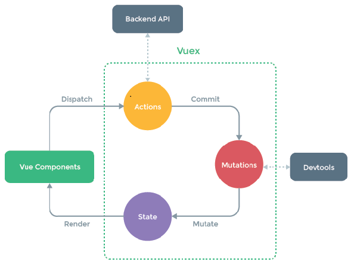

## 01 Vue 脚手架

CLI Command Line Interface 命令行接口工具

### 1.1 Vue 脚手架基础

```c
├── node_modules                 // 项目依赖包
├── public                       // 静态资源
│   ├── favicon.ico              // 页签图标
│   └── index.html               // 主页面
├── src：源代码
│   │── api                      // 关于 ajax 请求
│   │   ├── index.js             // 统一管理 api 接口
│   │   └── request.js           // 二次封装的 axios
│   ├── assets                   // 多个组件共用的静态资源（主题、字体）
│   │   └── logo.png
│   │── components               // 非路由组件(全局组件)
│   │   └── Header
│   │		├── index.vue
│   │		└── images
│   ├── directive                // 全局指令
│   ├── filters                  // 全局 filter
│   ├── icons                    // 项目所有 svg icons
│   ├── lang                     // 国际化 language
│   ├── mock                     // 项目 mock 模拟数据
│   │── pages                    // 路由组件
│   │── router                   // 路由配置文件（重写 axios）
│   │── store                    // Vuex 插件，状态管理库
│   │── styles                   // Vuex 插件，状态管理库
│   │── App.vue                  // 入口页面，唯一的根组件
│   │── main.js                  // 程序入口文件
│   │── permission.js            // 权限管理
├── .gitignore                   // git 版本管制忽略的配置
├── babel.config.js              // babel 的配置文件(语法翻译官)
├── package.json                 // 应用包配置文件(项目身份证，记录项目信息)
├── package-lock.json            // 包版本控制文件
├── vue.config.js                // Vue 脚手架的配置文件
└── jsconfig.json                // src 文件夹配置别名
```

### 1.2 关于不同版本的 Vue

- vue.js 与 vue.runtime.xxx.js 的区别：
    - vue.js 是完整版的 Vue，包含：核心功能 + 模板解析器；
    - vue.runtime.xxx.js 是运行版的 Vue，只包含：核心功能；没有模板解析器。
- 因为 vue.runtime.xxx.js 没有模板解析器，所以不能使用 template 这个配置项，需要使用 render 函数接收到的 createElement 函数去指定具体内容
- 模板解析器仅在开发时使用，webpack 打包后就不需要了

### 1.3 vue.config.js 配置文件

- 使用 `vue inspect > output.js` 可以查看到 Vue 脚手架的**默认配置**，比如 webpack 的那些配置。关于 webpack 的配置默认是隐藏的，如果要修改，使用 `vue.config.js`，修改后的配置会覆盖默认的配置；
- 使用 `vue.config.js` 可以对脚手架进行个性化定制，详情见：https://cli.vuejs.org/zh

```javascript
// vue.config.js 文件
const { defineConfig } = require('@vue/cli-service')  // CommonJS 模块化语法
module.exports = defineConfig({
  transpileDependencies: true,
  lintOnSave: false,  // 关闭语法检查
  pages: {
  	index: { entry: './src/main.js' }  // 入口文件
	}
})

// 也可直接写成
module.exports = {
  lintOnSave: false
}
```

### 1.4 操作流程

`-g` 是全局安装，会安装在C盘的某个位置；不加 -g 就是本地安装，安装在 node_modules 文件夹中

* 安装 Node.js
* 安装 Vue `npm install vue -g` 查看 Vue 版本 `npm list vue -g`
* 安装 Vue 脚手架 `npm install @vue/cli -g` 查看 Vue 脚手架版本 `vue -V`
* 安装 webpack `npm install webpack -g` 查看 webpack 版本 `webpack -v`
* 初始化脚手架 `vue create app` 创建工程
* 运行项目 `npm run serve`
* 浏览器不识别 less 样式，需要处理 `npm install less less-loader` `lang="less"`
* 安装 vue-router `npm install vue-router`
* 安装 axios `npm install --save axios`

### 1.5 其他

* 配置镜像 `npm config set registry http...`
* `index.html` 中 `<%= BASE_URL %>` 表示 public 文件夹；
* `<noscript>` 当浏览器不支持 JS 时 noscript 中的元素就会被渲染；
* `render` 配置项是用来代替 `template` 的，使用运行时 Vue 的时候无法使用 template
* render 是 Vue 帮忙调用的函数，接受的参数为一个函数 createElement

```javascript
render(createElement) {
  return createElement('h1', '你好')
}

// 精简
render: h => h(App)  // h 函数的第一个参数是 HTML 元素或组件，第二个参数是内容，组件不需要内容
```

## 02 ref 属性

- 功能：给元素或子组件注册引用信息（id 的替代者）；
- HTML 标签元素：使用 id 和 ref 属性，没有太大区别，获取的都是真实 DOM 元素；
- 组件标签：使用 id 获得的是组件的完整 DOM 结构，而使用 ref 获得的是组件实例对象；
- 使用方式：
    - 打标识：```<h1 ref="xxx">...</h1>``` 或 ```<School ref="xxx"></School>```
    - 获取：```this.$refs.xxx```

## 03 props 配置项

- 功能：让组件接收外部传过来的数据，父组件给子组件传数据（数据或方法）；

- 传递数据（父组件）：**数据**或**方法**写在**子组件标签**中；

- 接收数据（子组件）：在子组件中使用 `props` 配置项接收数据，有三种接收方式；

- props 是只读的，Vue 底层会监测你对 props 的修改，如果进行了修改，就会发出警告，若业务需求确实需要修改，请复制 props 的内容到 data 中一份，然后去修改 data 中的数据；

- **先读取 props 里面的数据，再处理 data 里面的数据**，props 中的数据会被代理到 vc 身上，可直接用插值语法访问，和 data 中的数据一样；

- props 传递数据时如果子组件不声明接收，数据会出现在 `vc.$attrs` 身上；如果声明接收了，`vc.$attrs` 身上就没有了，直接出现在 vc 身上了；

- `$listeners` 可以获取到父组件给子组件传递的自定义事件

```javascript
/******************** 父组件（传递数据） ********************/
<Student name="李四" sex="女" :age="18" :checkTodo="checkTodo"/>
// 数据或方法写在子组件标签中，可以直接写值，或加上冒号后写表达式或方法名

/******************** 子组件（接收数据） ********************/
// 方法1：直接收数据
props: ['name', 'sex', 'age', 'checkTodo']

// 方法2：限制类型（不会进行类型转换，只会在控制台报错）
props: { name: String, sex: String, age: Number }

// 方法3：完整写法
props: {
  name: {
    type: String, // 限制类型
    required: true, // 限制必要性
    default: '老王' // 指定默认值（不传的时候）
  }
}
```

```html
<a :title="title">
	<el-button v-bind="$attrs" v-on="$listeners"></el-button>
</a>
```

`$children`  `$parent`

### 3.1 依赖注入

但是 props 只能逐层传递，当需要跨越多层传递的时候比较麻烦，可以用**依赖注入**；写在组件配置对象中

```javascript
// 祖先，发送数据
export default {
  provide: {
    message: 'hello!'
  }
}

// 后代，接收数据
export default {
  inject: ['message'],  // 注入会在组件自身的状态之前被解析，因此你可以在 data() 中访问到注入的属性
	data() {  
    return { fullMessage: this.message }
  }
}
```

## 04 mixins 配置项（混入）

* 功能：把多个组件共用的配置 options 提取成一个混入对象；`mixin`（混入），提供了一种非常灵活的方式，来分发 `Vue` 组件中的可复用功能；
* 当组件自身的数据方法和混入中的数据方法冲突时，以组件自身为主；生命周期函数发生冲突时，先执行混入中的函数，再执行组件自身的生命周期函数。

```javascript
// 1.定义混入：在一个新的 mixin.js 文件中写
// 混入对象文件里面所写的配置和 Vue 组件身上的配置项相同，包括 data、methods、mounted 等
export const hunhe = {  // 分别暴露，可以有多个 hunhe，都需要挨个暴露
  data() { ... },
  methods: { ... },
  ...
}

// 2.使用混入
// 2.1 全局混入（所有的组件都拥有混入文件里面所写的配置项）【在 main.js 中引入和注册】
import { hunhe, hunhe2 } from './mixin'  // 全局引入
Vue.mixin(hunhe)  // 全局注册（只有main.js中有Vue这个构造函数，组件中没有）

// 2.2 局部混入【在School.vue组件中引入并注册混入】
import { hunhe, hunhe2 } from '../mixin'  // 局部引入
export default {
  mixins: [ hunhe, hunhe2 ],  // 局部注册
  ...
}
```

## 05 插件

- 功能：插件是用于增强 Vue 功能的，本质是包含 install 方法的一个对象，**该方法的第一个参数是 Vue 构造函数，第二个以后的参数是插件使用者传递的数据**。插件通常用来为 Vue 添加**全局功能**；
- 插件比混入功能更加强大，因为插件传入了 Vue 构造函数作为参数，插件中可以包含混入。

```javascript
// 1.定义插件：在一个新的 plugin.js 文件中写
Object.install = function (Vue, 形参) {
  // 添加全局过滤器
  Vue.filter('filterName', function() { } )
  // 添加全局指令
  Vue.directive(....)
  // 添加全局混入
  Vue.mixin(....)
  // 添加方法或属性（加在 Vue 原型对象上了，vm 和 vc 都可使用）
  Vue.prototype.$myMethod = function () { ... }
  Vue.prototype.$myProperty = xxxx
}
  
// 简写，更常用的写法 plugin.js
export default {
  install(Vue, 形参) { }
}
    
// 2.引入插件【main.js】
import plugins from './plugins'
  
// 3.应用插件（全局可用）
Vue.use(plugins, 实参)
```

## 06 scoped 样式

* 功能：让样式在局部生效，防止冲突，仅作用于当前组件；写法：```<style scoped>```
* 实现方法：在最外面的 div 标签中加了一个特殊的标签属性，每次都随机生成。

> `npm view webpack versions` 该命令可以查看包的所有版本信息


## 07 TodoList 案例

- 组件化编码流程：

    1. 拆分静态组件：组件要按照功能点拆分，命名不要与 HTML 元素冲突；

    2. 实现动态组件：考虑好数据的存放位置，数据是一个组件在用，还是一些组件在用：

       - 一个组件在用：放在组件自身即可；

       -  一些组件在用：放在他们共同的父组件上**（状态提升）**

    3. 实现交互：从绑定事件开始
- props 配置项适用于：
    - 父组件 ==> 子组件 通信
    - 子组件 ==> 父组件 通信（要求父先给子一个函数，子通过调用函数，传入实参，给父发数据）
- 使用 v-model 时要切记：v-model 绑定的值不能是 props 传过来的值，因为 props 是不可以修改的；
- props 传过来的若是对象类型的值，修改对象中的属性时 Vue 不会报错，但不推荐这样做。

> 数据在哪儿，操作数据的方法就在哪儿

## 08 浏览器存储 webStorage

* 分为 localStorage 和 sessionStorage；

* 存储内容大小一般支持 5-10MB 左右（不同浏览器可能还不一样）；

* 浏览器端通过 `Window.sessionStorage` 和 `Window.localStorage` 属性来实现本地存储机制，其中 `Window` 可以省略；

* webStorage 存储的数据不会自动发送到服务器上 。


```javascript
// 1.该方法接收一个键和值作为参数，会把键值对添加到存储中，如果键名存在，则更新其对应的值
localStorage.setItem('key', 'value')
// 2.该方法接收一个键名作为参数，返回键名对应的值
localStorage.getItem('key')
// 3.该方法接收一个键名作为参数，并把该键名从存储中删除
localStorage.removeItem('key')
// 4.该方法会清空存储中的所有数据
localStorage.clear()
```

* `sessionStorage` 存储的内容会随着浏览器窗口关闭而消失；
* `localStorage` 存储的内容，需要手动清除才会消失（同域共享）；
* ```xxxStorage.getItem(xxx)``` 如果 xxx 对应的 value 获取不到，则返回值是 null；
* ```JSON.stringify(对象)``` 可以把 JS 对象转换成字符串；
* `JSON.parse(字符串对象)` 可以把字符串表示的 JS 对象恢复成 JS 对象；
* ```JSON.parse(null)``` 的结果依然是 null；

### cookie（cookie也是本地存储方式）

* cookie 是某些网站**为了辨别用户身份而储存在用户本地终端上的文本数据**。是为了解决 `HTTP` **无状态**导致的问题，它由服务器生成，发送给客户端保存；
* 它由一个名称（name）、一个值（value）和其它几个用于控制 `cookie` 有效期、安全性、使用范围的可选属性组成；
* 它大小 4k 左右，每次请求都会发送给服务器，容易被窃取。服务器数据库中存有一份 cookie，每次客户端发过去cookie 后比对一下。（cookie 在所有标签页共享?）
* cookie 的安全性问题：
  * 通过监听未加密的网络窃取 cookie，可以通过 HTTPS 协议设置 Secure 属性；
  * XSS 跨站脚本攻击

### token

* token 是不同的身份验证方式，服务器返回一个签名的 token 给客户端，客户端存起来，每次请求带上这个 token，服务器对 token 解码，判断是否有效；
* token 可以放在 cookie 中，让它每次自动发送，但是不能跨域；也可以存在 webStorage 中

> 相同浏览器下，并且是同源窗口，不同页面可以共享 localStorage，cookies 值；通过跳转的同源页面可以共享 sessionStorage 值。

## 09 组件自定义事件

* 功能：组件自定义事件是一种组件间通信的方式，给组件的实例对象绑定自定义事件，实现子组件到父组件的数据传递；
* 在父组件中定义事件，通过 `@ 或 v-on`  写在子组件标签上，或通过 `ref` 拿到子组件实例对象，然后通过 `$on 或 $once` 绑定事件；
* 在子组件中通过 `$emit` 触发事件；通过 `$off` 解绑事件；
* 组件上也可以绑定原生 DOM 事件，需要使用 ```native``` 修饰符；
* 注意：通过 ```this.$refs.xxx.$on('event1', this.callback)``` 绑定自定义事件时，**回调函数要么配置在 methods 中，要么用箭头函数**，否则 this 指向会出问题；
* **谁触发的自定义事件，回调函数中的 this 就指向谁**。

```javascript
/******************** 父组件 School（定义并绑定自定义事件） ********************/
// 方法一：在子组件标签中用 @ 或 v-on 绑定事件
<Student @getStudentName="func" /> // 绑定自定义事件 getStudentName
<Student v-on:getStudentName.once="func" /> // 绑定自定义事件（触发一次）
  
// 方法二：通过 ref 获取子组件实例对象，通过 $on 绑定事件
<Student ref="student" @click.native="show" />,

export default {
	methods: { demo() { }, func(){ params } },  // 回调函数 func
  mounted(){
    this.$refs.student.$on('getStudentName', this.func)  // 绑定自定义事件 getStudentName
	},
}

/******************** 子组件 Student（触发自定义事件） ********************/
export default {
  methods: {
    sendStudentlName() {
      this.$emit('getStudentName', params)  // 触发组件实例身上的自定义事件 
    },
    unbind() {
      this.$off('getStudentName')  // 解绑一个自定义事件
      this.$off(['demo1', 'demo2'])  // 解绑多个自定义事件
      this.$off()  // 解绑全部自定义事件
    }
  }
}
```

## 10 全局事件总线 GlobalEventBus

`Vue.prototype.$bus = this`

- 功能：一种组件间通信的方式，**适用于任意组件间通信**；
- 是组件自定义事件的一种高级实现方式，没有把事件绑定给某个具体的组件，而是绑定在 vm 上，实现共享；
- 安装全局事件总线：在 `main.js` 里面，创建 vm 实例的时候 `Vue.prototype.$bus = this`
- 使用事件总线：

  * 接收数据（绑定事件）：A组件接收数据，在A组件中给 `$bus` 绑定自定义事件，事件的回调留在A组件自身
  * 发送数据（触发事件）：B组件触发事件 ```this.$bus.$emit('eventName', params)```
  
- 最好在 `beforeDestroy` 钩子中，用 `$off` 解绑当前组件所用到的事件。

```javascript
/******************** 安装全局事件总线（main.js） ********************/
new Vue({
  beforeCreate() {  // 必须写在这个生命周期中
		Vue.prototype.$bus = this // 安装全局事件总线，这里的 this 就是 vm
  },
}) 

/******************** 组件中使用事件总线 ********************/
// A组件，接收数据
mounted() {
  this.$bus.$on('eventName', (形参) => { })  // 绑定事件
},
beforeDestroy() {
  this.$bus.$off('eventName')  // 解绑事件
}
// B组件，发送数据
methods: {
  function() { this.$bus.$emit('eventName', 实参) }  // 触发事件
}
```

## 11 消息订阅与发布 pubsub

- 功能：一种组件间通信的方式，**适用于任意组件间通信**，和全局事件总线类似；

- 使用步骤：

   - 安装 pubsub：```npm i pubsub-js```

   - 引入：```import pubsub from 'pubsub-js'``` 哪个组件需要订阅或发布消息，就在哪个组件引入，实质上是一个对象，身上有一些方法。

- 接收数据：A组件想接收数据，则在A组件中订阅消息，订阅的回调留在A组件自身；
- 发送数据：```pubsub.publish('xxx', 数据)``` ；
- 最好在 `beforeDestroy` 钩子中，用 ```pubSub.unsubscribe(pid)``` 去取消订阅。

```js
import pubsub from 'pubsub-js'

/******************** 订阅消息（接收数据） ********************/
methods(){ callback(形参) { } },
mounted() {
  this.pid = pubsub.subscribe('msgName', (msgName, 形参) => { })  // 订阅消息，生成一个ID
},
beforeDestroy() {
  pubsub.unsubscribe(this.pid) // 取消订阅
}

/******************** 发布消息（发送数据） ********************/
methods: {
  sendStudentName() {
    pubsub.publish('msgName', 实参)
  }
}
```

## 12 nextTick

```this.$nextTick(callback)```

* 功能：在下一次 DOM 更新结束后执行 nextTick 指定的回调函数；
* 当改变数据后，要基于更新后的新 DOM 进行某些操作时，要在 nextTick 所指定的回调函数中执行；
* 原因：Vue 在遇到数据更改时，不会立马解析模板，而是等到所有数据更新完成之后，再统一更新；
* 应用场景：
  * 点击编辑按钮，div 变成 input 框，然后自动获取焦点；
  * 设置当页面渲染完成后再显示某些数据，比如查询多少个好友的时候；

```javascript
// 定义 message 原始值
this.message = '修改后的值'  // 修改 message 的值
// DOM 未更新
console.log(message) // 这里输出的是原始的值，因为 DOM 不会立马更新
this.$nextTick(function() {
  // DOM更新了
  console.log(message) // 这里输出的是修改后的值，这个回调函数在 DOM 更新之后再调用
})

this.$nextTick(function() {
  this.$refs.inputTitle.focus()
})
```

## 13 Vue 封装的动画与过渡(跳过)

- 作用：在插入、更新或移除 DOM 元素时，在合适的时候给元素添加样式类名；
- 用法：
  - 动画
    - 用 ```<transition>``` 包裹要动画的元素，并配置 name 属性；
    - 定义动画；
    - 进入过程和离开过程分别调用动画 `.v-enter-active` 和 `.v-leave-active`
  - 过度
    - 用 ```<transition>``` 包裹要动画的元素，并配置name属性；
    - 写动画**进入的起点和离开的终点**；**运动的过程**；**进入的终点和离开的起点**
- 备注：`<transition>` 只能用在单个元素上，若有多个元素需要过度，则需要使用：```<transition-group>```，且每个元素都要指定 ```key``` 值。
- 第三方动画库：npm 中的 animate.css 动画库

```vue
<!-- 动画：先写好动画，然后在进入过程和离开过程调用动画 -->
...
<!-- 用 transition 包裹要添加动画的元素，添加 name 属性 -->
<transition name="hello" appear>  
  <h1 v-show="isShow">你好啊！</h1>
</transition>
...
<style>
  /* 进入过程调用动画 */
  .hello-enter-active {	animation: atguigu 0.5s linear; }
  /* 离开过程调用动画 */
  .hello-leave-active {	animation: atguigu 0.5s linear reverse; }
  /* 定义动画 */
  @keyframes atguigu {
    from { transform: translateX(-100%); }
    to { transform: translateX(0px); }
  }
</style>

```

```vue
<!-- 过渡：写进出的起点和终点以及运动的过程 -->
<style>
	/* 进入的起点、离开的终点 */
  .hello-enter, .hello-leave-to { transform: translateX(-100%); }
  /* 运动的过程 */
  .hello-enter-active, .hello-leave-active { transition: 0.5s linear; }
  /* 进入的终点、离开的起点 */
  .hello-enter-to, .hello-leave { transform: translateX(0); }
</style>
```

 

## 14 Vue CLI 配置代理服务器

### 14.1 一个最简单的 node 服务器

```javascript
const express = require('express')
const app = express()

// 使用中间件处理静态资源，前端打包好的静态资源就放在 static 文件夹下，服务器根目录
app.use(express.static(__dirname+'/static'))

app.use((request, response, next) => {
	console.log('有人请求服务器1了');
	next()
})

app.get('/students', (request, response) => {
	const students = [
		{ id: '001', name: 'tom', age: 18 },
		{ id: '002', name: 'jerry', age: 19 },
		{ id: '003', name: 'tony', age: 120 },
	]
	response.send(students)
})

app.listen(5000, (err) => {
	if (!err) console.log('服务器1启动成功了,请求学生信息地址为：http://localhost:5000/students');
})
```

### 14.2 配置代理服务器

#### 方法一：可通过 nginx 配置，但是我不会

#### 方法二：在 vue.config.js 中添加如下配置

```js
/******************** vue.config.js ********************/
module.exports = {
  devServer: {
  	proxy: "http://localhost:5000"  // 这里写上需要请求数据的服务器
	}
}

/******************** 组件中 ********************/
axios.get("http://localhost:8080/students")  // 数据是在5000端口号的服务器上
```

- 优点：配置简单，请求资源时直接发给前端（8080）即可 ；
- 缺点：不能配置多个代理，不能灵活的控制请求是否走代理；
- 工作方式：若按照上述配置代理，当请求的资源在 public 文件夹下存在的时候，请求不会被代理转发；
- public 文件夹相当于 8080 端口服务器的根路径；

#### 方法三：编写 vue.config.js 配置具体代理规则

```js
/******************** vue.config.js ********************/
module.exports = {
	devServer: {
    proxy: {
      '/api1': {  // 请求前缀，匹配所有以 '/api1' 开头的请求路径(紧跟端口号)
        target: 'http://localhost:5000',  // 代理目标的基础路径
        pathRewrite: {'^/api1': ''},  // 转发给服务器的时候去掉请求前缀
        changeOrigin: true,  // 用于控制请求头的 host 值
      },
      '/api2': {  // 匹配所有以 '/api2' 开头的请求路径
        target: 'http://localhost:5001',  // 代理目标的基础路径
        pathRewrite: {'^/api2': ''}
      }
    }
  }
}

/******************** 组件中 ********************/
axios.get("http://localhost:8080/api1/students") // 请求前缀紧跟端口号

// changeOrigin 设置为 true 时，服务器收到的请求头中的 host 为：localhost:5000，与服务器端口号相同
// changeOrigin 设置为 false 时，服务器收到的请求头中的 host 为：localhost:8080，是请求真实的端口号
// changeOrigin 默认值为 true
```

- 优点：可以配置多个代理，且可以灵活的控制请求是否走代理；
- 缺点：配置略微繁琐，请求资源时必须加前缀；

**引入 css 静态资源**

- 方法1：在 src/assets/css 文件夹中放 css 文件，在 App.vue 中通过 import 引入，这样会进行严格的检查，包括字体文件；
- 方法2：在 public/css 文件夹中放 css 文件，在 index.html 中通过 link 引入，就不会报字体错误了；

```html
<link rel="stylesheet" href="<%= BASE_URL %>css/bootstrap.css">
```


## 15 插槽 slot

* 作用：让父组件可以向子组件指定位置插入 HTML 结构，也是一种组件间通信的方式，适用于**父组件 => 子组件** ；父组件中书写子组件标签，在**子组件标签体**中书写 HTML 结构，要把这个结构插入到子组件中，需要在子组件中用 slot 占位；通过插槽可以让用户可以拓展组件，去更好地复用组件和对其做定制化处理；
* 通过 `slot` 插槽向组件内部指定位置传递内容，完成这个复用组件在不同场景的应用，比如布局组件、表格列、下拉选、弹框显示内容等；
* slot 传递数据会出现在子组件的 `vc.$slots` 身上，`虚拟节点`；

```vue
<!-- 父组件 App 中 -->
<template>
  <div class="container">
    <Category title="美食">
        <!-- 子组件标签体内容会被插入到子组件 slot 位置 -->
    </Category>
    <Category title="游戏">
      <ul>
        <li v-for="(g, index) in games" :key="index">{{ g }}</li>
      </ul>
    </Category>
    <Category title="电影">
      <video controls src="..."></video>
    </Category>
  </div>
</template>

<script>
  import Category from "./components/Category";
  export default {
    name: "App",
    components: { Category },
    data() {
      return { games: ["红色警戒", "穿越火线", "劲舞团", "超级玛丽"] };
    },
  };
</script>
```

```vue
<!-- 子组件 Category 中 -->
<template>
  <div>
    <h3>{{ title }}分类</h3>
    <!-- 定义一个插槽（挖个坑，等着组件的使用者进行填充） -->
    <slot>我是一些默认值，当使用者没有传递具体结构时，我会出现</slot>  <!-- 父组件传来的结构在这里 -->
  </div>
</template>
```

### 15.1 默认插槽

```html
<!-- 默认插槽 -->
<!-- 父组件 App 中 -->
<Category>
  <div>html结构</div>  <!-- 整个 div 会被插入到子组件的 slot 标签处 -->
</Category>

<!-- 子组件 Category 中 -->
<div>
  <slot>插槽默认内容...</slot>  <!-- 定义插槽 -->
</div>
```

### 15.2 具名插槽

```html
<!-- 具名插槽 -->
<!-- 父组件 App 中 -->
<Category>
  <template slot="center">  <!-- 整个 template 会被插入到子组件的 center slot 标签处 -->
    <div>html结构 1</div>
  </template>

  <template v-slot:footer>  <!-- 只有使用 template 标签之后，才可以写 v-slot:footer -->
    <div>html结构 2</div>
  </template>
</Category>

<!-- 子组件 Category 中 -->
<div>
  <slot name="center">插槽默认内容 1 ...</slot>  <!-- 给插槽取名 -->
  <slot name="footer">插槽默认内容 2 ...</slot>
</div>
```

### 15.3 作用域插槽

* 功能：**数据在子组件的自身，但根据数据生成的结构需要组件的使用者（父组件）来决定。**（games 数据在 Category 组件中，但使用数据所遍历出来的结构由App组件决定）。**子给父传数据**；
* 子组件中：写数据，写 slot，配置 games 属性传递数据；
* 父组件中：使用 template，写 scope 属性接收数据，写结构，在结构中调用 scope 属性的值；
* 可以用解构赋值：`scope="{ games }"`

```html
<!-- 作用域插槽 -->
<!-- 父组件 App 中 -->
<Category>  <!-- 或者用 slot-scope="scopeData"  -->
  <template scope="scopeData">  <!-- scope 属性，scopData 对象来自子组件games -->
    <ul>  <!-- 这里的 scopeData 来自子组件，是一个对象，存放 slot 传过来的数据 -->
      <li v-for="g in scopeData.games" :key="g">{{ g }}</li>
    </ul>
  </template>
</Category>

<!-- 子组件 Category 中 -->
<template>
  <div>
    <slot :games="games"></slot>  <!-- 把 games 数据传给插槽使用者 -->
  </div>
</template>

<script>
  export default {
    name: 'Category',
    props: ['title'],
    data() {    // 数据在子组件自身
      return { games: ['红色警戒', '穿越火线', '劲舞团', '超级玛丽'] }
    }
  }
</script>

<!-- Element UI -->
<el-table-column prop="logoUrl" label="品牌LOGO" width="width">
  <template slot-scope="{ row, $index }">
    
  </template>
</el-table-column>
```

## 16 Vuex

`npm i vuex@3`

### 16.1 概念

在 Vue 中实现集中式状态（数据）管理的一个 **Vue插件**，对 Vue 应用中多个组件的共享状态进行集中式的管理（读/写），也是一种组件间通信的方式，且适用于任意组件间通信。当多个组件需要共享数据时使用。

 

**五个配置项：**

* State：是一个对象，用于存储数据
* Actions：是一个对象，用于响应组件中的动作
* Mutations：是一个对象，用于操作数据
* Getter：从基本数据 (State) 派生的数据，相当于 state 的计算属性
* Modules：模块化 Vuex，可以让每一个模块拥有自己的 state、mutation、action、getters，使得结构非常清晰，方便管理

### 16.2 搭建Vuex环境

* 创建文件：```src/store/index.js``` 该文件用于创建 store

```javascript
/******************** src/store/index.js ********************/
import Vue from 'vue'  // 引入 Vue 核心库
import Vuex from 'vuex'  // 引入 Vuex 插件
Vue.use(Vuex)  // 应用 Vuex 插件。应用该插件之后，就可以在创建 vm 的时候传入 store 配置项

// 准备 state 对象：保存具体的数据
const state = {	sum: 0 }

// 准备 actions 对象：响应组件中用户的动作（业务逻辑写在这里）
const actions = { 
  // context 相当于精简版的 store，身上有 dispatch, commit, state 等方法和属性
  jiaOdd(context, value) {
    if (context.state.sum % 2) {
      context.commit('JIA', value)  // mutation 里面的方法名都用大写
    }
  },
  jiaWait(context, value) {
    setTimeout(() => {
      context.commit('JIA', value)
    }, 500)
  }
}

// 准备 mutations 对象：修改 state 中的数据
const mutations = { 
  JIA(state, value) {  // mutations中的方法名一般大写
    state.sum += value
  }
}

// 创建并暴露 store
export default new Vuex.Store({
	actions: actions,
	mutations,  // 对象的简写形式，属性和值相同，只写一个即可
	state,
  getters,
  // 还能写 modules
})
```

* 在 ```main.js``` 中创建 vm 时传入 ```store``` 配置项

```javascript
/******************** 入口文件 main.js ********************/
import Vue from 'vue'  // 引入 Vue 核心库
import store from './store'  // 引入 store（Vuex 插件的引入和使用都写在 Vuex 的配置文件中了）

// 创建 vm
new Vue({
	el: '#app',
	render: h => h(App),
	store: store  // 传入store配置项，可简写为 store
})
```

###    16.3 基本使用

- 初始化数据、在 store 文件夹下的 `index.js` 文件中配置 `actions`   `mutations`   `state`

- 组件中读取 Vuex 中的数据 ```$store.state.sum```
- 组件中修改 Vuex 中的数据 
  - ```$store.dispatch('action中的方法名', 数据)``` 
  -  ```$store.commit('mutations中的方法名', 数据)```

- 备注：若没有网络请求或其他业务逻辑，组件中也可以越过 actions，即不写 ```dispatch```，直接编写 ```commit```

```js
/******************** 组件中 vc ********************/
methods: {
  increment() {
    this.$store.commit('JIA', this.n)  // 没有业务逻辑时，可不经过 action，直接 commit
  },
  incrementOdd() {
    this.$store.dispatch('jiaOdd', this.n)  // 经过 action 处理业务逻辑，然后再提交给 mutation
  },
}
// mapMutations 和 mapActions 分别用来替代以上两行代码
```

### 16.4 getters的使用

- 功能：当 state 中的数据需要经过加工后再使用时，可以使用 getters 加工；相比于计算属性，它的优点在于可以跨组件复用；
- 组件中读取数据：```$store.getters.bigSum```

```js
const state = { sum: 0 }
const getters = {  // 用于对 state 中的数据进行加工
	bigSum(state) {
		return state.sum * 10
	}
}

// 创建并暴露 store
export default new Vuex.Store({
	...
	getters
})
```

### 16.5 四个 map 方法的使用

当组件需要多次使用 Vuex 中的数据时，就需要写很多次 `$store.state`，可以使用计算属性将 state 中的数据映射出来。以下 map 方法可以替代 computed，直接在组件中引入并使用。

> 对象 `{ }` 中的 key 和 value，其中 key 永远都是字符串，所以可以不加引号；但是 value 一般要加引号，如果不加的话，就相当于是一个变量了。
>
> 对象的简写形式：`{a=a}` 可以简写为 `{a}`。注意第一个a为字符串，第二个a为变量。`{a: 'a'}`不可简写

- **mapState方法**：用于帮助我们映射 ```state``` 中的数据为计算属性；

   - mapState 是一个对象，key是属性（方法）名，value 是函数；computed 也是对象，一个对象不能直接写在一个对象里面；

   * `...mapState` 的意思是把 mapState 中每一组 key-value 都拿出来放到 computed 中，扩展运算符；
   * 对象 key 是组件 vc 中的属性名，value 是 `$store.state` 中的属性名，二者一致时可以简写成一个。


```js
// 先引入
import { mapState } from 'vuex'

// 写在计算属性中
computed: {
  // 借助 mapState 生成计算属性：sum、school、subject（对象写法）
  ...mapState({ sum: 'sum', school: 'school', subject: 'subject' }),
  // 借助 mapState 生成计算属性：sum、school、subject（数组写法）
  ...mapState(['sum', 'school', 'subject']), 
  // 相当于
  sum() { return this.$store.state.sum }
}
```

* **mapGetters 方法**：用于帮助我们映射 ```getters``` 中的数据为计算属性

```javascript
import { mapGetters } from 'vuex'

computed: {
  // 借助 mapGetters 生成计算属性：bigSum（对象写法）
  ...mapGetters({ bigSum: 'bigSum' }),
  // 借助 mapGetters 生成计算属性：bigSum（数组写法）
  ...mapGetters(['bigSum'])
}
```

* **mapActions方法**：用于帮助我们生成与 ```actions``` 对话的方法，即：包含 ```$store.dispatch(xxx)``` 的函数

```js
import { mapActions } from 'vuex'

// 写在方法中
methods:{
  // 靠 mapActions 生成：incrementOdd、incrementWait（对象形式）
  ...mapActions({ incrementOdd:'jiaOdd', incrementWait:'jiaWait' })
  // 靠 mapActions 生成：incrementOdd、incrementWait（数组形式）
  ...mapActions(['jiaOdd', 'jiaWait'])
  // 相当于
  incrementOdd(){ this.$store.dispatch('jiaOdd', this.n)	},
}
```

* **mapMutations方法**：用于帮助我们生成与 ```mutations``` 对话的方法，即：包含 ```$store.commit(xxx)``` 的函数

```js
import { mapMutations } from 'vuex'

methods:{
  // 靠 mapActions 生成：increment、decrement（对象形式）
  ...mapMutations({ increment: 'JIA', decrement:'JIAN' }),
  // 靠 mapMutations 生成：JIA、JIAN（数组形式）
  ...mapMutations(['JIA', 'JIAN']),
  // 相当于
  increment() { this.$store.commit('JIA', this.n) }
}
```

> 备注：mapActions 与 mapMutations使用时，若需要传递参数：需要在模板中绑定事件时传递好参数，否则参数是事件对象。
>
> `@click="increment"`   不携带参数，默认传递鼠标事件
>
> `@click="increment(n)"`    传递参数 n

### 16.6 模块化+命名空间

- 目的：让代码更好维护，让多种数据分类更加明确；
- 修改 ```store/index.js``` ，把不同组件的 Vuex 写在不同的 JS 文件中，也可以在同一个文件中

```javascript
const countOptions = {
  namespaced: true,  // 开启命名空间
  state: { x: 1 },
  mutations: { ... },
  actions: { ... },
  getters: { ... }
  }
}

const personOptions = {
  namespaced: true,  // 开启命名空间
  state: { ... },
  mutations: { ... },
  actions: { ... }
}

export default new Vuex.Store({
  modules: {  // 模块，它也可以嵌套
    countAbout: countOptions,
    personAbout: personOptions
  }
})
```

* 开启命名空间 `namespaced: true` 后，组件中读取 `state` 数据：

```js
/*********** Vuex 模块化时不使用 map 方法 **********/
this.$store.state.personAbout.list  // 读取 state
this.$store.getters['personAbout/firstPersonName']  // 读取 getters
this.$store.dispatch('personAbout/addPersonWang', personObj)  // 调用 dispatch
this.$store.commit('personAbout/ADD_PERSON', personObj)  // 调用 commit

/*********** Vuex 模块化时使用 map 方法 **********/
...mapState('countAbout', ['sum', 'school', 'subject'])  // 第一个参数读取命名空间
...mapGetters('countAbout', ['bigSum'])
...mapActions('countAbout', { incrementOdd: 'jiaOdd', incrementWait: 'jiaWait' })
...mapMutations('countAbout', { increment: 'JIA', decrement: 'JIAN' })
```

 ## 17 路由

- 安装：`npm i vue-router@3` 插件
- 理解： 一个路由（route）就是一组映射关系（key - value），多个路由需要路由器（router）进行管理；
- 前端路由：key 是路径，value 是组件；
- 后端路由：key 是路径，value 是函数；服务器根据请求路径找到匹配的函数来处理请求，返回响应数据；
- 适用于单页面应用（Single Page Web Application, SPA）。整个应用只有一个完整的页面，点击导航链接不会刷新页面，只会做页面的局部更新，数据需要通过 ajax 获取；
- VueRouter 的实例对象（new 出来的）就是一个路由器

### 17.1 基本使用

* 在 `main.js` 入口文件中

```js
/******************** 入口文件 main.js ********************/
import Vue from 'vue'  // 引入 Vue
import VueRouter from 'vue-router'  // 引入 VueRouter 插件
import router from './router'  // 引入路由器配置文件

Vue.use(VueRouter)  // 应用路由插件。应用该插件之后，就可以在创建 vm 的时候传入 router 配置项

// 创建 vm
new Vue({
	el: '#app',
	render: h => h(App),
	router: router  // 传入路由配置项
})
```

* 在 `router/index.js` 路由配置文件中

```js
/******************** 路由配置文件 router/index.js ********************/
// 该文件用于创建整个应用的路由器
import VueRouter from 'vue-router'  // 引入 VueRouter，一个构造函数
import About from '../views/about'  // 引入路由组件 vm （方法 1）

// 创建并暴露一个路由器
export default new VueRouter({
  routes: [
    {
      path: '/about',
      component: About
    },
    {
      path: '/home',
      component: () => import("@/views/home")  // 按需引入路由组件（方法 2）
    }
  ]
})
```

* 在组件中借助 `router-link`  标签实现路由的切换，该标签最终会被解析为  `a` 标签；用 `to` 属性指定路由跳转的目标组件，用 `active-class` 属性指定当前组件被激活时使用的样式；
* 用 `router-view` 标签指定路由组件的呈现位置

```vue
<a href="./about.html">About</a>  <!-- 多页面应用使用 <a> 标签实现页面跳转 -->
<!-- **************************************************************** -->
<!-- 在父组件中实现组件切换 -->
<router-link active-class="active" to="/about">About</router-link>
<router-link active-class="active" to="/home">Home</router-link>

<!-- 指定组件的展示位置 -->
<router-view></router-view>
```

### 17.2 几个注意点

- 路由组件通常存放在 ```views or pages``` 文件夹，一般非路由组件通常存放在 ```components``` 文件夹；
- 路由组件通过 `router-view` 渲染使用，非路由组件通过写组件标签使用；
- 通过切换，“隐藏”了的路由组件，默认是失活 `deactivated` 的，需要的时候再去激活 `activated`；
- 每个组件都有一个 ```$route``` 属性，里面存储着自己的路由信息( `route.path` `route.params` 等)；
- 每个组件都有一个 ```$router``` 属性，里面存储着整个应用唯一的 router 。

### 17.3 多级路由

* 配置路由规则，使用 `children` 配置项配置子路由：

```js
routes: [
	{
		path: '/home',
		component: Home,
		children: [  // 通过 children 配置子级路由
			{
				path: 'news',  // 此处不加斜杠
				component: News
			}
		]
	}
]
```

* 跳转（要写完整路径）：

```vue
<router-link to="/home/news">News</router-link>
```

### 17.4 路由的 query 参数

* 传递参数（参数写在 `router-link` 的 `to` 属性当中）（无需占位符）；
* 在 to 前面加了冒号之后，就把等号后面的内容当做 js 表达式去解析了（ `v-bind` ）。

```vue
<!-- 跳转并携带 query 参数，to 的字符串写法 -->
<router-link to="/home/message/detail?id=666&title=你好">跳转</router-link>
<router-link :to="`/home/message/detail?id=${m.id}&title=${m.title}`">跳转</router-link>
				
<!-- 跳转并携带 query 参数，to 的对象写法 -->
<router-link :to="{
  path: '/home/message/detail',
  query: { id: m.id, title: m.title }
}">跳转</router-link>
```

* 接收参数：

```js
vc.$route.query.id
vc.$route.query.title
```

### 17.5 命名路由

* 作用：可以简化路由的跳转，代替 to 之后的路径

```javascript
// 注册路由的时候给路由命名 router/index.js
{
  name: 'hello',
	path: '/demo',
	component: Demo,
	children: [ {	 } ]
}
```

* 路由跳转（用了 name 就不用 path ）

```vue
<!-- 简化前，需要写完整的路径 -->
<router-link to="/demo/test/welcome">跳转</router-link>

<!-- 简化后，直接通过名字跳转 -->
<router-link :to="{name: 'hello'}">跳转</router-link>

<!-- 简化写法配合传递参数 -->
<router-link 
	:to="{
		name: 'hello',
		query: { id: 666, title: '你好' }
	}"
>跳转</router-link>
```

### 17.6 路由的 params 参数

* 配置路由时，**使用占位符声明接收 params 参数**

```js
// 路由器配置文件 router/index.js
{
  name: 'shouye',
	path: '/home:/:id/:title',  // 使用占位符声明接收 params 参数
	component: Home
}
```

* 传递参数（参数写在 `router-link` 的 `to` 当中）

```vue
<!-- 跳转并携带 params 参数，to 的字符串写法 -->
<router-link :to="/home/666/你好">跳转</router-link>
<router-link :to="/home/${m.id}/${m.title}">跳转</router-link>
				
<!-- 跳转并携带 params 参数，to 的对象写法 -->
<router-link 
	:to="{
		name: 'shouye',
		params: {
		  id: m.id,
      title: m.title
		}
	}"
>跳转</router-link>
```

> 注意：路由携带 params 参数时，若使用 to 的对象写法，则不能使用 path 配置项，必须使用 name 配置！

* 接收参数

```js
vc.$route.params.id
vc.$route.params.title
```

### 17.7 路由的 props 配置项

* 好像很少使用
* 作用：让路由组件更方便地接收参数（query 和 params 方法均可），代替 `$route.xxxx.id` 写法；
* props 配置项写在 `router/index.js` 文件中**需要接收参数的组件中**；
* 理解：在使用 query 和 params 方法传递参数的时候，在路由器里面写上 props 配置项，这样在接收参数的组件中接收参数时，不用写 `$route.xxxx.id`，可以直接用 id，title 等代替。

```js
// 在router/index.js中
{
	name: 'xiangqing',
	path: 'detail',
	component: Detail,
	// 第一种写法：props 值为对象。该对象中所有的键值对的组合最终都会通过 props 传给 Detail 组件；
	// props: { a: 900 }  缺点：传递的是非动态数据
    
	// 第二种写法：props 值为布尔值。布尔值为 true，则把所有 params 参数通过 props 传给 Detail 组件；
	// props: true
    
	// 第三种写法：props 值为函数。该函数返回的对象中每一组键值对都会通过 props 传给 Detail 组件。
	props($route) {
		return {
			id: $route.query.id,
			title: $route.query.title
		}
	}
}

// 在 Detail 组件中（接受参数的组件）
props: ['id', 'title']
```

### 17.8 router-link 的 replace 属性

- 作用：控制路由跳转时操作浏览器历史记录的模式；
- 浏览器的历史记录有两种写入方式
  - ```push``` 是追加历史记录，路由跳转时候默认为 ```push``` 
  - ```replace``` 是替换当前记录

- 如何开启 ```replace``` 模式：```<router-link replace ...>News</router-link>```

### 17.9 编程式路由导航

- 作用：不借助 ```<router-link> ``` 实现路由跳转，让路由跳转更加灵活；使用组件身上 `$router` 的方法；
- 案例：如果用 `<button>` 进行路由跳转，则无法使用 `router-link` ，因为它会被转成 `<a>` 标签；或者有其他业务需求时的业务跳转；
- 具体编码：给标签绑定一个点击事件，事件的**回调函数**调用以下方法

```js
// $router 的两个 API（对象的内容和 router-link 中 to 属性的对象写法一致）
this.$router.push({
	name: 'xiangqing',
		params: {
			id: xxx,
			title: xxx
		}
})

this.$router.replace({
	name: 'xiangqing',
		params: {
			id: xxx,
			title: xxx
		}
})
this.$router.forward()  // 前进
this.$router.back()  // 后退
this.$router.go()  // 可前进也可后退，传入一个数字，指定跳转的步数
```

### 17.10 缓存路由组件 keep-alive

- 功能：让不展示的路由组件保持挂载，不被销毁，防止重复渲染
  - 如 input 类型，切走的时候组件被销毁，里面的内容也没了，这时应该缓存下来
  - 如列表页，一般缓存起来
  - 缓存多个组件，写成数组的形式 `:include=['News', 'Message']`
  - 可在路由元信息中配置 keepAlive 属性判断是否需要缓存

```vue
<keep-alive include="News">  <!-- include指定哪个组件要被缓存，写组件名 -->
    <router-view></router-view>
</keep-alive>

<keep-alive :include="['News', 'Others']"> <!-- 缓存多个组件，用数组写 -->
  <router-view></router-view>
</keep-alive>

<!-- 在路由元信息中配置是否需要缓存 -->
<div id="app" class='wrapper'>
  <keep-alive>
    <router-view v-if="$route.meta.keepAlive"></router-view><!-- 需要缓存的组件 --> 
  </keep-alive>
  <router-view v-if="!$route.meta.keepAlive"></router-view><!-- 不需要缓存的组件 -->
</div>
```

### 17.11 新的生命周期

- 与缓存组件相关的两个新的生命周期；
- 作用：路由组件所独有的两个钩子，用于捕获路由组件的激活状态；
- 具体名字：
   - ```activated``` 路由组件被激活时触发；
   - ```deactivated``` 路由组件失活时触发。

### 17.12 路由守卫

- 作用：对路由组件进行权限控制，允许或阻止对某些组件的访问（写在路由器中）；

- 不能直接创建并暴露路由器，需要先用一个变量 router 接收路由器，然后在暴露之前添加路由守卫；

- 在配置路由时，在元信息 mata 里面配置该路由是否需要权限校验的信息；

- 分类：全局守卫、独享守卫、组件内守卫；


#### 全局守卫：写在路由器外面

```javascript
const router = new VueRouter({   // 先用一个变量接收路由器，在其暴露之前添加守卫
	routes: [
    {
      name: 'guanyu',
      path: '/about',
      component: About,
      meta: '{ isAuth: true }'  // 配置是否需要授权
    }
  ]
})

// 全局前置守卫：初始化时执行、每次路由切换前执行
router.beforeEach((to, from, next) => {
	if (to.meta.isAuth) {  // 判断当前路由是否需要进行权限控制
		if (localStorage.getItem('school') === 'atguigu') {  // 权限控制的具体规则
			next()  // 放行
		} else { alert('学校名不对，暂无权限查看') }
	} else { next() }
})

// 全局后置守卫：初始化时执行、每次路由切换后执行（路径已经变过去了，常用于修改网页标题）
router.afterEach ((to, from) => {
	if (to.meta.title) { 
		document.title = to.meta.title  // 修改网页的 title
	} else { document.title = 'vue_test' }
})

export default router
```

#### 独享守卫：写在路由器配置项里面

* 只有 `beforeEnter` 一个配置项

```javascript
export default {
  name: 'guanyu',
  path: '/about',
  component: About,
  meta: '{ isAuth: false }',  // 配置是否需要授权
  beforeEnter (to, from, next) {
    if (to.meta.isAuth) {  // 判断当前路由是否需要进行权限控制
      if (localStorage.getItem('school') === 'atguigu') {
        next()
      } else { alert('暂无权限查看') }
    } else { next() }
  }
}
```

#### 组件内守卫：写在组件配置项里面

* 有 `beforeRouteEnter` 和 `beforeRouteLeave` 两个配置项，进入守卫和离开守卫

```javascript
export default {
  name: 'About',
  beforeRouteEnter (to, from, next) { },  // 进入守卫：通过路由规则，进入该组件时被调用
  beforeRouteLeave (to, from, next) { }  // 离开守卫：通过路由规则，离开该组件时被调用
}
```

#### 路由钩子函数

* 全局守卫（全局路由器 router 身上的函数）
  * `beforeEach` 全局前置：每次路由切换之前和初始化的时候
  * `afterEach` 全局后置：每次路由切换完成之后调用和初始化的时候（用来改网页 title）
  * `beforResolve`
* 独享守卫（每条路由的配置项，与 name，path 等同级）
  * `beforeEnter`
* 组件内守卫（每个组件的配置项）
  * `beforeRouteEnter` 通过路由规则**进入**该组件时被调用
  * `beforeRouteUpdate`
  * `beforeRouteLeave` 通过路由规则**离开**该组件时被调用

### 17.13 路由器的两种工作模式

- 对于一个 URL 来说，＃ 及其后面的内容就是 hash 值；
- 哈希值不会包含在 HTTP 请求中，不会带给服务器；
- hash 模式：
   - 地址中永远带着 ＃ 号，不美观；
   - 若以后将地址通过第三方手机 APP 分享，若 APP 校验严格，则地址会被标记为不合法；
   - 兼容性较好。
- history 模式：
   - 地址干净，美观，无 ＃ 号 ；
   - 兼容性和 hash 模式相比略差；
   - 应用部署上线时需要后端人员支持，解决**刷新页面**服务端404的问题 


```js
const router = new VueRouter({
  mode: 'history',  // 默认为hash，带#号
  ...
})
```

### 17.14 项目上线流程

* 前端写完之后，`npm run build` 打包，会生成一个 `dist` 文件夹，里面有 js、css、index.html 和一些静态资源，但是无法打开页面，需要部署到服务器上才能打开；
* `node.js` 运用 `express` 框架写一个服务器；
* 在服务器中新建文件夹 `static or public` 文件夹，把前端 `dist` 文件夹中的文件复制进去，然后借用中间件 `app.use(express.static(__dirname+'./static'))`  调用静态资源；
* 为了去除＃号，使用 `connect-history-api-fallback` 中间件。

### 17.15 UI 组件库

* 在 `main.js` 中
* 按需引入时需要安装相应的工具 `babel-plugin-component`，修改 babel 的配置文件

```js
/******************** 全部引入 ********************/
import ElementUI from 'element-ui'  // 引入插件
import 'element-ui/lib/theme-chalk/index.css' // 引入全部样式
Vue.use(ElementUI)  // 应用 Element UI 插件

/******************** 按需引入 ********************/
import { Button, Row, DatePicker } from 'element-ui'

Vue.use(Button) // 或以下写法
Vue.component('Button.name', Button)  // 部分应用，注册全局组件 el-button
Vue.component('Row.name', Row)  // Row.name 就是 el-row
Vue.component('atguigu-date-picker', DatePicker)  // 组件名也可以自定义

```

## 权限管理

ACL：访问控制列表
用户管理 user；角色管理 role；菜单管理 permission

### 菜单权限(动态路由)

* 起始不同的用户，登录的时候会向服务器发请求，服务器把用户相应的菜单的权限的信息返回回来，根据服务器返回的数据，动态地设置路由，根据不同的用户展示不同的菜单。
* 当用户获取用户信息的时候，服务器会把相应的用户拥有菜单的权限信息返回，需要根据用户身份对比出，当前这个用户需要展示哪些菜单
* 当用户登录的时候，服务器端会返回相应角色的菜单权限的信息，是一个数组 routes

### 按钮权限

也是在 Vuex 配置的按钮权限，由服务器返回，可以用 v-show 配合 state 中的数据实现

### 任意组件权限

使用全局自定义指令

```javascript
// array.js 与权限相关的全局函数
export function checkArray (key) {
  let arr = ['1', '2', '3', '4', 'demo']
  let index = arr.indexOf(key)
  if (index > -1) {
    return true // 有权限
  } else {
    return false // 无权限
  }
}
```

```javascript
// main.js 将 array 文件挂载到全局中 自定义指令
import { checkArray } from "./common/array";
Vue.directive("permission", {
  inserted (el, binding) {
    let permission = binding.value; // 获取到 v-permission的值
    if (permission) {
      let hasPermission = checkArray(permission);
      if (!hasPermission) { // 没有权限 移除Dom元素
        el.parentNode && el.parentNode.removeChild(el);
      }
    }
  }
});
```

```html
<div class="btns">
    <button v-permission="'1'">权限按钮1</button>
    <button v-permission="'10'">权限按钮2</button>
    <button v-permission="'demo'">权限按钮3</button>
</div>
```
