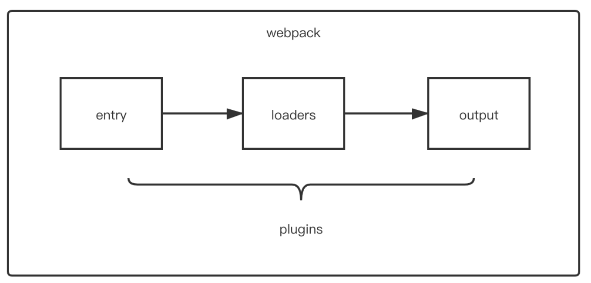

## 01 模块化

### 1.1 CommonJS模块化

CommonJS主要应用在Node.js中

```javascript
// 两种暴露语法
// 方法一
module.exports = {
  functin () {}
}

// 方法二
exports.msg = {} // exports 和 module.exports指向同一个对象

// 引入语法
const m1 = require('./module1')
```

### 1.2 ES6模块化

#### 暴露语法

```javascript
// 三种暴露语法
// 1.分别暴露
export const data = "hello"
export function fn() { ... }

// 2.统一暴露
export { data, fn }

// 3.默认暴露(暴露匿名模块)
export default {
  fn() { ... }, // 里面写配置对象 实际上是 fn: fn() {} 的简写
}
```

#### 引入语法

```javascript
// 引入“分别暴露”
import { data, fn } from './module1'
// 引入“分别暴露”并重命名
import { data as data2 } from './module1'
// 引入“分别暴露”并打包
import * as module from './module1'

// 引入“统一暴露”：和引入“分别暴露”的一样

// 引入“默认暴露”
import mudule from './module1' // 自定义模块名
```

先通过babel将ES6语法转为ES5，再转为CJS的模块化语法，再通过browserify翻译成浏览器认识的语法

#### import()函数

import()函数与引号形式import的核心区别是，import()可以动态导入模块

```javascript
// 动态加载路由
const Foo = () = import('./Foo.vue')
```

## 02 开发环境

### 2.1 注意事项

```bash
### 安装webpack
npm install webpack@4 webpack-cli@3 -g # 全局安装 装在C盘某处
npm install webpack@4 webpack-cli@3 -D # 本地安装 本地依赖 装在node_modules文件夹

### 查看版本
webpack -v
webpack-cli -v
```

* entry：入口
* output：输出
* loader：预处理器  本身是一个函数，接收源文件作为参数，返回转换后的结果
* plugins：插件  完成一些loader完成不了的工作
* mode：工作模式

#### 工作模式

* 开发模式和生产模式，生产模式会自动压缩代码
* `npm install -g`是全局安装，即安装在C盘，全局皆可使用命令
* `npm install -D`是开依赖，打包之后会丢弃，减小体积

#### webpack配置文件

```javascript
// webpack.config.js  CJS规范
module.exports = {
  context: path.resolve(__dirname, './src'), // 一般省略，因为默认是当前工程的根目录
  mode: 'development',
  entry: './foo.js', // 相对路径
  output: { }, // 绝对路径
  module: {
    rules: [ ]
  },
  plugins: [ ],
  devServer: { }
};
```

context在Webpack中表示资源入口entry是从哪个目录为起点的。context的值是一个字符串，表示一个绝对路径。一般我们不会去设置context，在我们没有设置context的时候，它是当前工程的根目录。

`[name]`表示的是chunk的名称，chunk这个概念可以单独写一节，简单理解的话就是打包过程中，一个资源入口代表一个chunk，一个异步模块资源也代表一个chunk。

### 2.2 js和json

* webpack能够编译打包`js`和`json`文件
  * `json`转成默认暴露 `import data from './test.json'`
* 能将ES6的**模块化语法**转换成浏览器可识别的语法
* 能压缩代码

### 2.2 less和css

* 引入css文件`import './css/demo.css`'
* 安装`css-loader`和`style-loader`；`less`和`less-loader`
  * `npm install css-loader -D`

* `less-loader`：将less编译成css文件
* `css-loader`：将css文件变成CommonJS的一个模块加载到js中，里面的内容是样式字符串
* `style-loader`：创建style标签，将js中的样式资源插入到head标签中生效
* use数组中的loader**从后往前**依次执行
* 以下方法会将css打包到js文件中，使用动态创建style标签的方式引入样式

```javascript
const baseCssLoader = ["style-loader", "css-loader"];

{ // 1.处理css资源
  test: /\.css$/, // 匹配规则
  use: [...baseCssLoader] // 使用的loader
},
{ // 2.处理less资源
  test: /\.less$/,
  use: [...baseCssLoader, 'less-loader']
}
```

### 2.3 html文件

* 使用`html-webpack-plugin`插件
* 在原html文件的基础上复制一份html文件，自动引入js，所以src源文件中无需引入
* 实例化的时候传入配置对象template，以保留原始html文件中的内容
* **loader无需引入，插件需要先引入，再实例化**

```javascript
const HtmlWebpackPlugin = require("html-webpack-plugin");

plugins: [ // 插件配置项是一个数组，每个元素都是一个插件，要new实例化
  new HtmlWebpackPlugin({
    template: "./src/index.html",
  }),
]
```

### 2.4 样式中的图片 

* 使用`url-loader`，它是对file-loader的封装
* 使用limit配置项可以转码小图片
* 处理的是css中的图片

```javascript
{
  test: /\.(png|jpg|gif|bmp)$/,
  use: [{
    loader: "url-loader", // file-loader的封装
    options: {
      name: "[hash:5].[ext]", // 命名(取哈希值前五位，保留原文件后缀)
      outputPath: "imgs", // 图片保存路径
      limit: 8 * 1024 // 图片小于8Kb时，转为base64编码
    }
  }]
},
```

### 2.5 打包html中的图片

* 使用html-loader `npm i html-loader -D`
* 它和上面的`url-loader`配合，这里的图片也会被放到imgs文件夹中

```javascript
{
  test: /\.(html)$/, // 解析html结尾的文件
  use: ["html-loader"]
}
```

### 2.6 打包其他资源

* 使用file-loader，对文件进行一次复制

```javascript
{
  exclude: /\.(html|js|css|less|json|jpg|png|gif)$/, // 排除的文件
  use: [{
    loader: "file-loader",
    options: {
      name: "[hash: 10].[ext]",
      outputPath: "media",
    }
  }]
}
```

### 2.7 devServer

* 开发服务器，让更改源码时webpack自动打包，自动打开浏览器
* 安装devServer，在webpack中配置deverver选项  `npm install webpack-dev-server -D`（全局也安装一下，凡是具有指令级的安装包，都建议全局和局部都安装）
* 开启的这个服务器中存放的是打包好的文件，放在内存当中
* 修改package.json中的scripts指令
  * `"dev": "webpack-dev-server"`
* 运行指令 `npm run dev`

```javascript
module.exports = {
  plugins: [],
  devServer: {
    port: 5050, // 开启服务器的端口号
    open: true, // 自动打开浏览器
    hot: true, // 模块热更新，只更新修改的地方
  }
}
```

## 03 生产环境

JS：语法检查——语法转换——兼容性处理——压缩

CSS：提取成单独文件——兼容性处理——压缩

* 新建config文件夹，创建webpack.dev.js和webpack.prod.js文件
* 修改package.json中的指令
* 修改output中的path为：`path: resolve(__dirname, "../dist")`

```json
"scripts": {
  "dev": "webpack-dev-server --config ./config/webpack.dev.js",
  "build": "webpack --config ./config/webpack.prod.js"
},
```

#### 01 提取css为单独的文件

* 安装插件 `npm install mini-css-extract-plugin -D`
* 引入插件 `const MiniCssExtractPlugin = require("mini-css-extract-plugin")` 并实例化
* 配置loader，替代style-loader

```javascript
const baseCssLoader = [MiniCssExtractPlugin.loader, "css-loader"];

new MiniCssExtractPlugin({
  filename: "css/index.css",
}),
```

#### 02 css兼容性处理

* 使用postcss-loader，安装三个东西
* `npm install postcss postcss-loader postcss-preset-env -D`
* 兼容性问题需要在css-loader之前进行
* postcss这里没有指明兼容到哪些浏览器，因此需要做配置，参考vue脚手架，在package.json中配置`browserslist`配置项。参考github

> 在使用MiniCssExtractPlugin.loader时要配置publicPath（资源访问路径），因为我们提取css文件时给了一个css的层级，这样默认css所依赖的模块在引用时都会加上css这个子目录，但实际上文件的存放位置没有这个层级，就会出现路径问题
>
> `build/css/imgs/xxx.png`  `build/css/media/xxx.ttf`  ——  不配置publicPath （错误）
>
> `build/imgs/xxx.png`  `build/media/xxx.ttf`  ——  配置publicPath （正确）

```javascript
const baseCssLoader = [
  {
    loader: MiniCssExtractPlugin.loader, // 替代style-loader，用来将css提取成单独的文件
    options: {
      publicPath: "../" // css文件依赖的模块的基础路径
    }
  }
  "css-loader",
  {
    loader: "postcss-loader",
    options: {
      postcssOptions: {
        plugins: [ "postcss-preset-env" ]
      }
    }
  }
];
```

#### 03 js语法检查

* 使用eslint-loader `npm install eslint-loader eslint -D`
* 安装规则检查库，别人配置好的 `npm install eslint-config-airbnb-base eslint-plugin-import`
* 配置loader
* 在package.json中配置eslintConfig

```json
"eslintConfig": {
  "extends": "airbnb-base", // 继承airbnb-base提供的规则
  "env": {
    "browser": true
  }
}
```

* 在webpack配置文件中写loader

```javascript
// 配置在webpack的loader中
{
  test: /\.js$/,
  exclude: /node_modules/,
  enforce: "pre", // 优先执行
  loader: "eslint-loader",
  options: {
    fix: true, // 自动修复问题
  }
}
```

* 使用`eslint-disable-next-line`禁止检查下一行

#### 04 js语法转换(es6->es5)

* 使用`babel-loader`
* `npm install babel-loader @babel/core @babel/preset-env -D`
* babel-loader会自动读取当前目录下的babel.config.js文件，加载相应的配置到options中

```javascript
{
  test: /\.js$/,
  exclude: /node_modules/,
  use: {
    loader: "babel-loader",
    options: {
      presets: ["@babel/preset-env"]
    }
  }
}
```

#### 05 js语法兼容性处理(Promise等问题)

* 经典的高级ES6语法转换库
* 使用polyfill库 `npm install @babel/polyfill`
* 在入口文件引入即可 `import "@babel/polyfill"`

#### 06 压缩html和js

webpack的工作模式中，production模式默认压缩html和js

#### 07 压缩css

使用 `optimize-css-assets-webpack-plugin` 插件

```javascript
new OptimizeCssAssetsPlugin({
  cssProcessorPluginOptions: {
    preset: ["default", { discardComments: { removeAll: true } }],
  }
})
```

## 04 常见问题

从本质上讲，webpack 是现代 JavaScript 应用程序的静态模块打包器。 当 webpack 处理您的应用程序时，它会在内部构建一个依赖关系图，该依赖关系图映射您的项目所需的每个模块并生成一个或多个捆绑包

### 4.1 webpack打包流程

1. 连接：webpack从入口文件开始，递归查找出所有相关的模块，并【连接】起来形成一个图（网）的结构；
2. 编译：将JS模块中的模块化语法【编译】为浏览器可以直接运行的模块语法（其它类型资源也会处理）；
3. 合并：将图中所有编译过的模块【合并】成一个或少量的几个文件，浏览器真正运行是打包后的文件。

### 4.2 常用loader

1. **less-loader**: 用于将less文件翻译成为css；
2. **postcss-loader**: 用于处理css兼容性问题；
3. **css-loader:** 用于将css以CJS语法打包到js中；
4. **style-loader**: 用于动态创建一个style标签，将css引入页面(和MiniCssExtractPlugin.loader二选一)；
5. **file-loader**: 用于处理其他资源，也可以处理图片资源，核心操作就是：复制资源到指定位置，且可修改文件名等操作；
6. **url-loader**: 与file-loader功能几乎一致，优势是可以对图片进行动态转换base64编码（控制limit属性值可以控制阈值）；
7. **html-loader**: 用于处理html中 `` 标签的图片；
8. **eslint-loader**: 对项目中的js语法进行检查；
9. **babel-loader**: 将es6语法转换为es5语法；
   备注1：直接使用只能处理简单的语法，Promise等无法处理。
   备注2：借助polyfill完成高级es6语法的转换，缺点：所有都转换，无法按需转换，生成的js体积大。
   备注3：使用core-js配合polyfill完成按需转换。

### 4.3 常用plugin

1. **mini-css-extract-plugin**：用于提取项目中的css为一个单独的文件
2. **html-webpack-plugin**：根据指定模板，自动创建html文件，且自动引入外部资源
3. **eslint-plugin-import**：用于配合eslint-loader
4. **eslint-config-airbnb-base**：用于引入airbnb配置好的语法检查规则
5. **@babel/polyfill**：用于处理JS兼容性问题
6. **optimize-css-assets-webpack-plugin**：用于压缩css
7. **clean-webpack-plugin**：用于自动清理打包的文件

### 4.4 tree-shaking

在ES6模块化和production环境下会自动开启tree-shaking，去除无用的代码，比如对外暴露了但是没有引入或者使用的模块

### 4.5 loader和plugin的区别

- loader 是文件加载器，能够加载资源文件，并对这些文件进行一些处理，诸如编译、压缩等，最终一起打包到指定的文件中；它运行在打包之前
- plugin 赋予了 webpack 各种灵活的功能，例如打包优化、资源管理、环境变量注入等，目的是解决 loader 无法实现的其他事；它运行在整个打包周期

 

### 4.6 source-map

如果想要在浏览器里直接看到打包前的代码，这个时候就需要使用source map了；在webpack配置项加入 `devtool: 'source-map'`

在开发环境，我们可以对devtool取值为eval-cheap-module-source-map，该配置值能保留loader处理前的原始代码信息，而打包速度也不错，是一个较佳的选择。

在生产环境，我们通常是不需要source map的，因为有泄露原始代码的风险，除非你想要定位线上的错误。

### 4.7 环境变量

#### Node的环境变量

Node.js环境里的环境变量，指的是用Node.js执行JavaScript代码时可以取到的环境变量，它都存放在process.env模块。`console.log(process.env)`

**设置环境变量**

* 在Windows系统：`set MY_ENV=dev`
* 在linux系统：`export MY_ENV=dev`
* 跨操作系统：`cross-env MY_ENV=dev`
  * 需要安装cross-env包 `npm i cross-env@7 -D`

```json
"scripts": {
  "build": "cross-env MY_ENV=dev webpack"
}
```

#### webpack的环境变量

