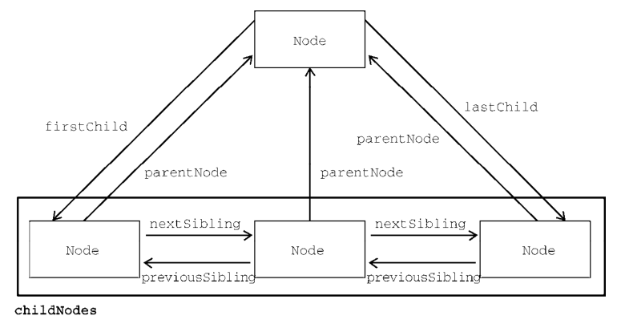

# DOM

## 01 DOM简介

 

当网页被加载时，浏览器会创建页面的文档对象模型（Document Object Model）；
DOM树，包含文档、**元素**、节点（元素、文本、属性等都是节点）。

### 1.1 属性操作

```javascript
let div = document.querySelector("div");

// 获取属性值
let id = div.id;
let id = div.getAttribute("id");

// 设置元素属性
div.id = 001;
div.setAttribute("id", "test");

// 删除属性
div.removeAttribute("id");
```

### 1.2 自定义属性

```javascript
// 自定义属性以 data- 开头
div.setAttribute("data-time", 30);
div.setAttribute("data-index", 001);

// dataset属性值是一个集合，存放了所有以data开头的自定义属性(前面不用加data了)
let t = div.dataset.time;
let i = div.dataset["index"];
```

## 02 文档对象

### 2.1 查找HTML元素

```javascript
document.getElementById(id);  // id
document.getElementsByTagName(name);  // 标签名
document.getElementsByClassName(name);  // 类名
```

### 2.2 修改HTML元素

```javascript
let element = document.getElementById(id);

element.innerHTML = "value";
element.innerText = "value";
element.<attributeName> = "value";  // 设置属性值
element.setAttribute("attributeName", "value");  // 设置属性值
element.style.property = "";  // 修改样式   div.style.width = "250px";
element.className = "class1 class2";  // 修改类名
```

### 2.3 添加和删除元素

```javascript
// 所有元素都是document的子元素，下面的document可以换成其他元素
document.createElement(element);  // 创建节点元素
document.removeChild(element);  // 删除节点元素
document.appendChild(element);  // 给元素追加子元素，如在 ul 里面追加 li
document.replaceChild(element);  // 
document.write(text);  // 

document.createDocumentFragment();  // 创建文档碎片，存储临时节点
```

## 03 HTML元素

### 3.1 获取元素

```javascript
// 返回指定选择器的第一个元素对象
document.querySelector("css选择器");

// 返回指定选择器的所有元素对象
document.querySelectorAll("css选择器");

document.documentElement;  // 获取HTML标签
document.body;  // 获取body元素对象
```

### 3.2 节点操作

 

- 利用节点的层级关系获取元素
- 页面中所有的内容都属于节点：标签属性文本注释等
- 节点一般有nodeType（元素节点为1，属性节点为2，文本节点为3），nodeName，nodeValue属性
- `node.parentNode` 父节点
- `node.childNodes` 子节点（得到的节点包含元素节点和文本节点等，换行属于文本节点），想获得元素节点比较麻烦，不推荐使用
- `node.children` 子元素节点，常用
- `node.firstChild` `node.lastChild` 第一个和最后一个子节点，包含文本节点
- `node.firstElementChild` `node.lastElementChild` 第一个和最后一个子元素节点，兼容性不好
- 实际开发中 `node.children[0]` `node.children[node.children.length - 1]`
- `node.nextSibling` 下一个兄弟节点（包含文本节点）`node.previousSibling`
- `node.nextElementSibling` 下一个兄弟元素节点（包含文本节点）`node.previousElementSibling` 兼容性不好
- 创建元素节点
  - `document.createElement('元素')`
  - `node.appendChild(child)` node是父节点，child是子节点（后面追加）
  - `node.insertBefore(child, 指定元素)`
- 删除节点 `node.removeChild(child)`
- `href = 'javascript:;'` 阻止链接跳转
- 克隆节点 `node.cloneNode(true)` 深拷贝，如果括号内为空，则只复制标签，不复制内容

## 04 事件

### 4.1 事件基础

JS侦测到的行为；

事件三要素：事件源；事件类型；事件处理程序

```jsx
var btn = document.getElementById('btn');
btn.onclick = function() {
	alert('点秋香');
}
```

### 4.2 注册事件

```javascript
// 传统注册事件
btn.onclick = function() { alert('点秋香') };
// 监听注册事件（可以注册多次）
btn.addEventListener("click", function() {});
```

### 4.3 删除事件

```javascript
btn.onclick = null;
btn.removeEventListener();
```

### 4.4 事件流

事件传播的过程：捕获和冒泡

 

### 4.5 事件对象

```javascript
// e就是一个事件对象，系统自动创建，不需要传递参数
div.onclick = function(e) { };

e.target;  // 返回事件的触发对象
e.type;  // 返回事件的类型
e.preventDefault()  // 阻止默认行为
e.stopPropagation();  // 阻止冒泡
```

### 4.6 事件委托

不是给每个子节点单独设置监听器，而是事件监听器设置在父节点上，利用**冒泡原理**影响设置每个子节点

```javascript
ul.addEventListener('click', function(e) {
  e.target.style.backgroundColor = 'pink';  // e.target就是所点击的 li
}
```

### 4.7 常用的鼠标事件

- contextmenu 鼠标右键菜单
- selectstart 鼠标选中
- 鼠标事件
  - e.clientX e.clientY
  - e.pageX
  - e.mousemove
- 键盘事件
  - onkeyup onkeydown onkeypress(不识别功能键)
  - `e.key`
  - keydown和keypress在文本框中的特点，它们两个事件触发的时候，文字还没有落入文本框

# BOM

浏览器对象模型（Browser Object Model (BOM)）允许 JavaScript 与浏览器对话

## 01 Window对象

* 所有浏览器都支持 window 对象。它代表浏览器的窗口
* 所有全局 JavaScript 对象，函数和变量自动成为 window 对象的成员
* 全局变量是 window 对象的属性；全局函数是 window 对象的方法
* 甚至（HTML DOM 的）document 对象也是 window 对象属性

```javascript
// 窗口尺寸属性
window.innerHeight;  // 浏览器窗口的内高度（以像素计）
window.innerWidth;  // 浏览器窗口的内宽度（以像素计）

// 窗口方法
window.open();  // 打开新窗口
window.close();  // 关闭当前窗口
window.moveTo();  // 移动当前窗口
window.resizeTo();  // 重新调整当前窗口

// 窗口事件
// DOMContentLoaded  DOM加载完毕，无需css等，比load快一点
document.addEventListener('DOMContentLoaded', () => alert(1) );
// load  页面加载完成
window.addEventListener('load', () => alert(2) );
// resize  调整页面大小
window.addEventListener("resize", debounce(print, 1000));
```

## 02 Sceen对象

包含用户的屏幕信息，以下都是**属性**

```javascript
// Window Screen对象，可以不带window前缀
window.screen.width  // 返回以像素计的访问者屏幕宽度
screen.height  // 返回以像素计的访问者屏幕的高度
screen.availWidth  // 返回访问者屏幕的宽度，以像素计，减去诸如窗口工具条之类的界面特征
screen.availHeight  // 返回访问者屏幕的高度，以像素计，减去诸如窗口工具条之类的界面特征
screen.colorDepth  // 返回用于显示一种颜色的比特数
screen.pixelDepth  // 返回屏幕的像素深度
// 对于现代计算机，颜色深度和像素深度是相等的
```

## 03 Location对象

可用于获取当前页面地址（URL）并把浏览器重定向到新页面，以下都是**属性**

```javascript
// Window Location对象，可以不带window前缀
window.location.href  // 返回当前页面的URL
location.hostname  // 返回（当前页面的）因特网主机的名称
location.pathname  // 返回当前页面的路径名
location.protocol  // 返回页面的 web 协议
location.port  // 返回（当前页面的）互联网主机端口号
location.assign()  // 加载新文档，即重定向跳转网页
```

## 04 History对象

包含浏览器历史，以下是**方法（函数）**

```javascript
// Window History对象，可以不带window前缀
window.history.back()  // 加载历史列表中前一个URL，等同于浏览器中的后退按钮
history.forward()  // 加载历史列表中下一个URL

```

## 05 Navigator对象

包含有关访问者的信息

```javascript
// Window Navigator对象，可以不带window前缀
window.navigator.cookieEnabled  // 浏览器如果启用了cookie，则返回true，否则返回false
navigator.appName  // 返回浏览器应用程序名称 Netscape
navigator.appCodeName  // 返回浏览器的代码名称 Mozilla
navigator.platform  // 返回浏览器平台（操作系统）Win32
navigator.language  // 返回浏览器语言
navigator.onLine  // 返回浏览器是否在线

```

## 06 弹出框

```javascript
// 警告框（可省略window）
window.alert("sometext");

// 确认框（可省略window）
window.confirm("sometext");
var r = confirm("请按按钮");
if (r == true) {
    x = "您按了确认！";
} else {
    x = "您按了取消！";
}

// 提示框（可省略window）获取用户输入的值，输入值-确定
window.prompt("sometext", "defaultText");
// defaultText会默认出现在输入框中，如果用户点击取消，则返回null

```

## 07 Timing事件

window 对象允许以指定的时间间隔执行代码，这些时间间隔称为定时事件。

```javascript
myVar = window.setTimeout(function, milliseconds);
// 参数一：要执行的函数；参数二：执行前等待的毫秒数
clearTimeout(myVar)  // 停止setTimeout()

setInterval(function, milliseconds);
// 参数一：要执行的函数；参数二：每个执行之间的时间间隔的长度（循环执行）
clearInterval()  // 停止setInterval()
```

## 08 Cookies

让用户在网页中存储信息。cookie保存在**名称-值**对中

```javascript
// 创建cookie
document.cookie = "username=Bill Gates; expires=<UTC time>; path=/";
// expires添加有效日期，默认情况下，浏览器关闭时会删除cookie；path指定cookie的路径，默认属于当前页面

// 读取cookie
var x = document.cookie;  // 返回一条cookie字符串

// 删除cookie：将expires参数设置为过去的日期即可，指定要删除的cookie的路径
```
