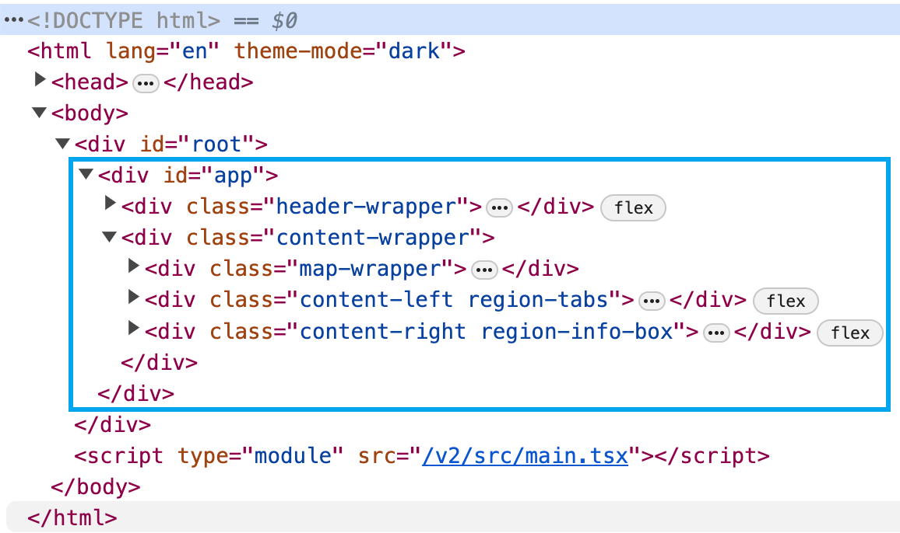
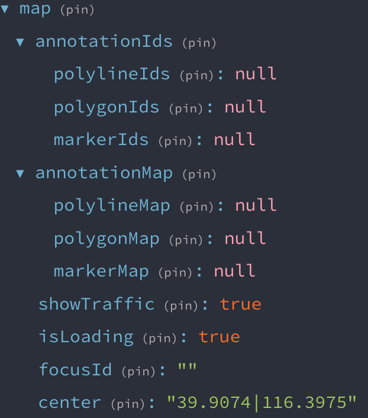

## 态势重构项目汇报 2023-12-01

### 01 项目介绍

> 项目地址 https://test-status.traffic.map.qq.com/v2

#### 1.1 业务模块

> 区域感知 ｜ 道路感知 ｜ 路口感知 ｜ 交通事件 ｜ 态势预测 ｜ 监控查询

* 前面四大模块主要是实时数据(分钟级刷新)和短时预测(30 分钟)数据；
* “态势预测”模块是长时预测(全天)数据；
* “监控查询”可以导出“区域、道路、路口”的指标趋势数据

#### 1.2 区域划分

> 行政区域 ｜ 自定义区域 ｜ 自定义线路

* 行政区域为标准预定义区域
* 自定义区域是客户通过人路通施画平台自己绘制的区域
* 自定义线路暂时不使用

---

### 02 代码结构

> 仓库地址 https://git.woa.com/evanqhu/traffic-status-web-refactor

#### 2.1 整体代码结构

```javascript
├── src
│   ├── main.tsx                            # 入口文件
│   ├── app                                 # app 根组件
│   ├── assets                              # 静态资源
│   ├── components                          # 公共组件
│   │   ├── common                            - 多个小的公共组件
│   │   ├── Header                            - 顶部组件
│   │   ├── Map                               - 地图组件
│   │   ├── MonitorQuery                      - 感知数据查询组件
│   │   └── RegionSelector                    - 城市｜区域选择器组件
│   ├── configs                             # 配置项
│   ├── pages                               # 页面组件
│   │   ├── Signin                            - 登录组件
│   │   ├── RegionMonitor                     - 区域感知
│   │   ├── RoadMonitor                       - 道路感知
│   │   ├── CrossMonitor                      - 路口感知
│   │   └── TrafficIncident                   - 交通事件
│   ├── redux                               # 状态管理库
│   │   ├── store.ts                          - 创建 store
│   │   ├── actions                           - action creator
│   │   │   ├── mod.ts #                        - 同步 action
│   │   │   └── infoApi.ts                      - 异步 action creator
│   │   ├── middlewares                       - 中间件
│   │   └── reducers                          - reduces
│   ├── styles                              # 全局样式
│   ├── types                               # 类型声明
│   └── utils                               # 工具包
└── README.md
```

> 项目强依赖封装的**地图组件**和 **redux** 状态管理器

#### 2.2 地图组件

> 较为特殊的路由结构：地图组建放在 app 下，和路由组件同级，**切换路由时地图组件不发生变化**
> 通过路径来判断是否加载地图组件

```html
<!-- 网页结构 -->
<>
  <Header />
  <div className='content-wrapper'>
    <MapWrapper pathname={pathname} />     <!-- 地图组件 -->
    <RouteGuard />                         <!-- 路由守卫 -->
  </div>
</>
```

 

> 封装地图组件

```javascript
└── Map # 地图组件
    ├── index.tsx               0.初始化地图实例，创建 MultiPolygon MultiPolyline MultiMarker 图层
    └── components
        ├── Printer.tsx					1.绘制地图覆盖物
        ├── Hover.tsx						2.监听鼠标悬浮事件，更新 hover 覆盖物对象的样式
        ├── InfoBox.tsx					3.监听鼠标悬浮事件，为 hover 覆盖物对象添加信息窗口
        ├── Select.tsx					4.监听鼠标点击事件，更新地图聚焦点 mapFocusId
        └── Focus.tsx						5.监听地图聚焦点 mapFocusId 的变化，更新选中的覆盖物对象的样式，设置地图缩放

```

 

* `Printer`组件监听`annotationIds` 和`annotationMap`的变化来更新绘制或清除覆盖物
* `focusId`标识当前选中的覆盖物
* `showTraffic`控制路况的显示
* `center`标识城市中心点
* `isLoading`标识加载状态

#### 2.3 redux 状态管理器

> 为实现地图组件和页面组件的数据交互，绝大部分数据都存在 store 中

```javascript
├── reducers
    ├── city                  # 城市
    │   └── id.ts
    ├── area									# 区域
    │   ├── id.ts
    │   └── ids.ts
    ├── road									# 道路
    │   ├── id.ts
    │   └── ids.ts
    ├── rdseg									# 路段
    │   ├── id.ts
    │   └── ids.ts
    ├── cross									# 路口
    │   ├── id.ts
    │   └── ids.ts
    ├── info									# 全局信息
    │   ├── dataTime.ts
    │   ├── order.ts
    │   ├── userInfo.ts
    │   ├── userResources.ts
    │   └── index.ts
    ├── map										# 地图
    └── entities							# 实体(相当于一个数据库)
        ├── regionMenu.ts
        ├── cityMap.ts
        ├── areaMap.ts
        ├── roadMap.ts
        ├── rdsegMap.ts
        └── crossMap.ts
```

* `id`存储当前选中的项的 id
* `ids`存储全部项的 id
* `entities`中存储全部项的详细信息(包括地图坐标信息)

> react-redux 插件

```jsx
// 容器组件
import { connect } from 'react-redux';
import { modAreaId } from '@/redux/actions/mod'; // 同步 action creator
import { getAreaTpiList } from '@/redux/actions/infoApi'; // 异步 action creator

// 映射 state 中的数据到 props
const mapStateToProps = (state) => {
  const areaId = state.area.id;
  return { areaId };
};

// 映射 dispatch 方法到 props
const mapDispatchToProps = { modAreaId，getAreaTpiList };

// UI 组件
const RegionMonitor = ({ areaId，modAreaId，getAreaTpiList }) => {
  console.log(areaId);
  
  useEffect(() => {
    modAreaId('110001'); 							// 修改 areaId
    getAreaTpiList({ areaId }); ⚠️		// 修改 areaIds
  }, []);
  
  return (<div>...</div>);
}

export default connect(mapStateToProps, mapDispatchToProps)(RegionMonitor);
```


**动作对象生成函数 action creators**

使用 redux 中自定义的 api 中间件处理异步 action creator

> 同步 action creator

```javascript
// 修改区域 id
export const modAreaId = (id: string | null) => ({
  type: actionTypes.MOD_AREA_ID, // 动作类型 action type
  payload: { id },							 // 携带的数据 payload
});
```

> 异步 action creator

```javascript
// 查询区域列表
export const getAreaTpiList = (params) => {
  const endpoint = `${API_ROOT}/quota/tpispd/city/list`;
	
  // 返回一个 action 对象
  return {
    // api 中间件会监听 [CALL_API] 标记
    [CALL_API]: {
      endpoint, // 接口地址
      params, 	// 请求参数
      types: [	// 动作类型 action type
        actionTypes.FETCH_AREA_TPI_LIST_REQUEST,
        actionTypes.FETCH_AREA_TPI_LIST_SUCCESS,
        actionTypes.FETCH_AREA_TPI_LIST_FAILURE,
      ],
      // 该函数处理响应结果，返回携带的数据 payload
      normalize: (resp: IResponse) => {
				...;
        return { payload: { ids: temp.areaIds, areaMap: temp.areaMap } };
    },
  };
};
```

> api 中间件

```javascript
// 通过封装的 axios 发送请求
const requestAPI = async (endpoint, params, next: Function) => resp;

export default () => (next) => (action) => {
  if (![CALL_API]) {
    // 将同步 action 直接传递给下一个中间件，修改 store
    return next(action);
  } else {
    // 通过 requestAPI 函数发送异步请求，拿到返回的数据后再将 action 传递给下一个中间件，修改 store
    return requestAPI(endpoint, params, needCancel, next).then(
    	(resp) => next({ type, payload});
    )
  }
}
```

### 03 其他重难点

#### 3.1 页面间继承性

切换组件时保持当前选中的区域不变

#### 3.2 自定义区域

* 自定义区域的逻辑与行政区域略有不同，导致复杂性增加

* 没有将 行政区域｜自定义区域 状态提升到全局，导致页面间跳转麻烦

#### 3.3 自动刷新

* 重点：将 updateCount 变量添加到初始化钩子的依赖项中，通过其变化控制页面刷新
* 难点：打开模态框时暂停自动刷新。之前的思路是清楚定时器，后来发现可以保持定时器不变，仅暂停自动刷新标记的变化即可

```javascript
const [isRefreshing, setIsRefreshing] = useState<boolean>(true); // 模态框用，用来暂停自动刷新
const [needUpdateIm, setNeedUpdateIm] = useState<boolean>(false); // 自动刷新标记
const [updateCount, setUpdateCount] = useState<number>(0); // 自动刷新变量，根据其变化执行自动刷新

// @hooks 初始化开启自动刷新定时器
useEffect(() => {
  let timer: any = null;
  if (!isLoading && isRefreshing) {
    timer = setInterval(() => {
      if (isRefreshing) {
        setNeedUpdateIm(true);
      }
    }, 1000 * 60);
  }
  return () => clearInterval(timer);
}, [isLoading, isRefreshing]);

// 自动刷新时间，更新数据
useEffect(() => {
  if (needUpdateIm) {
    setNeedUpdateIm(false);
    setUpdateCount((prevCount) => prevCount + 1);
  }
}, [needUpdateIm]);

// 组件初始化数据的钩子
useEffect(() => {}
}, [updateCount, ...]);

// *********************************************** //
  // @hooks 模态框状态标记值发生变化时，控制自动刷新标记的更新
  useEffect(() => {
    if (showLineChartDialog) {
      setIsRefreshing(false);
    } else {
      setIsRefreshing(true);
    }
  }, [showLineChartDialog]);

```

### 04 总结
